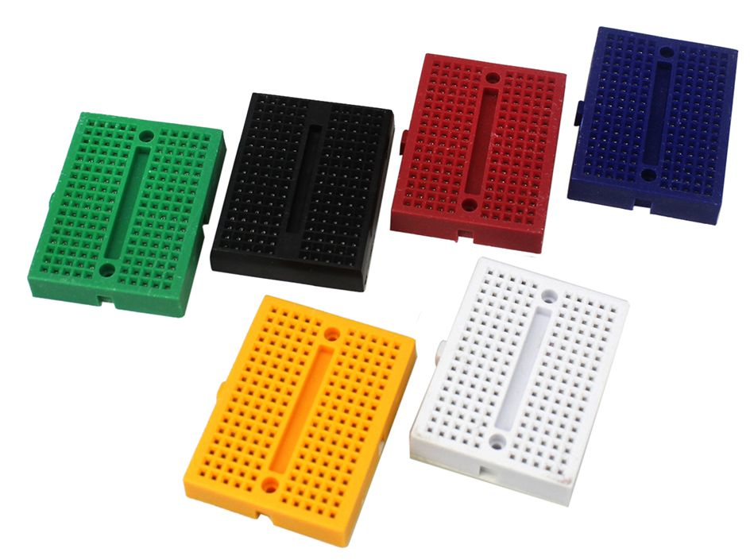

 

# Breadboard

### Inhoud

- [Breadboard](#breadboard)
    - [Inhoud](#inhoud)
  - [Een introductie](#een-introductie)
    - [Elektronische schakeling](#elektronische-schakeling)
  - [Referenties](#referenties)

---

**v0.1.1 ** Start document breadboard gebruiken door HU IICT.

---

## Een introductie

Om je elektronische schakeling te testen gebruik je een bordje om deze tijdelijk op te bouwen. Dit breadboard is vaak wit en bestaat uit verschillende rijen gaatjes.

### Elektronische schakeling

De LEDs en knoppen zijn met behulp van draadjes (jumper wires) aan te sluiten, deze zijn te vinden in de [Turing Lab Hardware Shop](https://hu-hbo-ict.gitlab.io/turing-lab/ti-lab-shop/index.html). De verschillende onderdelen zijn echter bedoeld om op een printplaat te solderen, niet om met draadjes aan elkaar geknoopt te worden. Een alternatief voor soldern is de breadboard: een plastic bordje met gaten die per rij aan elkaar verbonden zitten. Je kunt hier alle onderdelen inprikken om deze met elkaar te verbinden. In de Turing Lab Hardware Shop zijn verschillende maten te koop.

Afhankelijk van de maat heb je een aantal rijen waarbij ieder gat in een rij met elkaar in verbinding staat. In het midden zit een richel, waardoor de rijen onderbroken zijn. Grotere breadboards hebben daarnaast aan de buitenkant twee lange rijen waarvan rood voor de VCC ($3,3V$ of $5V$) en blauw voor de GND ($0V$) bedoeld zijn.

## Referenties
- Breadboard (<https://en.wikipedia.org/wiki/Breadboard>)