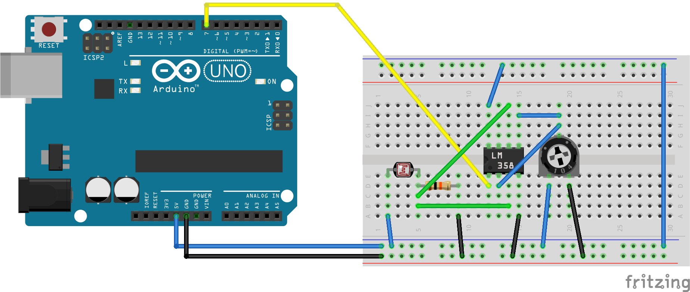

 [](logo-id)

# PCB[](title-id) <!-- omit in toc -->

### Inhoud[](toc-id) <!-- omit in toc -->

- [Een introductie](#een-introductie)
- [Printplaat](#printplaat)
- [Een licht/donker sensor](#een-lichtdonker-sensor)
- [LDR Arduino lichtsensor](#ldr-arduino-lichtsensor)
- [Arduino example](#arduino-example)
- [Elektrisch schema](#elektrisch-schema)
- [PCB Ontwerp](#pcb-ontwerp)
- [Referenties](#referenties)

---

**v0.1.1 [](version-id)** Start document PCB maken door HU IICT[](author-id).

---

## Een introductie

Een eerste stap naar een prototype product is het maken van een Printed Circuit Board (PCB). Dit heeft uiteraard raakvlakken met het werkveld Elektrotechniek. Als Technisch Informaticus kan het een goede oefening zijn als je het ontwerpen en maken van een PCB een keer hebt gedaan.

## Printplaat

In het Nederlands noemen we een PCB een printplaat. De plaat is isolatiemateriaal die dient als drager voor elektronische componenten, waarop koperen bedradingen, genaamd sporen, zijn aangebracht ter verbinding van die componenten. 

## Een licht/donker sensor

In dit voorbeeld gaan we een lich/donker sensor maken met behulp van een Arduino. Licht sensoren worden veel gebrukt in elektronische toepassingen. Een lichtgevoelige weerstand in het Engels een light-dependent [resistor](../../basis-elektronica/README.md#resistance) (LDR) is een lichtgevoelig elektronischcomponent waarvan de weerstand wordt beinvloed door de hoeveelheid licht die er op valt. In het donker heeft de sensor een hoge weerstand (> 1 MΩ) terwijl deze onder invloed van licht zakt naar enkele 100 Ωs. 

Een LDR is niet geschikt om licht intensiteit te meten. Het is vooral geschikt om te bepalen of het licht of donker is. De gevoeligheid is afgestemd op een golflengte van 540 nm.

Een lichtsensor kan worden gemaakt door een LDR in een [voltage-divider](../../basis-elektronica/README.md#voltage-divider) circuit te plaatsen. 

    De voltage-drop is hoog wanneer het donker is. De output van de voltage-divider is een laag voltage. De voltage-drop wordt minder wanneer het licht is omdat de weerstand dan afneemt. Het resultaat is een hoog voltage als output van de voltage-divider.

De output daarvan is analoog en met behulp van een [operational amplifier](../../elektronische-componenten/ic/OpAmp/README.md) kunnen we een ideale (digitale) lichtschakelaar maken. We sluiten de output van de voltage-divider aan op non-inverting input en de referentie voltage aan de non-inverting input van de OpAmp. De gevoeligheid kunnen we instellen door een variabele weerstand te plaatsen op de referentie voltage. 

    Als het donker is dan is de output voltage lager dan de referentie voltage. De OpAmp is logisch LOW. Als het licht is dan is de output voltage hoger dan de referentie voltage. De OpAmp output is logisch HIGH.

Door twee operational amplifiers te gebruiken kunnen we het circuit als donker- of lichtsensor gebruiken. We maken eerst een schakeling op een breadboard de sensor is een lichtsensor.

## LDR Arduino lichtsensor




## Arduino example

```c++ {.line-numbers}
int inPin = 7;    // Operational amplifier output connected to digital pin 7
int val = 0;      // variable to store the read value

void setup() {
  Serial.begin(9600);
  pinMode(inPin, INPUT);    // sets the digital pin 7 as input
}

void loop() {
  val = digitalRead(inPin);   // read the input pin
  Serial.println(val);
}
```
## Elektrisch schema

Voordat we een PCB gaan ontwerpen maken we eerst een elektrisch schema. We ontwerpen de sensor zo dat we deze als licht of donker sensor kunnen gebruiken met behulp van een jumper setting.

## PCB Ontwerp

## Referenties

- Printed circuit board (<https://en.wikipedia.org/wiki/Printed_circuit_board>)
- Photoresistor (<https://en.wikipedia.org/wiki/Photoresistor>)
- TinyCad (<https://www.tinycad.net/>)