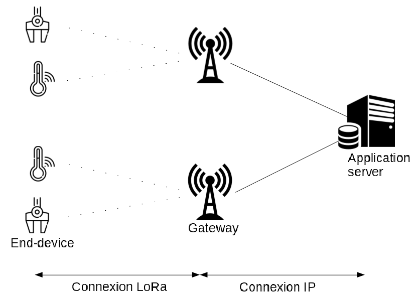
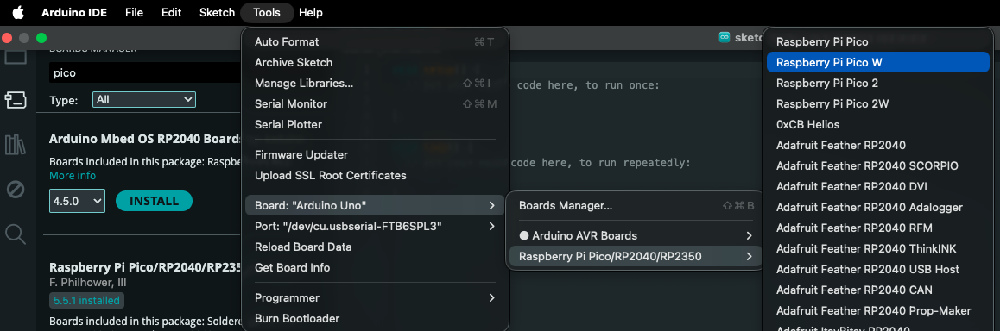

 [](logo-id)

# LoRaWAN[](title-id) <!-- omit in toc -->

### Inhoud[](toc-id) <!-- omit in toc -->

- [Hardware voorbereiden](#hardware-voorbereiden)
  - [End device configuratie](#end-device-configuratie)
  - [Arduino IDE geschikt maken](#arduino-ide-geschikt-maken)
  - [RadioLib installeren](#radiolib-installeren)
- [End Node aanmaken in TTN](#end-node-aanmaken-in-ttn)
  - [Voorbeeld Applicatie](#voorbeeld-applicatie)
  - [Arduino voorbeeld sketch](#arduino-voorbeeld-sketch)
  - [Payload formatteren](#payload-formatteren)
  - [JavaScript voorbeeld data formatter](#javascript-voorbeeld-data-formatter)
- [Referenties](#referenties)

---

**v0.1.0 [](version-id)** Start document voor LoRaWAN en installatie instructies door HU IICT[](author-id).

---

## LoRaWAN

LoRaWAN (Long Range Wide Area Network) is een specificatie voor een telecommunicatienetwerk geschikt voor langeafstandscommunicatie met weinig vermogen. Deze techniek gaan we dit semester gebruiken om sensor data over lange afstand te versturen. De hardware componenten bestaan uit een Raspberry Pi Pico W uit Semester 1 in combinatie met een Pico-LoRa-SX1262-868M Waveshare HAT. Als software backbone gebruiken we netwerkinfrastructuur van [The Things Network](https://www.thethingsnetwork.org).

Iedere student kan het onderstaande stappenplan doorlopen om een werkende verbinding te laten zien. Je gaat daarna met je team verder om de hardwareintegratie met jullie sensor-node verder vorm te geven.

# Hardware voorbereiden

Je hebt nodig:
- Raspberry Pi Pico W
- een USB kabel (moet ook geschikt zijn voor data)
- een Waveshare HAT
- Een antenne

## End device configuratie

Bevestig eerst de antenne aan de Waveshare HAT (dit is een SMA naar I-PEX MHF I antennekabel). Installeer dan pas de Waveshare HAT op de Raspberry Pi Pico W. **Op de PCB van de Waveshare HAT staat de richting van de USB aansluiting aangeven** zo weet je hoe je deze module moet orienteren. 

## Arduino IDE geschikt maken

We gaan nu de Arduino IDE geschikt maken om softare op de Raspberry Pi Pico te flashen.

1) Installeer als je dit nog niet hebt gedaan de Arduino IDE. Ik heb gebruik gemaakt van Arduino IDE versie 2.3.8.
2) Open Arduino IDE
3) Ga naar File->Preferences (op een Mac Arduino IDE -> Preferences)  
Voeg bij “Additional Boards Manager URLs” de volgende URL toe: https://github.com/earlephilhower/arduino-pico/releases/download/global/package_rp2040_index.json en klik op OK
4) Ga naar Tools->Boards->Board Manager.  
Type “pico”
Installeer “Raspberry Pi Pico/RP2040/RP2350 by Earle F. Philhower, III” (mijn versie is 5.5.1)

## RadioLib installeren

RadioLib geeft ons de SX1262 radio driver dat is de chip waarmee we data draadloos kunnen versturen.

1) Ga naar Tools->Manage Libraries en zoek op “RadioLib”
2) Installeer “RadioLib by Jan Gromes” (mijn versie is 7.6.0)

Je ben nu klaar met de voorbereidingen.

# End Node aanmaken in TTN

We maken nu een uitstapje naar The Things Network(TTN). Je kunt bij TTN gratis een account aanmaken en tot 50 devices registeren. Op de HU hebben we een aantal LoRaWAN gateways staan dus het bereik moet voldoende zijn. Nieuwe end-nodes maar ook gateways moet je op het TTN platform registeren.

Ga naar https://eu1.cloud.thethings.network/ en login met je TTN login en wachtwoord (maak deze aan als je dit nog niet hebt gedaan).

1) Kies 'Create application'. Maak een applicatie aan.
2) Kies 'Add end device' en klik daarna op je eerder aangemaakte applicatie
3) Selecteer End device type
Kies “Enter end device specifics manually”  
Frequency plan: Europe 868.1 MHz  
LoRaWAN version: 1.1.0  
Regional Parameters version: RP001 1.1 revision A  

The joinEUI for custom devices is JoinEUI = 0000000000000000  

De volgende keys kan je laten genereren (ik laat in verband om veiligheidsredenen de keys hier niet zien)  
DevEUI: generate one in TTN (70xxxxxxxxxxxxxx)  
AppKey: generate one in TTN (ABxxxxxxxxxxxxxxxxxxxxxxxxxxxxxxx)  
NwkKey: generate one in TTN (CAxxxxxxxxxxxxxxxxxxxxxxxxxxxxxxx)  

Noteer deze keys. **Sla ze niet op in je repo**. Plaats ze eventueel in een bestand en voeg een .gitignore regel toe voor dat bestand (oefen dit eerst een keer).

## Voorbeeld Applicatie

We gaan nu een voorbeeld sketch uploaden naar de Raspberry Pi Pico W. Sluit de USB kabel aan op je computer. Daarna kan je de Raspberry Pi Pico W aansluiten en gelijktijdig de BOOTSEL button inhouden. De Pico komt zo in boot mode zodat we nieuwe firmware kunnen flashen. 

In de Arduino IDE:

1) Selecteer jouw developement board
Selecteer je board onder Tools->Board->Raspberry Pi (…)->Raspberry Pi Pico W



2) De sketch die je moet gebruiken staat bij het volgende kopje in deze manual (hieronder bij "Arduino voorbeeld sketch").    
De DevEUI key, AppKey en NwKey moet je toevoegen aan de voorbeeld sketch. 
4) Kies board Pico W onder Tools->Board
5) Kies UFL board onder Tools->Port
6) Kies Upload

## Arduino voorbeeld sketch

```c++
// LoRaWAN example code for the Raspberry Pi Pico W and the Waveshare LoRa HAT
// Version 2 with EEPROM persistent LoRA join information
#include <Arduino.h>
#include <SPI.h>
#include <EEPROM.h>
#include <RadioLib.h>
#include <math.h>
#include <stddef.h>
#include <string.h>

// Waveshare Pico-LoRa-SX1262-868M pin mapping
constexpr uint8_t LORA_SCK   = 10;
constexpr uint8_t LORA_MISO  = 12;
constexpr uint8_t LORA_MOSI  = 11;
constexpr uint8_t LORA_CS    = 3;
constexpr uint8_t LORA_DIO1  = 20;
constexpr uint8_t LORA_RST   = 15;
constexpr uint8_t LORA_BUSY  = 2;

// TTN / LoRaWAN configuration
const LoRaWANBand_t region = EU868;
constexpr uint8_t subBand = 0;
constexpr uint8_t UPLINK_FPORT = 1;
constexpr unsigned long UPLINK_INTERVAL_MS = 5UL * 60UL * 1000UL; // 5 minutes

// TTN OTAA credentials
// Replace these with your own values from TTN, devEUI, appKey and nwkKey can be auto-generated
// JoinEUI may be all zeros for TTN if that is how your device is registered

uint64_t joinEUI = 0x0000000000000000ULL;  // zero's for your own created device
uint64_t devEUI  = 0x0000000000000000ULL;  // replace with your DevEUI

uint8_t appKey[16] = {
  0x00, 0x00, 0x00, 0x00,
  0x00, 0x00, 0x00, 0x00,
  0x00, 0x00, 0x00, 0x00,
  0x00, 0x00, 0x00, 0x00
};

uint8_t nwkKey[16] = {
  0x00, 0x00, 0x00, 0x00,
  0x00, 0x00, 0x00, 0x00,
  0x00, 0x00, 0x00, 0x00,
  0x00, 0x00, 0x00, 0x00
};

// Radio + LoRaWAN node
SX1262 radio = new Module(
  LORA_CS,
  LORA_DIO1,
  LORA_RST,
  LORA_BUSY,
  SPI1,
  RADIOLIB_DEFAULT_SPI_SETTINGS
);

LoRaWANNode node(&radio, &region, subBand);

// Persistent storage layout in RP2040 simulated EEPROM
constexpr uint32_t EEPROM_MAGIC = 0x4C575031UL;   // "LWP1"
constexpr uint16_t EEPROM_VERSION = 1;

struct PersistedLoRaState {
  uint32_t magic;
  uint16_t version;
  uint8_t hasNonces;
  uint8_t hasSession;
  uint8_t nonces[RADIOLIB_LORAWAN_NONCES_BUF_SIZE];
  uint8_t session[RADIOLIB_LORAWAN_SESSION_BUF_SIZE];
  uint32_t checksum;
};

static_assert(sizeof(PersistedLoRaState) <= 4096, "Persistent state does not fit in RP2040 EEPROM emulation");

PersistedLoRaState g_state{};

// Helpers
uint32_t fnv1a32(const uint8_t* data, size_t len) {
  uint32_t hash = 2166136261UL;
  for (size_t i = 0; i < len; ++i) {
    hash ^= data[i];
    hash *= 16777619UL;
  }
  return hash;
}

uint32_t calculateStateChecksum(const PersistedLoRaState& state) {
  return fnv1a32(reinterpret_cast<const uint8_t*>(&state), offsetof(PersistedLoRaState, checksum));
}

void initEmptyState(PersistedLoRaState& state) {
  memset(&state, 0, sizeof(state));
  state.magic = EEPROM_MAGIC;
  state.version = EEPROM_VERSION;
  state.checksum = calculateStateChecksum(state);
}

bool loadPersistedState(PersistedLoRaState& state) {
  EEPROM.get(0, state);

  if (state.magic != EEPROM_MAGIC) {
    return false;
  }

  if (state.version != EEPROM_VERSION) {
    return false;
  }

  const uint32_t expected = calculateStateChecksum(state);
  if (state.checksum != expected) {
    return false;
  }

  return true;
}

void savePersistedState(PersistedLoRaState& state) {
  state.magic = EEPROM_MAGIC;
  state.version = EEPROM_VERSION;
  state.checksum = calculateStateChecksum(state);

  PersistedLoRaState current{};
  EEPROM.get(0, current);

  if (memcmp(&current, &state, sizeof(state)) == 0) {
    return;
  }

  EEPROM.put(0, state);
  EEPROM.commit();
}

void copyNoncesFromNode(PersistedLoRaState& state) {
  const uint8_t* buffer = node.getBufferNonces();
  memcpy(state.nonces, buffer, RADIOLIB_LORAWAN_NONCES_BUF_SIZE);
  state.hasNonces = 1;
}

void copySessionFromNode(PersistedLoRaState& state) {
  const uint8_t* buffer = node.getBufferSession();
  memcpy(state.session, buffer, RADIOLIB_LORAWAN_SESSION_BUF_SIZE);
  state.hasSession = 1;
}

void clearSessionInState(PersistedLoRaState& state) {
  memset(state.session, 0, sizeof(state.session));
  state.hasSession = 0;
}

String decodeState(int16_t state) {
  switch (state) {
    case RADIOLIB_ERR_NONE: return "RADIOLIB_ERR_NONE";
    case RADIOLIB_ERR_CHIP_NOT_FOUND: return "RADIOLIB_ERR_CHIP_NOT_FOUND";
    case RADIOLIB_ERR_NETWORK_NOT_JOINED: return "RADIOLIB_ERR_NETWORK_NOT_JOINED";
    case RADIOLIB_ERR_NO_RX_WINDOW: return "RADIOLIB_ERR_NO_RX_WINDOW";
    case RADIOLIB_ERR_NO_JOIN_ACCEPT: return "RADIOLIB_ERR_NO_JOIN_ACCEPT";
    case RADIOLIB_ERR_UPLINK_UNAVAILABLE: return "RADIOLIB_ERR_UPLINK_UNAVAILABLE";
    case RADIOLIB_ERR_CHECKSUM_MISMATCH: return "RADIOLIB_ERR_CHECKSUM_MISMATCH";
    case RADIOLIB_LORAWAN_NEW_SESSION: return "RADIOLIB_LORAWAN_NEW_SESSION";
    case RADIOLIB_LORAWAN_SESSION_RESTORED: return "RADIOLIB_LORAWAN_SESSION_RESTORED";
    default: return "UNKNOWN";
  }
}

void printState(const char* label, int16_t state) {
  Serial.print(label);
  Serial.print(": ");
  Serial.print(decodeState(state));
  Serial.print(" (");
  Serial.print(state);
  Serial.println(")");
}

void configureSpi() {
  SPI1.setSCK(LORA_SCK);
  SPI1.setTX(LORA_MOSI);
  SPI1.setRX(LORA_MISO);

  pinMode(LORA_CS, OUTPUT);
  digitalWrite(LORA_CS, HIGH);

  SPI1.begin();
}

bool restoreBuffersIfPresent() {
  bool loaded = loadPersistedState(g_state);

  if (!loaded) {
    Serial.println("No valid persisted LoRaWAN state found.");
    initEmptyState(g_state);
    return false;
  }

  Serial.println("Found persisted LoRaWAN state.");

  if (g_state.hasNonces) {
    const int16_t nonceState = node.setBufferNonces(g_state.nonces);
    printState("node.setBufferNonces", nonceState);

    if (nonceState != RADIOLIB_ERR_NONE) {
      Serial.println("Stored nonces buffer is invalid for current credentials. Starting fresh.");
      initEmptyState(g_state);
      savePersistedState(g_state);
      return false;
    }
  }

  if (g_state.hasSession) {
    const int16_t sessionState = node.setBufferSession(g_state.session);
    printState("node.setBufferSession", sessionState);

    if (sessionState != RADIOLIB_ERR_NONE) {
      Serial.println("Stored session buffer is invalid. Keeping nonces, discarding session.");
      clearSessionInState(g_state);
      savePersistedState(g_state);
      return false;
    }
  }

  return g_state.hasNonces || g_state.hasSession;
}

bool activateNode() {
  int16_t state = node.beginOTAA(joinEUI, devEUI, nwkKey, appKey);
  printState("node.beginOTAA", state);
  if (state != RADIOLIB_ERR_NONE) {
    return false;
  }

  restoreBuffersIfPresent();

  uint32_t failedJoinCount = 0;

  while (true) {
    Serial.println("Calling node.activateOTAA()...");
    state = node.activateOTAA();
    printState("node.activateOTAA", state);

    // Always save current nonces after every OTAA attempt.
    // This prevents DevNonce rollback after power loss/reset.
    initEmptyState(g_state);
    copyNoncesFromNode(g_state);

    if ((state == RADIOLIB_LORAWAN_NEW_SESSION) ||
        (state == RADIOLIB_LORAWAN_SESSION_RESTORED)) {
      copySessionFromNode(g_state);
      savePersistedState(g_state);
      return true;
    }

    clearSessionInState(g_state);
    savePersistedState(g_state);

    failedJoinCount++;
    const unsigned long retryDelayMs = min(180000UL, failedJoinCount * 60000UL);

    Serial.print("Join failed, retrying in ");
    Serial.print(retryDelayMs / 1000UL);
    Serial.println(" seconds.");
    delay(retryDelayMs);
  }
}

void saveCurrentSession() {
  if (!g_state.hasNonces) {
    initEmptyState(g_state);
    copyNoncesFromNode(g_state);
  }

  copySessionFromNode(g_state);
  savePersistedState(g_state);
}

void setup() {
  Serial.begin(115200);

  unsigned long start = millis();
  while (!Serial && (millis() - start < 5000UL)) {
    delay(10);
  }

  delay(1000);
  Serial.println();
  Serial.println("Pico W + Waveshare SX1262 + TTN persistent OTAA example");

  EEPROM.begin(sizeof(PersistedLoRaState));
  configureSpi();

  int16_t radioState = radio.begin();
  printState("radio.begin", radioState);
  if (radioState != RADIOLIB_ERR_NONE) {
    while (true) {
      delay(1000);
    }
  }

  if (!activateNode()) {
    Serial.println("Activation failed.");
    while (true) {
      delay(1000);
    }
  }

  Serial.println("Activation successful.");
}

void loop() {
  const float tempC = analogReadTemp();
  const int16_t tempCenti = static_cast<int16_t>(lroundf(tempC * 100.0f));

  uint8_t payload[2];
  payload[0] = static_cast<uint8_t>((tempCenti >> 8) & 0xFF);
  payload[1] = static_cast<uint8_t>(tempCenti & 0xFF);

  Serial.print("Internal temperature: ");
  Serial.print(tempC, 2);
  Serial.println(" C");

  const int16_t state = node.sendReceive(payload, sizeof(payload), UPLINK_FPORT);
  printState("node.sendReceive", state);

  if (state >= 0) {
    saveCurrentSession();
    Serial.println("Session saved to EEPROM.");
  } else {
    Serial.println("Uplink failed. Session not updated.");
  }

  Serial.print("Waiting ");
  Serial.print(UPLINK_INTERVAL_MS / 1000UL);
  Serial.println(" seconds...");
  delay(UPLINK_INTERVAL_MS);
}
```

We versturen een temperatuur meting van de interne temperatuur sensor. Dit doen we alleen als een test. Dit is geen betrouwbare manier om de omgevingstemperatuur te meten.

## Payload formatteren

Op het TTN moeten we voor deze end node nog laten weten hoe onze payload is geformateerd. Daarvoor voegen we een Payload formatter toe. Ga terug naar [https://eu1.cloud.thethings.network/](https://eu1.cloud.thethings.network/) en kies je project. Selecteer dan je end node. Onder het tabblad 'Payload formatters' voeg je een Custom Javascript formatter toe. De javascript behorende bij de Arduino voorbeeld sketch is de volgende:

## JavaScript voorbeeld data formatter

```javascript
function decodeUplink(input) {
  const bytes = input.bytes;

  if (bytes.length !== 2) {
    return {
      errors: [`Expected 2 bytes, got ${bytes.length}`]
    };
  }

  let value = (bytes[0] << 8) | bytes[1];

  if (value & 0x8000) {
    value -= 0x10000;
  }

  return {
    data: {
      temperature_c: value / 100.0
    }
  };
}
```

Kies het tabblad Live data. Zie je de data binnenkomen?

# Referenties

- LoRaWAN (<https://nl.wikipedia.org/wiki/LoRaWAN>)
- The Things Network (<https://www.thethingsnetwork.org>)
