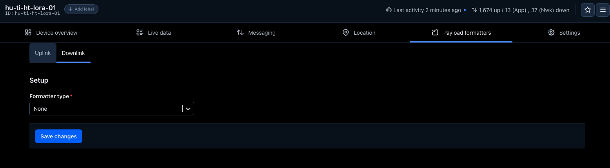
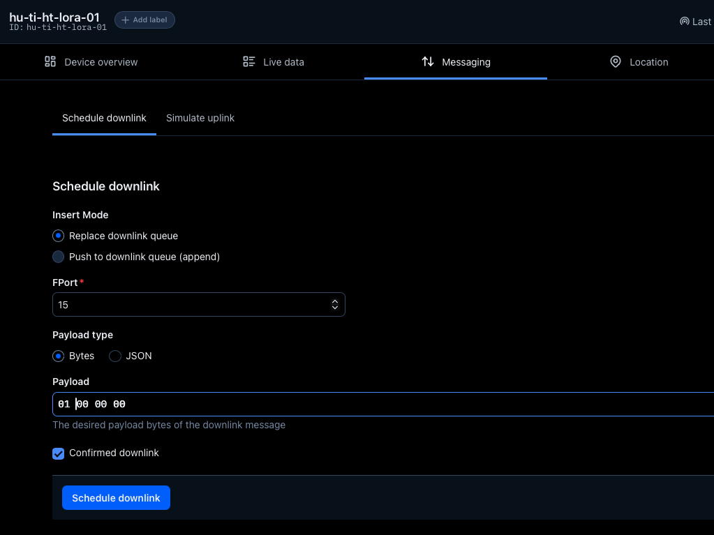
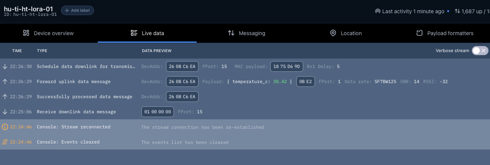

 

# LoRaWAN downlink <!-- omit in toc -->

### Inhoud <!-- omit in toc -->

- [Uplink en Downlink berichten](#uplink-en-downlink-berichten)
  - [Device Class](#device-class)
  - [Stoplicht aansluiten](#stoplicht-aansluiten)
  - [Stoplicht demo](#stoplicht-demo)
  - [Payload decoder](#payload-decoder)
  - [Downlink bericht](#downlink-bericht)
- [Maak je eigen protocol](#maak-je-eigen-protocol)
- [Referenties](#referenties)

---

**v0.1.0 ** Start document voor LoRa Downlink berichten en data protocol door HU IICT.

---

# Uplink en Downlink berichten

Een uplink bericht is waar jullie in de praktijk veel mee gaan werken. In je team moet je daar ook een berichtformaat voor defineren een soort van protocol. De payload moet in een bekend formaat data versturen. Dit leg je vast zodat ook bijvoorbeeld de opdrachtgever de end node kan integereren in zijn platform.

Dit prakticum gaat over defineren van een dataformaat. De opdracht bestaat uit het aansturen van een stoplicht met (payload)data in een downlink bericht.

Downlink berichtjes zijn data berichten die vanaf het platform worden verzonden naar de end node. Hoe deze downlink berichten worden verwerkt is afhankelijk van het type device dat je hebt gemaakt.

## Device Class

In LoRaWAN bestaan drie type devices [Class A, Class B en Class C](https://www.thethingsnetwork.org/docs/lorawan/classes/). Alle end nodes in LoRaWAN moeten Class A ondersteunen. 

## Stoplicht aansluiten

We gaan op de Raspberry Pi Pico W een stoplicht aansluiten. Het stoplicht wat jullie krijgen heeft al 'current limiting' resistors. Je kunt deze dus veilig aansluiten. De Wavshare module zorgt er wel voor dat we niet alle pinnen goed kunnen gebruiken. GPIO 16, 17 en 18 lijken veilig. Sluit ook Ground aan anders is er geen stroomkring.

## Stoplicht demo

Dit stoplicht demo is deels geimplementeerd. Je kunt de leds aan en uitzetten en je kunt de leds laten knipperen.

[LoRa stoplicht demo](./lora_stoplicht/lora_stoplicht.ino) .ino bestand

## Payload decoder

We defineren geen payload decoder we sturen namelijk raw data. 

## Downlink bericht

Onder Messaging kan je downlink berichten sturen. Kies FPort 15, formateer je payload. Wij sturen 4 Bytes. Ik heb confirm downlink aangevinkt.

Onder Live data kan je zien dat het berichtje klaarstaat. Waarom moet je nu wachten?

# Maak je eigen protocol

De stoplicht moet extra functionaliteit krijgen. Documenteer alles wat je doet en leg dit vast in je repo.

    De eerste byte is zo gedefinieerd:
     bit 0 = rood
     bit 1 = geel
     bit 2 = groen
    Dat betekent in binaire vorm:
     rood = 00000001 = hex 01
     geel = 00000010 = hex 02
     groen = 00000100 = hex 04

De opvolgende bytes zijn instructies voor het laten knipperen van een led. Laat de gele led 5 keer knipperen. Wat moet je sturen als downlink?

Wat stuur je als downlink bericht als je zowel geel als groen aan wilt hebben? Stuur en downlink bericht vanuit TTN en controleer of het werkt.

Waarom zou in de praktijk een Class A end node geen verstandige keus zijn voor een stoplicht?

De volgende opdrachten mag je samen met je team maken:
- Stel met een nieuw commando de duur (tijd in seconden) in dat een led aan gaat
- Stuur de huidige toestand van het stoplicht met een uplink bericht
- Verstuur een downlink bericht via de MQTT integratie
  
Optioneel:
- Maak een automatische verkeerslichtcyclus. Bijvoorbeeld: rood, rood + geel, groen, geel, rood. Het downlink bericht moet dit automatisch programma kunnen starten, stoppen, pauzeren en hervatten.

# Referenties

- MQTT (<https://en.wikipedia.org/wiki/MQTT>)
- LoRa (<https://en.wikipedia.org/wiki/LoRa>)
- The Things Network (<https://www.thethingsnetwork.org>)