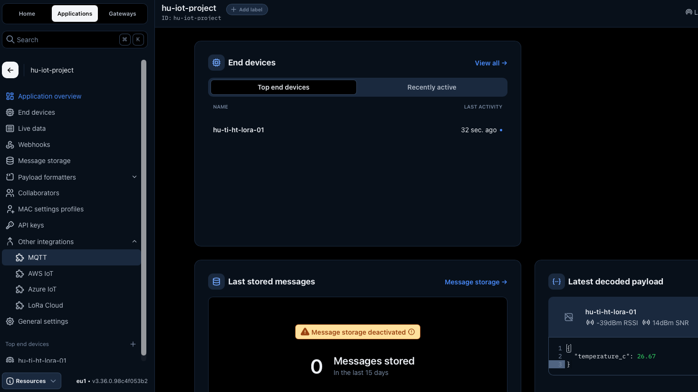
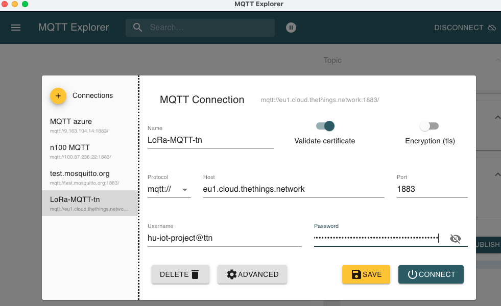

 [](logo-id)

# MQTT[](title-id) <!-- omit in toc -->

### Inhoud[](toc-id) <!-- omit in toc -->

- [MQTT Integratie met TTN](#mqtt-integratie-met-ttn)
  - [Testen van de MQTT verbinding](#testen-van-de-mqtt-verbinding)
  - [Programmatisch een koppeling maken](#programmatisch-een-koppeling-maken)
- [Installeer de Python MQTT library](#installeer-de-python-mqtt-library)
  - [Pas het voorbeeld script aan](#pas-het-voorbeeld-script-aan)
- [Referenties](#referenties)

---

**v0.1.0 [](version-id)** Start document voor MQTT integratie en installatie instructies door HU IICT[](author-id).

---

# MQTT Integratie met TTN

Login in op The Things Stack sandbox [eu1.cloud.thethings.network](https://eu1.cloud.thethings.network/console/)

Ga naar je applicatie. De applicatie van mij heeft de naam hu-iot-project. In het linker menu Kies voor 'Other integrations'.
Selecteer MQTT. 



De default instelling zijn goed. 
   
**Public address**:  eu1.cloud.thethings.network:1883  
**Public TLS address**: eu1.cloud.thethings.network:8883  
**Username**:  hu-iot-project@ttn  
**Password**: xxxxxxx(..)xxxxxxxx (mijn wachtwoord is hier verborgen in verband met veiligheid)  

Maak een API key aan door op de knop Generate new API key te klikken.  
De getoonde key moet je bewaren! En uiteraard niet openbaar zetten in je repo.

Is het niet gelukt of ben je de key vergeten dan kan je de key verwijderen onder je project-naam bij het menu item ‘API keys’. Voer de stappen dan opnieuw uit.

## Testen van de MQTT verbinding

We gaan nu eerst testen of we een MQTT verbinding kunnen opzetten. Daarvoor gebruiken we een gratis programmaatje [MQTT Explorer](https://mqtt-explorer.com) dat er voor Windows en MacOS is. Als je op MacOS werkt adviseer ik te installeren via de App Store.

Gebruik de credentials die je hebt gemaakt om een nieuwe verbinding (MQTT Connection) te maken. Vergeet niet voor het verbinden op Save te klikken zodat je later makkelijk opnieuw kunt verbinden. 



Je moet even geduld hebben en wachten op het volgende LoRa bericht. Kan je alle informatie terugvinden? Staat je sensor data er ook tussen?

## Programmatisch een koppeling maken

De volgende stap is data naar je eigen platform te krijgen. Daar zijn veel mogelijkheden voor. Bijvoorbeeld door een 'bridge' te maken naar je [eigen MQTT server](../../../software/communicatie/MQTT/README.md). Dat is iets wat je in je team kunt gaan opzetten.

Voor nu maken een eenvoudige koppeling met TTN MQTT uplink topic in Python. Met dit Ptyhon script lezen we temperatuur en dan rekenen we temperatuur om van Celsius naar Kelvin.

# Installeer de Python MQTT library
```bash
py -m pip install paho-mqtt
```

Ik moest mijn installatie van de MQTT library eerst updaten met:

```bash
py -m pip install --upgrade paho-mqtt
```

Nog geen pip? Dat kan je zo installeren (niet getest)

```bash
py -m ensurepip --upgrade
py -m pip --version
py -m pip install --upgrade pip
```

## Pas het voorbeeld script aan

Voeg de ontbrekende verbindingsgegevens aan in het volgende voorbeeldscript.

```Python
#!/usr/bin/env python3
"""
Simple TTN MQTT temperature subscriber.

- Connects to TTN MQTT
- Subscribes to uplink messages
- Reads temperature from decoded_payload
- Converts Celsius to Kelvin
- Prints the result to the console
"""

from __future__ import annotations

import json
import ssl
from typing import Any, Optional

import paho.mqtt.client as mqtt

# Configuration

TTN_MQTT_HOST = "eu1.cloud.thethings.network"
TTN_MQTT_PORT = 8883

APPLICATION_ID = "your-application-id"
TENANT_ID = "ttn"  # Usually "ttn" on The Things Network Cloud
API_KEY = "NNSXS.YOUR_API_KEY"

USERNAME = f"{APPLICATION_ID}@{TENANT_ID}"
TOPIC = f"v3/{APPLICATION_ID}@{TENANT_ID}/devices/+/up"

# Helpers

def find_temperature_c(decoded_payload: dict[str, Any]) -> Optional[float]:
    """
    Try a few common field names for temperature in decoded_payload.
    Returns the temperature in degrees Celsius if found, else None.
    """
    preferred_keys = [
        "temperature_c",
        "temperature",
        "temp",
        "temperature_0",
        "temperature_1",
        "temperature_2",
        "temperature_3",
        "temperature_4",
        "temperature_5",
    ]

    for key in preferred_keys:
        value = decoded_payload.get(key)
        if isinstance(value, (int, float)):
            return float(value)

    # Fallback: search for any key that starts with "temperature"
    for key, value in decoded_payload.items():
        if key.startswith("temperature") and isinstance(value, (int, float)):
            return float(value)

    return None


def celsius_to_kelvin(temp_c: float) -> float:
    """
    Convert degrees Celsius to Kelvin.
    """
    return temp_c + 273.15

# MQTT callbacks

def on_connect(
    client: mqtt.Client,
    userdata: Any,
    flags: dict[str, Any],
    reason_code: mqtt.ReasonCode,
    properties: Any,
) -> None:
    print(f"Connected to TTN MQTT with result: {reason_code}")
    client.subscribe(TOPIC, qos=0)
    print(f"Subscribed to topic: {TOPIC}")


def on_message(
    client: mqtt.Client,
    userdata: Any,
    msg: mqtt.MQTTMessage,
) -> None:
    try:
        payload = json.loads(msg.payload.decode("utf-8"))
    except Exception as exc:
        print(f"Invalid JSON received: {exc}")
        return

    device_id = (
        payload.get("end_device_ids", {})
        .get("device_id", "unknown-device")
    )

    uplink_message = payload.get("uplink_message", {})
    decoded_payload = uplink_message.get("decoded_payload", {})

    if not isinstance(decoded_payload, dict):
        print(f"[{device_id}] No decoded_payload found")
        return

    temperature_c = find_temperature_c(decoded_payload)

    if temperature_c is None:
        print(f"[{device_id}] No temperature field found in decoded_payload: {decoded_payload}")
        return

    temperature_k = celsius_to_kelvin(temperature_c)

    print("-" * 50)
    print(f"Device      : {device_id}")
    print(f"Topic       : {msg.topic}")
    print(f"Temperature : {temperature_c:.2f} °C")
    print(f"Kelvin      : {temperature_k:.2f} K")


# Main

def main() -> None:
    client = mqtt.Client(mqtt.CallbackAPIVersion.VERSION2)
    client.username_pw_set(USERNAME, API_KEY)
    client.tls_set(cert_reqs=ssl.CERT_REQUIRED)

    client.on_connect = on_connect
    client.on_message = on_message

    client.connect(TTN_MQTT_HOST, TTN_MQTT_PORT, keepalive=60)
    client.loop_forever()


if __name__ == "__main__":
    main()
```

Wat zie je? Wat zou een volgende stap kunnen zijn?

# Referenties

- MQTT (<https://en.wikipedia.org/wiki/MQTT>)
- The Things Network (<https://www.thethingsnetwork.org>)