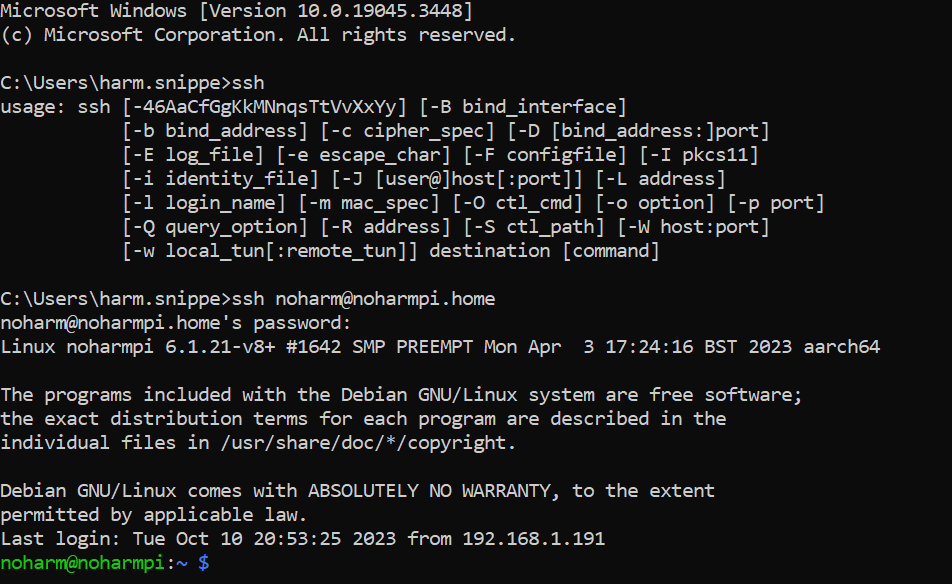
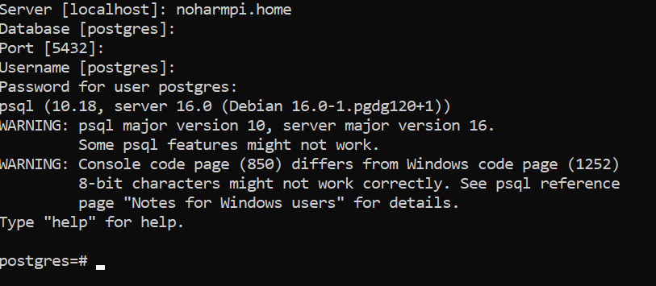

 [](logo-id)

# Raspberry Pi OS[](title-id) <!-- omit in toc -->

### Inhoud[](toc-id) <!-- omit in toc -->

- [Docker containers](#docker-containers)
  - [Data opslag](#data-opslag)
  - [Berichten service](#berichten-service)
  - [Visual coding](#visual-coding)
  - [Flask](#flask)
- [Referenties](#referenties)

---

**v0.1.0 [](version-id)** Start document voor Raspberry Pi en installatie instructies door HU IICT[](author-id).

---

### Inleiding

Dit is een algmene instructie voor het installeren van Raspberry Pi OS op een Raspberry Pi 3 of hoger. 

Voor deze installatie is gebruik gemaakt van de volgende hardware en software versies:

- Raspberry Pi 4 Model B
- Raspberry Pi Imager 1.7.5
- Windows 10 Enterprise
- Raspberry Pi OS (32-bit), released: 2023-05-03

Voor een nieuwe installatie van Raspberry Pi OS op je Raspberry Pi kan je gebruik maken van de Windows Raspberry Pi Imager: https://www.raspberrypi.com/software/


Download en installeer de image op een microSD kaart. Voor het schrijven vraag de software nog of je custom configuratie wil toepassen. Je kunt dan vooraf ssh activeren, een gebruiker aanmaken en wifi credentials opgeven.

### ssh verbinding

Maak met ssh verbinding met je Raspberry Pi.

**ssh < user >@< hostname or ip >**



### Update systeem

Voordat je verder gaat. Zorg dat je systeem up-to-date is:

```bash
sudo apt-get update && sudo apt-get upgrade
```

Om je systeem daarna weer wat op te schonen:

```bash
sudo apt autoremove
```

### Datum en tijd

Contreel datum, tijd en tijdzone.

```bash
timedatectl status
```

De Raspberry Pi 4 heeft geen hardware clock. Is er geen internet verbinding? Dan kan er geen tijdsynchronisatie plaatsvinden. Overweeg de installatie van een Real Time Clock (RTC).

### Sudo

Je hebt voor de meeste configuratie en executie momenten sudo toegang nodig.
```bash
sudo su
```

### IP adres opvragen

Om te controleren hoe je Raspberry Pi is verbonden gebruik het volgende commando.
```bash
ip a
```

## Docker containers

De Raspberry Pi 4 is de centrale hub voor het verwerken van sensor gegevens. Om efficient verschillende applicaties te installeren en te beheren gaan we gebruik maken van [Docker containers](../../Docker/README.md). Installeer Docker en Docker Compose om de volgende applicaties te installeren.

### Data opslag

Sensor data wil je opslaan om historische gegevens te kunnen opvragen en trends te kunnen ontdekken. Voor data opslag maken we gebruik van PostgreSQL. Maak eerst een folder voor dataopslag.

```bash
mkdir data
```

Start een docker container. Uiteraard niet met de volgende parameters. Pas de [parameters](../../Docker/README.md) aan voor je eigen project.

```bash
docker run --name postgres -d --restart unless-stopped -p 5432:5432 -e POSTGRES_PASSWORD=123456 -v ${PWD}/data:/var/lib/postgresql/data postgres:16
```

Controlleer de database verbinding bijvoorbeeld met SQL shell (psql) of pgAdmin.



### Berichten service

Om berichten uit te wisselen maken we gebruik van [MQTT](../../../software/communicatie/MQTT/README.md). Mosquitto is daar een veel gebruikte broker voor.

Maak eerst de volgende folders aan.

```bash
mkdir mosquitto
cd mosquitto
mkdir config
mkdir data
mkdir log
```

Maak een bestand **mosquitto.conf** aan in de config directory.
```bash
cd config
nano mosquitto.conf
```

Voeg de volgende inhoud toe.
```bash
allow_anonymous true
listener 1883
persistence true
persistence_location /mosquitto/data/
log_dest file /mosquitto/log/mosquitto.log
```

```bash
cd ../
docker run --name mqtt -d --restart unless-stopped -it -p 1883:1883 -p 9001:9001 -v ${PWD}/config/mosquitto.conf:/mosquitto/config/mosquitto.conf eclipse-mosquitto
```

Controleer de MQTT broker bijvoorbeeld met [MQTT Explorer](https://github.com/thomasnordquist/MQTT-Explorer).


### Visual coding

Voor het visueel programmeren en het maken van Inernet of Things (IoT) toepassingen kan je gebruik maken van [NodeRed](../../../software/visueel-programmeren/Node-RED/README.md).


```bash
cd ../
mkdir node_red_data
```

```bash
docker run --name nodered -d --restart unless-stopped -it -p 1880:1880 -v node_red_data:/data nodered/node-red
```

De grafische gebruikersinterface kan je nu met een browser bereiken op http://< your host ip adress >:1880

### Flask

Maak een webinterface voor je IoT oplossing met [Flask](../../../software/webserver/Flask/README.md).

## Referenties
- Raspberry Pi OS (<https://www.raspberrypi.com/software/>)
- Raspberry Pi Foundation (<https://en.wikipedia.org/wiki/Raspberry_Pi_Foundation>)
- Docker (<https://www.docker.com/>)
- Postgres (<https://www.postgresql.org/>)
- Flask (<https://pypi.org/project/Flask/>)