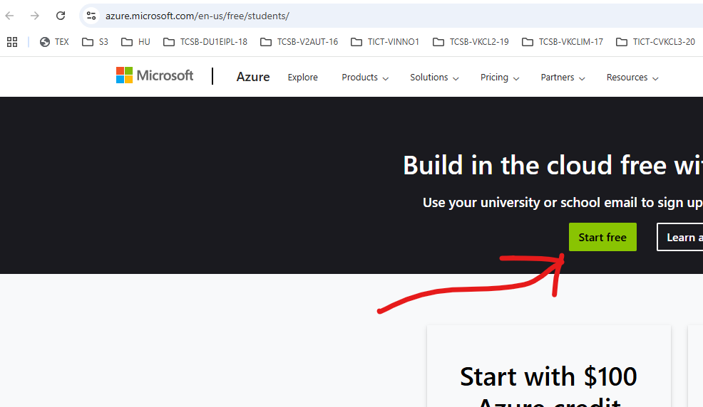

# Infrastructuur

## Installeren van een besturingssysteem. 

Voor jullie IoT-systeem heb je als team naast een werkende end node een back-end systeem en een front-end systeem nodig. Ergens wil je data opslaan en verwerken. Voor de gebruiker wil je de sensor data onstluiten via een dashboard.

Deze applicaties moeten ergens op een server komen te staan. Als team kan je de komende periode gebruik maken van een Raspberry Pi singleboardcomputer om een aantal IoT sofwarecomponenten te hosten. Het mag ook op een ander platform of via Azure. Als jullie alles maar goed documenteren.

## Voorbereiding

Ter voorbereiding kan je vast de [Raspberry Pi Imager](https://www.raspberrypi.com/software/) software op je computer installeren. De handleiding voor dit prakticum staat hier: [Raspberry Pi OS installeren](../../infrastructuur/OS/Raspberry-Pi-OS/README.md). Voeg tijdens de installatie ssh toe en iotroam WiFi. Heb je een werkende Raspberry Pi dan kan je verder gaan met het installeren van Docker en Docker containers.

Op basis van de MAC-adressen hebben alle Raspberry Pi 4 devices een mogelijkheid om van het iotroam WiFi netwerk gebruik te kunnen maken. Voor ieder team is er één Raspberry Pi 4 beschikbaar voor het project. Jullie zijn zelf verantwoordelijk voor deze hardware.

Maak je gebruik van Azure krijgen studenten een budget van 50 Euro per jaar. Ga naar [Azure](<https://azure.microsoft.com/en-us/free/students/>). Klik op de groene knop.

Kies voor een minimale VM en installeer bijvoorbeeld Ubuntu. **Stop altijd je services** en delete de VM na dit Semester. Anders ga je door je budget heen en dat heb je mogelijk weer nodig voor het volgende Semester.

## Na de les

Heb je een werkende Raspberry Pi 4 met een Operating System (OS) en een aantal Docker containers. Ieder team is verantwoordelijk voor de hardwareonderdelen. Deze hardwareonderdelen willen wij komend semester weer opnieuw kunnen gebruiken. Aan het eind van dit semester lever je de hardware weer in.

## Portfolio Tip

Maak een database aan om bijvoorbeeld sensor data in op te slaan. Maak een NodeRed implementatie om weer data op te vragen uit de database. 

## References

[RaspberryPI - Show IP and Time on LCD on startup](https://github.com/RickMageddon/RaspberryPI-LCD-IPonStartup)