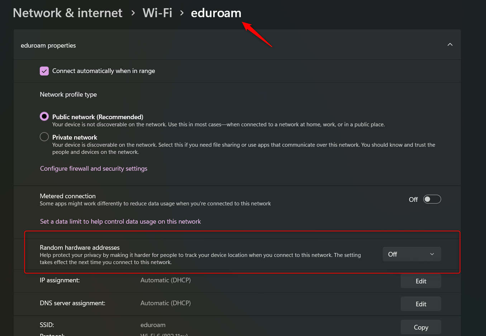

# Infrastructuur

- Docker & Docker containers
- Operating Systems & Raspberry Pi OS
- Postgres SQL en Node-Red

## Voorbereiding

In de vorige les hebben we een OS op de [Raspberry Pi computer](../../hardware-interfacing/embedded/computer/Raspberry-Pi/README.md) geinstalleerd en hebben jullie kennis gemaakt met [Docker containers](../../infrastructuur/Docker/README.md). Per team is er een centrale Raspberry Pi voor het ontvangen, opslaan en visualiseren van sensor-data.

## Dit hebben we in een vorige les gedaan

Installeer een [Operating System (OS)](../../infrastructuur/OS/Raspberry-Pi-OS/README.md) op de Raspberry Pi. Zorg dat de Raspberry Pi toegang heeft tot iotroam en benaderbaar is met ssh. 

Iotroam

Iotroam is een wifi netwerk is speciaal geschikt voor dit type apparaten en toepassingen. Mocht je veel problemen ondervinden zou je kunnen terugvallen op Eduroam of een eigen hotspot.

Tip! Vanaf Windows 11 is het mogelijk om gebruik te maken van Random Hardware Addresses. Dan werkt uiteraard de MAC filtering op het wifi netwerk niet. Zie onderstaand hoe je deze functionaliteit uit kunt zetten.

Gebruik eventueel dit script en de LCD opstelling om het IP adres van de Raspberry Pi te achterhalen [RaspberryPI - Show IP and Time on LCD on startup](https://github.com/RickMageddon/RaspberryPI-LCD-IPonStartup). Je kunt ook verbinding maken met de hostnaam van je device mits deze uniek is. 

## Tijdens de les

Installeer [Docker](../../infrastructuur/Docker/README.md) en start en configureer de volgende Docker containers: Postgres, [MQTT](../../software/communicatie/MQTT/README.md), [Node-RED](../../software/visueel-programmeren/Node-RED/README.md) en [Flask](../../software/webserver/Flask/README.md). De installatie instructies kan je [hier](../../infrastructuur/OS/Raspberry-Pi-OS/README.md) vinden.

Opdracht: Configureer Meshtastic zodat deze werkt met de door jullie gehoste MQTT server. Visualseer met Node-RED data van de BME280 sensor die is aangesloten op een van jullie nodes.

## Portfolio-Tip

Maak een verslag van de werkzaamheden. Vergeet geen beeldmateriaal te maken. Denk vast na over een data format voor de nog te configureren sensoren die jullie gaan aansluiten.
