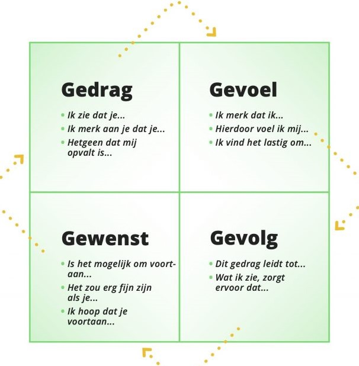

 

[1]

# Feedback geven en ontvangen

### Inhoud

- [Feedback geven en ontvangen](#feedback-geven-en-ontvangen)
    - [Inhoud](#inhoud)
  - [Een introductie](#een-introductie)
  - [Basis vaardigheden](#basis-vaardigheden)
  - [Toepassen](#toepassen)
  - [bronnen](#bronnen)

---

**v0.1.0 ** Start document voor feedback geven en ontvangen uitleg en voorbeelden door HU IICT.

---

## Een introductie

Als je aan de slag gaat voor een bedrijf zal je op verschillenden manieren feedback moeten kunnen geven, ontvangen en verwerken. Het uitgangspunt hierbij is altijd dat het gaat over de inhoud en nooit over de persoon. De basis vaardigheden wordt eerst toegelicht en daarna wordt een praktische methode beschreven die je zelf kan toepassen. 

## Basis vaardigheden
Feedback ontvangen kan soms spannend zijn, maar het is een belangrijk onderdeel van leren en met elkaar omgaan. De basis van goede feedback is altijd: wees duidelijk over de inhoud en vriendelijk voor de persoon.

Hard op de Inhoud: Vertel specifiek wat goed ging en waar er nog ruimte is voor verbetering. Focus op feitelijke dingen die je hebt gezien of gehoord, zodat het duidelijk is waar je het over hebt. 

Zacht voor de Persoon: Vermijd het geven van kritiek op wie ze als persoon zijn. Gebruik 'ik'-verklaringen om jouw gevoelens en ervaringen te delen, zodat het minder aanvoelt als een persoonlijke aanval.

Door dit te doen, maak je het makkelijker voor anderen om jouw feedback te begrijpen en ermee aan de slag te gaan. Het helpt een positieve sfeer te behouden en moedigt samenwerking aan.

## Toepassen
Er zijn heel veel verschillende manieren om goed feedback te geven. Een veel gebruikt model is het 4G model:

Gedrag:
  Begin met het benoemen van specifiek gedrag dat je hebt waargenomen. Wees concreet en vermijd vage generalisaties. Bijvoorbeeld, in plaats van te zeggen "Je communiceert slecht," zou je kunnen zeggen: "Tijdens de teamvergadering onderbrak je herhaaldelijk anderen terwijl ze spraken."

Gevoel:
  Uitdrukking geven aan gevoelens is cruciaal voor begrip. Deel je eigen gevoelens en gebruik 'ik'-verklaringen om de boodschap persoonlijker te maken. Zeg bijvoorbeeld: "Ik voelde me gefrustreerd tijdens de vergadering omdat ik het idee had dat mijn inbreng niet werd gehoord."

Gevolg:
 Bespreek de concrete gevolgen van het waargenomen gedrag. Dit helpt de ontvanger de impact van hun acties te begrijpen. Een voorbeeld hiervan zou zijn: "Doordat je anderen herhaaldelijk onderbrak, werd de flow van de vergadering verstoord en voelde ik mij minder betrokken."

Gewenst:
 Sluit af met het benoemen van het gewenste gedrag. Formuleer dit positief en moedig de ontvanger aan om verbeteringen aan te brengen. Bijvoorbeeld: "Ik kan mij beter concentren als we om de beurt praten en luisteren naar anderen."

Op deze manier kan je het gesprek dicht bij jezelf houden en voorkom je dat je op de persoon gaat spelen. Het is niet altijd makkelijk, mer weerstand moet vaak eerst overwonnen worden door een open gesprek.

## bronnen
[1] https://zelforganisatiefabriek.nl/wp-content/uploads/2021/01/4G-model-1024x683.jpg
 

