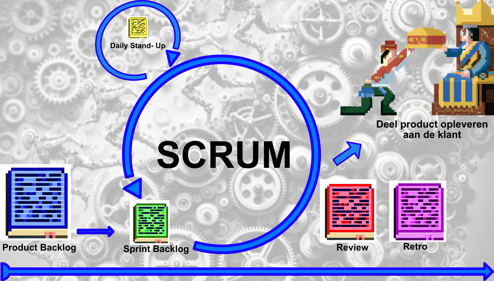
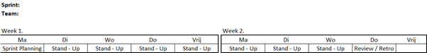

 

# Scrum

### Inhoud

- [Scrum](#scrum)
    - [Inhoud](#inhoud)
  - [Een introductie](#een-introductie)
  - [Onderdelen van Scrum](#onderdelen-van-scrum)
    - [De rollen binnen scrum](#de-rollen-binnen-scrum)
    - [Ondersteunende documenten](#ondersteunende-documenten)
    - [De scrum ceremonies](#de-scrum-ceremonies)
  - [Hoe gaan we scrum toepassen](#hoe-gaan-we-scrum-toepassen)
  - [Ondersteunende documenten](#ondersteunende-documenten-1)
  - [bronnen](#bronnen)

---

**v0.1.0 ** Start document voor scrum uitleg en voorbeelden door HU IICT.

---

## Een introductie

Samenwerken in projecten komt voor in alle organisaties en is vaak zelfs de basis waarop het werk wordt georganiseerd. Er zijn veel verschillende methoden om projecten te structureren. Een van de meest gebruikte vormen is Scrum. Binnen deze methodiek wordt een project beschreven vanuit het gezichtspunt van de uiteindelijke gebruiker. Deze gebruikersverhalen vormen de basis voor het opdelen van het werk in kleine taken.Deze taken worden vervolgens opgepakt in korte sprints waarbij elke team lid verantwoordelijk is voor een aantal taken. Aan het einde van de sprint wordt hiermee een (deel) product opgeleverd aan de eindklant en wordt er een voorstel gedaan voor de volgende sprint. Om ervoor te zorgen dat iedereen prettig kan werken wordt er ook aan het einde van de sprint binnen het team besproken hoe de samenwerking is gegaan.  

## Onderdelen van Scrum
Binnen scrum onderscheiden we een aantal rollen en een aantal activiteiten die worden uitgevoerd binnen het project. De activiteiten binnen het project worden ook wel ceremnonies genoemd omdat ze altijd via een vast patroon verlopen. Hierbij wordt er ook gebruikt gemaakt van een aantal vaste documenten. In dit hoofdstuk beschrijven we eerst de rollen en de ondersteunende documenten. Vervolgens koppelen we deze rollen en documenten aan de verschillende ceremonies. 

### De rollen binnen scrum
- productowner
De product owner (PO) is de opdrachtgever in het project. Met de PO wordt afgestemd wat er moet worden gemaakt en wanneer dit moet gebeuren. De PO bepaald dit dus niet alleen, maar in samenspraak met het team.

- De scrum master
De scrum master is vergelijkbaar met een aanvoerder in de sport. Dus niet niet een baas, maar een project lid die zorgt voor het goed lopen van de ceremnonies. Vaak is de scrum master wel het eerste aanspreekpunt voor de PO, maar dit hoeft niet.

- Het team
De belangrijkste rol binnen scrum is het team. In principe bepaald het team de gang van het project en wat er wanneer gebeurd. In de praktijk moet dit ook aangezien in het projectteam vaak de kennis zit. De PO heeft vaak niet de kennis en gaat alleen over het probleem dat moet worden opgelost. 

### Ondersteunende documenten
- Product backlog
Het product backlog is een verzamellijst van alle zaken die nog opgepakt gaan worden in het project. Om het document voor iedereen goed leesbaar te maken zijn de tickets opgeschreven in vorm van kleine verhaaltjes met als uitgangspunt de eindgebruiker. Het heeft meestal de vorm van Ik als X wil graag dit bereiken/gebruiken. Door het minder technisch te maken kan de PO actief meedenken over het project en kan ook bij eindgebruikers worden nagegaan of dat inderdaad is wat ze bedoelen. 

- Sprint backlog
In het sprint backlog worden de items opgenomen die in een sprint opgepakt zullen gaan worden. Deze grotere verhalen worden daarin opgesplitst naar kleinere taken zodat de voortgang dagelijks kan worden bijgehouden. Deze taken worden toegewezen aan de individuele projectleden. 

- Scrum board
Het scrumboard heeft als functie om de voortgang bij te houden. De backlog en de sprintplanning kunnen hierop worden opgenomen, maar in ieder geval de taken die worden opgepakt in de sprint staan erop. In een dagelijkse ceremonie worden hier de taken doorgezet van nog niet gestart naar klaar om op te leveren. Aan het eind van de sprint is het de bedoeling dat alle taken naar klaar zijn gegaan.

-Burn down chart
Naast dat taken worden doorgezet op het scrumboard wordt de voortgang vaak ook grafisch weergegeven in een burn down chart. Op deze grafiek staan op de X as de taken en op de Y as de tijd in dagen. Er wordt een lijn getrokken van linksboven naar rechtsonder. per dag wordt dan bijgehouden welke taken klaar zijn en zodoende kan er globaal worden weergegeven hoeveel taken er af zouden moeten zijn en hoeveel er nu af zijn. Let wel dit zijn geen harde cijfers, maar een globale lijdraad. Bij de review wordt de burn down chart getoond aan de PO.  

- Definition of done
De definition of done (DOD) is eigenlijk niet een apart document, maar de afspraken waaraan alle tickets moeten voldoen voordat ze als klaar kunnen worden gemarkeerd. Dit is erg belangrijk omdat dit nodig is om aan de PO aan te tonen dat iets daadwerkelijk klaar is.

-Defintion of fun
De defintion of fun (DOF) wordt direct afgeleid van het teamcontract. In de praktijk wordt deze meestal vastgesteld aan het begin van het project en ook niet alszodanig benoemt. Wel is het zo dat dit ook in de praktijk een van de basis elementen is van de retro. Je kan elkaar alleen houden aan afsrpaken die je hebt opgeschreven.  
  
### De scrum ceremonies 
- Sprint Planning
In de planning ceremonie wordt er bepaald wat er in de volgende sprint wordt opgepakt. Dit wordt gedaan door eerst een (grove) isnschatting te maken van hoeveel uren beschikbaar zijn. Vervolgens wordt er een selectie gemaakt van tickets vanuit het backlog. Om dit goed te kunnen doen wordt eerst per ticket bepaald hoeveel uren het team verwacht nodig te hebben. Als dit is gebeurd is worden de tickets opgedeeld in taken en worden deze opgenomen op het sprint backlog. 

- Daily-Stand up
Om de voortgang in de sprint te bewaken is er elke dag een kort moment om samen te komen met het team. Dit duurt meestal niet meer dan een kwartier. In dit kwartier geeft ieder project lid aan wat er is gedaan, wat er gaat worden gedaan en of er problemen zijn. Eventuele problemen worden niet direct geadresseerd (tenzij heel klein), maar worden buiten de stand-up opgepakt. Op basis van reacties wordt het scrumboard en de burn down chart bijgewerkt.  

- Review 
Aan het eind van sprint wordt het werk dat is gedaan en dat voldoet aan de DOD, officieel opgeleverd aan de PO. Deze accepteerd daarmee de voortgang. Als er items niet af zijn gekomen wordt dit ook toegelicht. Het team rond de presentatie af met een voorstel van tickets die ze verwachten op te gaan pakken in de volgende sprint. De PO kan hier op reageren en eventueel prioriteit geven aan andere tickets. De elementen van de review kunnen uiteraard op een andere volgorde gedaan en ook de vorm kan verschillen. Zo kan bijvoorbeeld de oplevering een fysiek product zijn, maar ook een presentatie of een andere vorm.

- Retro
Als afronding van de sprint voor team wordt ook een retro gehouden. In de retro wordt besproken hoe de samenwerking is gegaan. Dit gaat dus niet om de inhoud van het werk, maar enkle het proces. Als uitkomst kan het zijn dat er voor de volgende sprint een taak wordt opgeonomen op het bord om iets te verbeteren aan het proces. Ook kan een uikomst zijn dat er een aanpassing wordt gedaan aan de afpsraken van het samenwerken of dat de definition of done waar alle tickets aan moeten voldoen wordt aangepast. Dit laatste moet uiteraard ook met de PO worden afgestemd. Hoewel er dus maar drie mogelijke uiktomsten zijn voor de retro is er geen vast format voor het houden van een retro. 

## Hoe gaan we scrum toepassen

Hieronder staat een visuele representatie van het programma per sprint voor S2:

 
*Eerste sprint*

*Overige sprints*

Elke sprint begint met het maken van een planing voor de sprint. De eerste sprint wijkt af doordat deze start op een maandag. De sprints daarna starten op de donderdag direct na de review. In de planningsessie wordt het bord gevuld met taken door het team. Deze taken worden toegewezen aan de projectleden. De scrum master begeleid dit proces, maar het team bepaald wie welke taak krijgt. Als alle leden akkoord zijn wordt het aantal taken geregistreerd op de burn down chart en kan er gestart worden met de sprint. Elke dag daarna werkt elk teamlid autonoom of als de taak dat vereist samen. Om de voortgang te bewaken wordt elke dag een stand-up gehouden. De laatste dag van de sprint is de donderdag. Hier wordt in maximaal een uur de sprint opgeleverd aan de product owner in de review en doet het team een retro van een uur om het werkproces scherper te krijgen. **Let er op dat de uitkomst van de ceremonies vast staat, maar de vorm zeker niet!**  
Na het aflsuiten van de sprint wordt direct de nieuwe sprint opgestart. De informatie vanuit de review is dan nog vers en dat maakt het maken van de planning makkelijker.
De uitkomsten van de ceremonies worden tijdens de ceremonie vastgelegd in een kort document. Dit document wordt bij elkaar verzameld en dient als naslag werk voor het team en de PO. 

## Ondersteunende documenten
In de template staan de elementen beschreven die in de ceremonies moeten worden behandeld. Let op dat dit de vorm bepaald, maar enkel het resultaat beschrijft. 

[Sprint verslag](../Scrum/files/Sprint-verslag.md)

## bronnen
[scrum checklist](../Scrum/files/Scrum%20Checklist.pdf)

