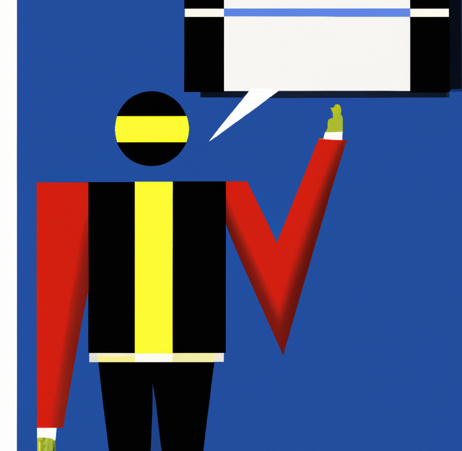

 

# Presenteren

### Inhoud

- [Presenteren](#presenteren)
    - [Inhoud](#inhoud)
  - [Een introductie](#een-introductie)
  - [Voorbereiding](#voorbereiding)
    - [Wat wil het publiek?](#wat-wil-het-publiek)
    - [Wat wil jij?](#wat-wil-jij)
    - [Know, Believe, Do](#know-believe-do)
  - [Tijdens de presentatie](#tijdens-de-presentatie)
  - [Gebruik van visuele ondersteuning](#gebruik-van-visuele-ondersteuning)
  - [Referenties](#referenties)

---

**v0.1.1 ** Start document voor presentatietechnieken uitleg en voorbeelden door HU IICT.

---

## Een introductie

Effectief leren communiceren naar een groep is iets waar vrijwel iedereen in zijn leven te maken mee krijgt. Voor veel mensen is dit een zeer stressvolle gebeurtenis [1]. Hoewel het altijd spannend is hoeft het voor veruit de meeste mensen geen groot probleem te zijn. In dit topic is informatie verzameld die gebruikt kan worden bij het effectief leren presenteren. De focus ligt hierbij niet op theorie, maar juist op het doen. We beginnen met de voorbereiding en bespreken daarna tips voor tijdens de presentatie. Het gebruik van visuele ondersteuning wordt apart beschreven in het topic [Gebruik van visuele ondersteuning](#gebruik-van-visuele-ondersteuning). 

## Voorbereiding
Bij het voorbereiden van een presentatie is het essentieel om een balans te vinden tussen de behoeften van het publiek, jouw eigen doelen en de gewenste acties die je wilt stimuleren. Hieronder worden de drie aspecten belicht: wat het publiek wil, wat jij wilt, en het belang van het kennen, geloven en doen.

### Wat wil het publiek?

Een succesvolle presentatie begint met een begrip van het publiek. Wat zijn hun verwachtingen, behoeften en zorgen? Door jezelf te verplaatsen in de schoenen van je toehoorders, kun je de juiste toon aanslaan en relevante informatie aanbieden. Dit vraagt om onderzoek en empathie. Stel jezelf vragen zoals: Wat zijn de achtergronden van mijn publiek? Wat motiveert hen? Welke informatie kan hen werkelijk boeien en nuttig zijn? Door deze vragen te beantwoorden, kun je een presentatie creëren die aansluit bij de specifieke interesses en verwachtingen van je publiek.

### Wat wil jij?

Een presentatie is niet alleen voor het publiek, maar ook voor jou als spreker. Wat wil je bereiken met je presentatie? Wil je informeren, overtuigen, inspireren of een call-to-action bewerkstelligen? Een helder begrip van je eigen doelstellingen stelt je in staat om de inhoud, de toon en de stijl van je presentatie effectief te bepalen. Wees duidelijk over de boodschap die je wilt overbrengen en welke impact je wilt hebben op je publiek. Dit zal je helpen om gericht en zelfverzekerd te presenteren, waardoor je publiek meer geneigd is om betrokken te blijven.

### Know, Believe, Do

Een krachtige presentatie gaat verder dan het overbrengen van informatie. Het draait om het creëren van een blijvende impact. Het model "Know, Believe, Do" is een handige leidraad om dit te bereiken. Eerst moeten je toehoorders de informatie begrijpen en 'weten' wat je presenteert. Vervolgens is het belangrijk dat ze het 'geloven' en een emotionele connectie voelen. Tot slot, wil je hen aanzetten tot 'doen' - actie ondernemen op basis van de informatie en overtuigingen die ze hebben verworven.

Zorg ervoor dat je aandacht besteedt aan de behoeften van je publiek, jouw eigen doelstellingen begrijpt en het "Know, Believe, Do"-model toepast om een blijvende indruk achter te laten. Het helpt om hiervoor een mindmap te maken. Zet je thema centraal en koppel daaraan drie lijnen. Een voor de inleiding. Een voor het middendeel en een voor het slot. 

In de inleiding start je met de behoefte van de toehoorder en koppel je items die daar mee te maken hebben. Bedenk hierbij of je een gode trigger kan verzinne zoals "Wellicht hebben jullie dit ook wel eens gehad". In het middendeel koppel je items die te maken hebben met jouw boodschap. Wat wil je dat iemand meenmeent? Ten slotte sluit je af met een call to action. Wat wil je dat de luisteraar gaat doen? Als je een beeld hebt gevormd met je mind map probeer dan het verhaal achter elkaar te vertellen op basis van de punten die je hebt opgeschreven. Als je tevreden bent over het verhaal dan kan je een presentatie gaan maken.   

## Tijdens de presentatie
Als je voor een publiek staat, is het cruciaal om je boodschap duidelijk over te brengen en de aandacht vast te houden. Hier zijn enkele praktische tips om jouw presentatie krachtiger en boeiender te maken:

Houd het Kort en Simpel:
- Beperk je tot de kern van je boodschap.
- Vermijd overbodige details en jargon.
- Maak gebruik van eenvoudige taal om de boodschap helder over te brengen.

Maak het Overtuigend:
- Ondersteun je argumenten met feiten en voorbeelden.
- Gebruik overtuigende taal en vermijd twijfelachtige uitdrukkingen.
- Bouw een logische en samenhangende structuur op.

Maak het Persoonlijk:
- Vertel verhalen of voorbeelden die jouw boodschap onderstrepen.
- Maak oogcontact en richt je rechtstreeks tot je publiek. 
- Laat je persoonlijkheid doorschemeren om een connectie te creëren.

Gebruik Plaatjes en Herkenningspunten:
- Integreer visuele elementen zoals grafieken, afbeeldingen of korte video's.
- Maak gebruik van herkenbare voorbeelden om complexe ideeën te verduidelijken.
- Visuele ondersteuning kan de boodschap beter verankeren in het geheugen van je publiek.
- Pas op met tekst. Je wil niet dat mensen gaan lezen. 

Ontdek Jouw Stijl:
- Wees authentiek en trouw aan jezelf.
- Experimenteer met verschillende presentatiestijlen om te ontdekken wat het beste bij jou past.
- Pas je stijl aan aan het onderwerp en het publiek.

Lichaamstaal:

Gebruik je Handen:
  - Gebruik gebaren om je woorden te benadrukken, maar overdrijf niet.
  - Vermijd nervositeit door je handen nuttig in te zetten.

Houding:
  - Sta rechtop met een open houding om zelfvertrouwen uit te stralen.
  - Vermijd monotone bewegingen en blijf dynamisch.
  - Kijk niet teveel naar je eigen presentatie op het scherm en als je het doet doe het dan functioneel.
  
  Stem:
  - Varieer in toonhoogte en tempo om de aandacht vast te houden.
  - Let op je stemvolume en pas dit aan aan de ruimte en het publiek.

## Gebruik van visuele ondersteuning
Het is vaak een goed idee om je presentatie visueel te ondersteunen. Dit is vaak met presentatie software, maar het kan heel verfrissend zijn om iets heel anders te doen. Een voorbeeld is bijvoorbeeld fysieke objecten mee te nemen. Met bord werken en live schetsen. Dingen opplakken. Als je toch bijvoorbeeld powerpoint wil gebruiken kijk dan vooral even naar het filmpje over death by powerpoint[3] en lees de onderstaande tips. Een andere vorm van presenteren is de [posterpresentatie](poster.md).

Houd het Eenvoudig en Visueel Aantrekkelijk:
  - Beperk de hoeveelheid tekst op elke dia. Gebruik korte zinnen of bulletpoints.
  - Kies een duidelijk leesbaar lettertype en zorg voor voldoende contrast tussen tekst en achtergrond.
  - Integreer visuele elementen zoals afbeeldingen, grafieken of iconen om complexe informatie te verduidelijken.

Consistentie in Ontwerp en Stijl:
  - Gebruik een consistente lay-out en stijl voor al je dia's.
  - Houd kleuren, lettertypen en achtergronden uniform om een professionele uitstraling te behouden.
  - Zorg voor een logische en gestructureerde volgorde van de dia's.

Beperk Animaties en Overgangen:
  - Wees terughoudend met het gebruik van animaties en overgangseffecten.
  - Subtiele overgangen en eenvoudige animaties kunnen de presentatie verlevendigen, maar overdrijf niet.
  - Zorg ervoor dat de gekozen effecten de boodschap versterken en niet afleiden.

Focus op Kernpunten:
  - Elke dia moet één kernpunt of boodschap bevatten.
  - Vermijd overvolle dia's met te veel informatie.
  - Gebruik de dia's als visuele ondersteuning en niet als een vervanging voor je mondelinge presentatie.

Interactie en Betrokkenheid Stimuleren:
  - Voeg interactieve elementen toe, zoals quizvragen, polls of korte discussiemomenten.
  - Gebruik PowerPoint als een hulpmiddel om de betrokkenheid van het publiek te vergroten, niet als een statisch medium.
  - Laat ruimte voor vragen en discussie aan het einde van de presentatie.

## Referenties

[1] J. Elliott and . J. L. Chong, "Presentation Anxiety: A challenge for some students and a pit of despair," [Online]. Beschikbaar: [http://www.isana.org.au/files](http://www.isana.org.au/files).

[2] https://enterprisersproject.com/article/2018/9/7-ted-talks-how-improve-your-presentations

[3] https://www.youtube.com/watch?v=Iwpi1Lm6dFo Death by powerpoint
