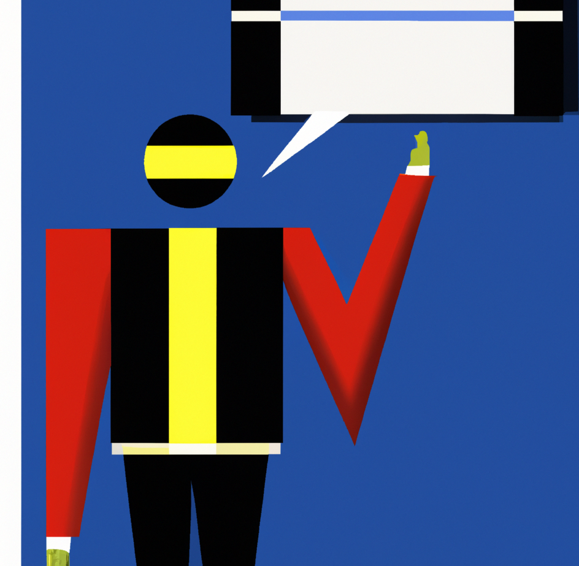

 

# Presenteren

### Inhoud

- [Presenteren](#presenteren)
    - [Inhoud](#inhoud)
  - [Een introductie](#een-introductie)
  - [Ontwerp](#ontwerp)
  - [Inhoud](#inhoud-1)
  - [Technische tips](#technische-tips)
  - [Referenties](#referenties)

---

**v0.1.0 ** Start document voor het maken van een poster door HU IICT.

---

## Een introductie

Een presentatie kan ook in de vorm van een poster. Steeds vaker komen we posterpresentaties tegen, op school, op het werk. Kort gezegd houdt dit in dat de hoofdlijnen van het onderzoek of project in tekst en afbeeldingen op een poster worden gepresenteerd. De poster wordt vaak tijdens een congres of symposium opgehangen. Een posterpresentatie is een laagdrempelige manier om onderzoeksresultaten of je project compact en aantrekkelijk te verpakken. Vaak wordt een groot formaat poster afgedrukt, A0 formaat. We maken tijdens dit semester kennis met het maken en presenteren van een poster. De poster op A4 formaat moet gereed zijn tijdens de project presentaties.

## Ontwerp

- Oriënteer je op voorbeelden. Vaak hangen deze in gangen van opleidingsinstituten, maar op het internet zijn ook veel voorbeelden te vinden.

- Informeer vooraf bij de organisatie of docenten welke voorschriften of richtlijnen gelden voor format, omvang, staand/liggend formaat et cetera.

- Informeer hoe de poster zal worden opgehangen: zijn er posterborden beschikbaar, wat voor bevestigingssysteem zit daarop?

- Wees selectief. Overweeg zorgvuldig wat de kern van je boodschap is. Laat details weg en beperk de tekstuele informatie tot een minimum.

- Een poster is primair een visueel medium; kies daarom krachtige illustraties.

- De poster moet zelf het werk kunnen doen: hoewel je je poster meestal mondeling zult kunnen toelichten, zal je poster ook vaak te bezichtigen zijn als je er niet bent om uitleg te geven.

- Zorg voor een aandachttrekkende focus: een opvallend beeld of een pakkende tekst.

- Maak vooraf een schets. Ontwerp een evenwichtige compositie met een duidelijke 'leesrichting' en kies per tekstblok of illustratie één helder thema.

- Wees voorbereid op een mondelinge toelichting en neem kopieën van je poster of je abstract (samenvatting) mee voor geïnteresseerden.

## Inhoud

Wat in ieder geval op de poster niet mag ontbreken:
- Titel: korte aandachttrekkende titel die de lading dekt.
- Auteurs: de namen van de auteurs, projectnaam/onderwerp (of de naam van de cursus) en de datum.
- Onderwerp: heldere omschrijving van het onderwerp/project, eventueel in vragende vorm.
- Werkwijze: korte, krachtige beschrijving van de aanpak.
- Resultaten: deze worden in de vorm van ontwerp, modellen, Proof of Concept (PoC), of tabellen/grafieken gepresenteerd. Zo nodig worden ze voorzien van een toelichting.
- Discussie en conclusie: ook hier is het belangrijk dat zo bondig mogelijk wordt geformuleerd!

## Technische tips

- Hanteer voor de tekstblokken lezersgerichte taal, maar in compacte, korte zinnen.

- Zorg dat je illustraties in een oogopslag te begrijpen zijn; vereenvoudig grafieken zo nodig en zorg voor een legenda.

- Voor lezers die op circa 2 meter afstand langslopen, is een minimale lettergrootte van 18 punts vereist.

- Je kunt je poster behalve met plak- en knipwerk ook met Microsoft Powerpoint ontwerpen en eventueel uitvoeren. Bedenk wel vooraf of het afdrukken van je PowerPoint-poster op het gewenste formaat (A1, A2?) in verband met de kosten haalbaar is.

## Referenties

[1] © 2002 | RUG, Faculteit der Letteren, project Communicatieve Vaardigheden. Geraadpleegd via: https://www.rug.nl/language-centre/communication-training/academic/hacv/handboek/mondeling/student/posterpresentatie