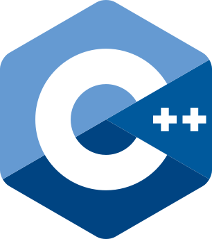

 

# Deprecated Feature Notice
This page will be removed because we do not use the do-while loop in our lessons. Please refer to [do-while at cppreference](https://en.cppreference.com/cpp/language/do) for explanation of the do-while loop.

# do-while <!-- omit in toc -->

### Inhoud <!-- omit in toc -->

- [Deprecated Feature Notice](#deprecated-feature-notice)
  - [Introductie](#introductie)

## Introductie

C++ kent een do-while-loop. Deze behandelen we niet in de les (reader), maar deze kan soms wel handig zijn.

"The do statement is always executed at least once, even if the expression always yields false. If it should not execute in this case, a while or for loop may be used."

Voor meer informatie over de do-while-loop zie de cppreference:
[do-while at cppreference](https://en.cppreference.com/cpp/language/do).
