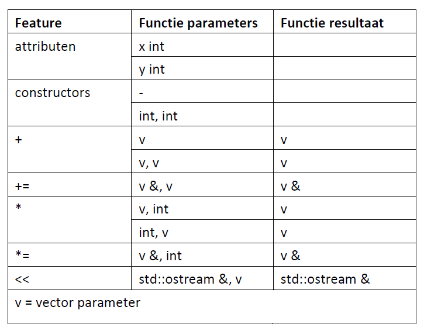

# OO - Classes & operatoren

<!-- Zorg dat de opdrachtnaam overeenkomt met de naam van de opdracht in Canvas. Dit is om de tooling voor het controleren van de deadline makkelijker te maken, maar het maakt het voor studenten ook overzichtelijker. -->

## Omschrijving
Deze oefening betreft een **opdracht**, dit betekent dat wij dit een belangrijke opdracht vinden en dat deze dus zwaarder meeweegt voor je portfolio.

- Schrijf een *vector klasse* (.hpp en .cpp file) met de functionaliteit die aangegeven is in de onderstaande tabel. Je mag daarvoor code uit de md-files en de voorbeelden kopiëren. 
- Geef aan waar je je code hebt gevonden.
- De eerste parameter in een operator als onderdeel van een class is impliciet. Zie: [Belangrijkste operatoren](https://github.com/HU-TI-DEV/TI-S2/blob/main/software/c%2B%2B/oop-concepten/operatoren/meer-operatoren.md#tabel-belangrijkste-operatoren)

> [!WARNING]
> Let op: 'jouw' vector-klasse is een heel andere vector-klasse dan de `std::vector` klasse. De `std::vector` is vergelijkbaar met een array of lijst en bedoeld voor opslag. De *in deze opdracht* gevraagde vector-klasse is vergelijkbaar met een coördinaat. Helaas heten ze allebei vector. Zie ook: [Vector, wikipedia](https://en.wikipedia.org/wiki/Vector)

NB: `v` is in deze tabel gelijk aan een instance van `vector`

*Figuur: Functionaliteiten voor een vector of coördinatenpaar*

### Gebruik van AI
Voor deze opdracht mag je **geen** generatieve AI gebruiken. 

## Opleveren

### Inleverbox

<!-- Deze kan door het script dat de deadlines controleert hier automatisch geplaatst worden-->

### Deadline

Voor deze opdracht heb je ongeveer een week. Zie de inleverbox op Canvas voor de exacte deadline.

<!-- Écht controleren of de deadline goed staat is helaas onmogelijk (tenzij we dit ieder half jaar willen hardcoden). Wat we wel kunnen doen is kijken of de deadline ná de datum staat waarop de opdracht is uitgegeven (via het rooster, datum van bijbehorende les controleren t.o.v. deadline op Canvas) en of de deadline binnen een gegeven range na die les valt. Alternatief zouden we natuurlijk de deadline uit Canvas kunnen uitlezen en hier automatisch laten invullen, maar het originele probleem is natuurlijk dat dat steeds niet goed ging -->

### Criteria

- Je code werkt volgens de eisen uit de omschrijving
- Je code is opgedeeld in .hpp en .cpp bestanden
- Er is een main.cpp aanwezig waarin je de code test

Bij deze opdracht kijken wij vooral naar je begrip van de onderliggende concepten. Wij verwachten dat je inhoudelijke vragen over de code kunt beantwoorden en eventueel kleine aanpassingen aan de code kunt doen tijdens het aftekenen bij de docent.

### Wat in te leveren

- Een link naar de opdracht in je persoonlijke GitHub repository
- Alle nodige .cpp en .hpp files om je code uit te kunnen voeren en te kunnen testen

### Feedback verzamelen
Voor feedback op deze opdracht is aftekenen in de les vereist.

## Leeruitkomsten

Deze opdracht draagt bij aan de leeruitkomsten LU1 (Onderzoekend vermogen) en LU8 (Realiseren).