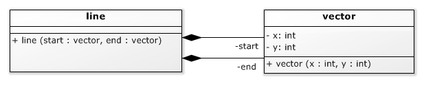

# Abstracte Data Typen (ADTs)(title-id) <!-- omit in toc -->

### Inhoud[](toc-id) <!-- omit in toc -->
- [Abstracte Data Typen (ADTs)](#abstracte-data-typen-adts)
  - [Wat is een ADT?](#wat-is-een-adt)
  - [Getters en setters](#getters-en-setters)
  - [Getters en setters](#getters-en-setters-1)
  - [Public attributes vs. getters en setters](#public-attributes-vs-getters-en-setters)
    - [Best practices attributen](#best-practices-attributen)
    - [Vector-klasse met publieke attributen](#vector-klasse-met-publieke-attributen)


## Abstracte Data Typen (ADTs)
Behandelde onderwerpen
- ADTs
- Public, of get/set

In andere files vind je informatie over:
- [Operatoren en overloading](../operatoren/README.md)
- [Overloading, meerdere constructors](../operatoren/constructor.md)
- [Default parameterwaarden](../operatoren/constructor.md#default-parameter-waarden)
- [Operatoren als methoden of als losse functies]()
- [Lijst van operatoren en hun prioriteiten]()
- [Vuistregels voor user-defined operatoren]()

[TODO: links aanvullen]

### Wat is een ADT?
Een **Abstract Data Type (ADT)** is:
- een door de gebruiker geschreven datatype 
- dat zich zo veel mogelijk gedraagt en gebruikt kan worden als één van de ingebouwde datatypen (int, float, etc.), 
- en daarbij zijn implementatie verbergt.

### Getters en setters
Tot nu toe hebben we, om een plaats op een scherm aan te geven, steeds twee integer waarden gebruikt. Dit leidt tot lange parameter- en attribuutlijsten, en als we willen rekenen met zulke coördinaten (bv. twee coördinaten bij elkaar optellen) dan moeten we aparte bewerkingen doen op de x en y elementen.

```cpp
class line {
private:
  int start_x;
  int start_y;
  int end_x;
  int end_y;
public:
  . . .
  // move the line
  void shift( int x, int y ){
    start_x += x;
    start_y += y;
    end_x += x;
    end_y += y;
  }
};
```
*Codevoorbeeld 06-01 - Een lijn klasse met een shift() functie*

Om een plaats op een scherm aan te geven is het handig om een *vector klasse* te maken die een x- en y-coördinaat bevat. Een lijn kan worden geimplementeerd met twee van zulke vectoren: 
- het *startpunt* en 
- het *eindpunt* van de lijn.

*N.B. De hier geintroduceerde vector-klasse is een andere vector dan de std::vector<>. Misschien is het goed om van onze 'lijn-vector' in de toekomst een 'lijn-coordinate' klasse te maken? Het gebruik van meerdere vector-klassen maakt het begrip 'namespace' wel snel belangrijk en duidelijk.*


*Image: UML voor een lijn klasse die twee vectoren bevat* 

```cpp
class vector {
private:
  int x;
  int y;
public:
  vector( int x, int y ):
    x( x ), y( y )
  {}
};

class line {
private:
  vector start;
  vector end;
  . . .
};
```
*Codevoorbeeld 06-02 - Een vector klasse, en een lijn klasse met vectoren i.p.v. losse integers*

### Getters en setters
Omdat de x en y *private* zijn moeten we nog wat aanpassingen maken om er nuttig gebruik van te kunnen maken. Een manier is om zogenaamde getter en setter methoden toe te voegen: klasse functies die als enige taak hebben de waarde van een privé attribuut op te halen of te wijzigen.

```cpp
class vector {
private:
  int x;
  int y;

public:
  . . .
  int x_get(){ return x; }
  int y_get(){ return y; }
  void x_set( int new_x ){ x = new_x; }
  void y_set( int new_y ){ y = new_y; }
};

vector a( 1, 2 ), b( 3, 4 );

// add b to a
a.x_set( a.x_get() + b.x_get() );
a.y_set( a.y_get() + b.y_get() );
```
*Codevoorbeeld 06-03 - Vectoren bij elkaar optellen door middel van getters en setters*

### Public attributes vs. getters en setters
In plaats van het gebruik van getters en setters, kunnen we de attributen x en y publiek toegankelijk te maken. Dit maakt het werken met een locatie object veel makkelijker, maar het datatype is nu wel een belangrijk deel van zijn ‘abstractie’ kwijt:
- We kunnen nu niet meer de *implementatie* van de klasse veranderen (bv. van twee integers naar cartesische coördinaten: een hoek en een afstand) *zonder dat dit gevolgen heeft voor de gebruikers van de klasse*.
- We kunnen geen *samenhang* tussen de attributen meer garanderen. Als we bv. aan een ‘kleine’ vector de eis willen stellen dat de afstand tot de oorsprong maximaal 100 is, dan zouden we die met x_set() en y_set functies kunnen afdwingen: als de afstand groter zou worden, dan wordt de waarde niet veranderd, of er wordt een foutmelding gegeven. Met publieke attributen kan dit niet meer.

#### Best practices attributen
De keuze tussen ofwel publieke attributen, ofwel getters en setters, is lastig. Er zijn in de software engineering verschillende **meningen** hierover, variërend van 
- ‘altijd alle attributen public maken’ (dit is in feite zo in Python) tot 
- ‘altijd getters en setters gebruiken’ (deze mening komt veel voor onder bv. Java programmeurs).

**Tips**

Als je in een getter of setter *meer doet dan alleen de waarde ophalen of wegschrijven*, is het duidelijk dat je geen publieke attributen moet gebruiken. 
Als dat niet zo is, dan moet je het gemak van publieke attributen afwegen tegen de toekomstige flexibiliteit die getters en setters bieden. 
Helaas laat de toekomst zich lastig voorspellen.

#### Vector-klasse met publieke attributen
Voor de vector klasse is besloten om de x en y attributen publiek te maken, omdat
- er in de getters/setters niets anders gebeurt dan de waarde opvragen en wegschrijven, en
- de kans dat er ooit overgeschakeld zal worden op een andere representatie te verwaarlozen is, want de pixels op een klein grafisch scherm worden altijd aangeduid met integer coördinaten.

*N.B. Helemaal sluitend is dit argument niet, want op een kleine processor en met een klein scherm is het wellicht beter om ruimte te besparen door 8-bit waarden op te slaan in plaats van integers die minimaal 16 bit zijn. En op grotere systemen is het soms juist handiger om doubles te gebruiken voor schermcoördinaten, omdat je dan met meer dan pixel-nauwkeurigheid kan rekenen voor de plaats van een object.*

```cpp
class vector {
public:
  int x;
  int y;
  . . .
};

vector a( 1, 2 ), b( 3, 4 );
// add b to a
a.x += b.x;
a.y += b.y;
```
*Codevoorbeeld 06-04 - Vectoren bij elkaar optellen via publieke attributen*