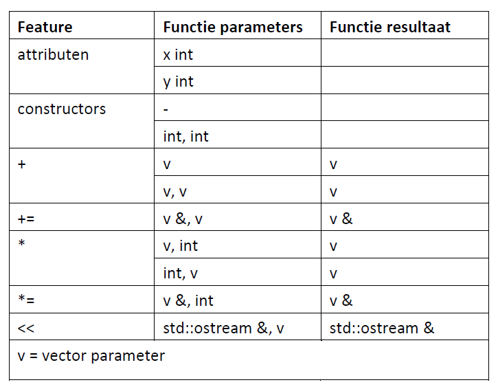

# Opdracht ADT:vector

### Inhoud
- [Opdracht ADT:vector](#opdracht-adtvector)
    - [Inhoud](#inhoud)
      - [Opdracht 2.4A Klasse en operatoren](#opdracht-24a-klasse-en-operatoren)
      - [Opdracht 2.4B - Doxygen (deze opdracht volgt nog)](#opdracht-24b---doxygen-deze-opdracht-volgt-nog)
      - [Opdracht 2.4C en 2.4D - Catch2 (deze opdrachten volgen nog)](#opdracht-24c-en-24d---catch2-deze-opdrachten-volgen-nog)

#### Opdracht 2.4A Klasse en operatoren
- Schrijf een *vector klasse* (.hpp en .cpp file) met de functionaliteit die aangegeven is in de onderstaande tabel. Je mag daarvoor code uit de md-files en de voorbeelden kopiëren. 
- Geef aan waar je je code hebt gevonden.

Let op: 'jouw' vector-klasse is een heel andere vector-klasse dan de `std::vector` klasse. De `std::vector` is vergelijkbaar met een array of lijst en bedoeld voor opslag. De *in deze opdracht* gevraagde vector-klasse is vergelijkbaar met een coördinaat. Helaas heten ze allebei vector. Zie ook: [Vector, wikipedia](https://en.wikipedia.org/wiki/Vector)

*Tabel: Functionaliteiten voor een vector of coördinatenpaar*

#### Opdracht 2.4B - Doxygen (deze opdracht volgt nog)

#### Opdracht 2.4C en 2.4D - Catch2 (deze opdrachten volgen nog)
