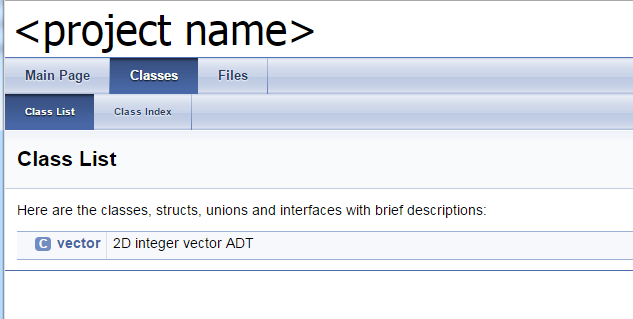
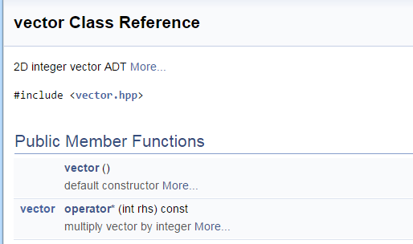
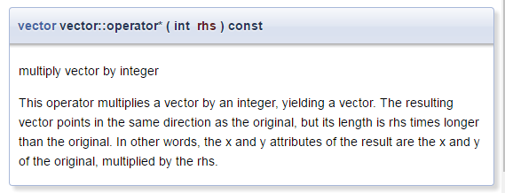

# Doxygen [](title-id)

## Inhoud[](toc-id)
- [Doxygen ](#doxygen-)
  - [Inhoud](#inhoud)
    - [Doxygen](#doxygen)
    - [Werkwijze voor luie documenteurs](#werkwijze-voor-luie-documenteurs)
    - [Werkwijze Doxygen](#werkwijze-doxygen)
      - [Doxyfile](#doxyfile)
      - [Runnen en uitvoer](#runnen-en-uitvoer)
      - [Excuus-documentatie](#excuus-documentatie)
      - [Tips](#tips)
      - [Beschrijving per parameter](#beschrijving-per-parameter)
    - [Meer mogelijkheden](#meer-mogelijkheden)
    - [Installatie van Doxygen](#installatie-van-doxygen)


### Doxygen

Om een library te kunnen gebruiken moet je weten wat je met de verschillende onderdelen ervan kunt doen. Je kunt natuurlijk de code gaan lezen om dit uit te vinden, maar het is handiger als de onderdelen van de library die voor extern gebruik bedoeld zijn,  **gedocumenteerd** zijn in een overzichtelijk formaat. 

### Werkwijze voor luie documenteurs
Programmeurs zijn lui, dus ze hebben tools uitgevonden die met een minimale inspanning een redelijke library documentatie kunnen opleveren. De truc hierbij is dat de tool zoveel mogelijk informatie uit de code (hpp file) zelf haalt (bv. de headers van de functies, en de onderlinge relaties tussen klassen), en dat de programmeur commentaar toevoegt dat door de tool wordt herkend en meegenomen.

### Werkwijze Doxygen
Doxygen is een *command-line tool* die je moet runnen 
- in de directory waar de header files staan voor de documentatie die je wilt genereren.
- In diezelfde directory moet een Doxyfile staan 
- die specificeert hoe de documentatie gegenereerd wordt. 

#### Doxyfile
De Doxyfile is een lange text file met heel veel uitleg. In de meeste gevallen zijn de defaults die er in staan prima. 

#### Runnen en uitvoer
Als je doxygen runt (met de Doxyfile die bij de voorbeelden zit) wordt een subdirectory html aangemaakt met daarin de documentatie. Het startpunt van de documentatie is de `index.html` file in die subdirectory.

- In de header files - waarvoor documentatie gegenereerd moet worden - moet commentaar staan dat begint met `///`. 
- Bovenin de file moet een regel `///@file` staan om aan te geven dat deze file Doxygen input is. 
- Bij alle te documenteren onderdelen (namespaces, klassen, niet-privé attributen en functies, losse functies, losse variabelen) zet je
  - `/// \brief`, 
  - gevolgd door een regel die in telegramstijl (geen grammaticaal volledige zin) aangeeft *wat het onderdeel doet*. Deze regel komt terecht in een overzicht van alle onderdelen, dus een lezer moet er snel uit kunnen opmaken of hij het onderdeel wil gaan gebruiken.
  - `/// \details`, 
  - gevolgd door een stuk text (met volledige zinnen) dat aangeeft *hoe het onderdeel gebruikt moet worden*. 

Dit moet genoeg informatie bevatten voor een gebruiker om het onderdeel te kunnen gebruiken. Hoeveel dat is hangt af van de complexiteit van (het gebruik van) het onderdeel. In heel eenvoudige gevallen is de naam en de telegramstijl regel al voldoende en kun je dit details-stuk weglaten.

#### Excuus-documentatie
Helaas zie je, vooral in one-(hu)man open-source projecten, nogal eens ‘excuus-documentatie’ die is gegenereerd uit alleen de declaraties, zonder toegevoegd commentaar. Daar heeft dus niemand iets aan.

#### Tips
- De header files kunnen ook ergens anders staan, maar dan moet je de Doxyfile aanpassen.

```c++
/// @file
/// \brief
/// 2D integer vector ADT
/// \details
/// This is 2D vector ADT that stores its two components as (signed) integers.
/// The x and y components are public attributes.
/// The appropriate constructors and operators are provided.
class vector {
public:

  /// \brief
  /// default constructor
  /// \details
  /// This constructor does not initialize the x and y attributes.
  vector();

  /// \brief
  /// multiply vector by integer
  /// \details
  /// This operator multiplies a vector by an integer, yielding a vector.
  /// The resulting vector points in the same direction as the original,
  /// but its length is rhs times longer than the original.
  /// In other words, the x and y attributes of the result are
  /// the x and y of the original, multiplied by the rhs.
  vector operator*( int rhs ) const;

  ...
};
```
*Codevoorbeeld 10-01 - Een deel van een met Doxygen gedocumenteerde vector declaratie*

#### Beschrijving per parameter
Voor functies met veel parameters kun je ook een *beschrijving per parameter* geven.
Doxygen geneert hieruit een overzicht van alle (in dit geval dus maar één) klassen. De <project name> staat in de Doxyfile, die kun je daar dus aanpassen.


Voor iedere klasse genereert Doxygen een pagina met bovenaan de beschrijving van de klasse, en een overzicht van attributen en methoden in de klasse.


Referenties kunnen linken naar de langere beschrijving die verderop in dezelfde pagina staan.



### Meer mogelijkheden
Bovenstaande tekst bevat het meest eenvoudige gebruik van Doxygen. 
Er zijn veel meer mogelijkheden met Doxygen, bv.
- formatteren van gegenereerde text,
- genereren van documentatie in document (printbare) vorm,
- documentatie per parameter,
- invoegen van plaatjes,
- invoegen van fragmenten uit andere files (handig voor code voorbeelden),
- documentatie van informatie die niet bij een bepaald onderdeel hoort, bv. een algemene inleiding op de hoofdpagina.

### Installatie van Doxygen
[Doxygen installatie informatie](../../../inrichten-ontwikkelomgeving/doxygen.md)