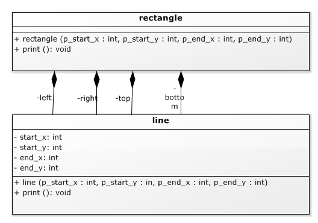
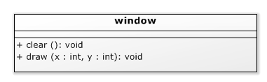

# Compositie - header en source files [](title-id)

### Inhoud[](toc-id)
- [Compositie - header en source files ](#compositie---header-en-source-files-)
    - [Inhoud](#inhoud)
    - [Verdeling over header en source files](#verdeling-over-header-en-source-files)
      - [Header files](#header-files)
      - [Source files](#source-files)
      - [Namespace](#namespace)
    - [Relaties tussen klassen](#relaties-tussen-klassen)
      - [Compositie](#compositie)
      - [Constructor en initialisatielijst voor compositie](#constructor-en-initialisatielijst-voor-compositie)
      - [Initialisatie van variabelen (in constructor)](#initialisatie-van-variabelen-in-constructor)
    - [Schermobjecten](#schermobjecten)
      - [Gebruik schermobject](#gebruik-schermobject)
    - [Reference parameters en reference variabelen](#reference-parameters-en-reference-variabelen)
    - [Relaties tussen klassen: Associatie](#relaties-tussen-klassen-associatie)

TODO: puntjes op de i zetten (laatste stuk)

### Verdeling over header en source files
Vaak wordt C++ code opgesplitst in twee soorten files:
**header en source files**.

#### Header files
De *declaratie* (interface) van een klasse staat vrijwel altijd in een **header file**: zo kunnen andere onderdelen in een programma deze declaratie binnen hun code 'includen'.
Vaak is een klasse bedoeld om in andere onderdelen van een applicatie gebruikt te worden. Via een header file kunnen deze andere onderdelen de declaratie van de klasse includen. Voor C++ wordt meestal de extensie `.hpp` gebruikt voor header files.

#### Source files
De *definitie* (implementatie) van een klasse functie kan in de klasse declaratie staan (dus in de header file), zoals we hebben gedaan bij de lijn constructor. Dit wordt over het algemeen alleen gedaan met heel simpele functies. Niet-triviale functies worden in de bijbehorende implementatie file gezet: de **source file**. Voor C++ wordt meestal de extensie .cpp gebruikt voor implementatie files. 

Over header files:
- Een header file heeft een `#ifndef/#define/#endif` die zorgt dat er geen problemen ontstaan als een header meer dan 1 keer ge-include wordt. Dit heet een *include Guard*.
- De header file wordt altijd ge-#include door de bijbehorende implementatie file (.cpp). Deze file heeft dezelfde naam (bv `line.hpp` en `line.cpp`)
- De header file wordt ge-#include door alle andere files die gebruik maken van de services die in de header file zijn gedeclareerd.
- In code voorbeelden worden de #include regels vaak weggelaten; in code zijn ze natuurlijk wél nodig.

```c++
#ifndef LINE_HPP
#define LINE_HPP

class line {
. . .
};
```
*Codevoorbeeld 04-06 - Bescherming tegen multiple-inclusion in de file line.hpp*

#### Namespace
Een functie of methode is meestal onderdeel van een bepaalde klasse. Voor de lijn klasse (`class line`) staat de implementatie van de print functie in de `line.cpp` file. Buiten deze klasse declaratie moet je aangeven bij welke klasse de functie behoort: voor de naam van de functie zet je zijn klasse-naam en `::` zetten, anders heb je het over een losse functie die niets met een klasse te maken heeft. Bínnen de klasse definitie zelf hoeft dat niet.
De scope waarbinnen een functie geldig is, heet *namespace*.

```c++
#include ”line.hpp”

void line::print(){
  . . . // code
}
```
*Codevoorbeeld 04-06 - Implementatie van een member-functie (= methode) in de file line.cpp*

### Relaties tussen klassen

#### Compositie
Een object kan samengesteld zijn uit deelobjecten. Als we een (niet opgevulde) rechthoek willen kunnen printen dan kunnen we dat doen door de vier lijnen die de omtrek van de rechthoek vormen te printen. 
De *constructor* kan deze lijn-objecten aanmaken; in de print functie hoeven we ze dan alleen maar te printen. Het rechthoek object bevat dan vier lijn objecten. 

In *UML* wordt dit aangegeven door een lijn met aan de kant van de ‘eigenaar’ een opgevuld wiebertje. Dit heet compositie: de rechthoek is samengesteld uit vier lijnen. Compositie (A bevat B, B is een deel van A) is de sterkste relatie (associatie) tussen klassen: de deelobjecten kunnen alleen bestaan als onderdeel van het omvattende object en dat omvattende object is verantwoordelijk voor het aanmaken van zijn deelobjecten.
Net als bij attributen geeft een + of – voor de naam van het deelobject aan of de compositie public (voor code buiten de klasse benaderbaar) of private (niet door vreemden benaderbaar) is.


Zie het UML diagram hierboven:
In C++ zijn de vier compositie relaties zichtbaar als attributen van de rechthoek, van het type lijn. Om dit te kunnen doen moet de declaratie van lijn (line.hpp) opgenomen worden in de definitie van rechthoek.

```c++
#include ”line.hpp”

class rectangle {
  private:
    line left, right, top, bottom;

  public:
    rectangle( int start_x, int start_y, int end_x, int end_y );
    void print();
};
```
*Codevoorbeeld 04-07A - C++ declaratie van een rechthoek die vier lijnen bevat (file rectangle.hpp)*

#### Constructor en initialisatielijst voor compositie
In de rechthoek zijn vier lijnen opgenomen (*left, right, top en bottom*). 
In de declaratie van lijn is een constructor gedeclareerd. Dat betekent dat we bij het aanmaken van een *lijn* verplicht zijn deze constructor aan te roepen. Het aanmaken van de lijnen moet in de constructor van rechthoek, net voor de body (het stuk tussen de krulhaken), in de initialisatielijst. Daarmee zijn de lijnen geïnitialiseerd en er is niets meer te doen in de body zelf, dus die is leeg. Dit patroon komt vaak voor in C++: het meeste ‘werk’ in een constructor wordt gedaan in de initialisatielijst, en de body is vaak leeg.

#### Initialisatie van variabelen (in constructor)
Vaak kun je kiezen of je klasse variabelen hun initiële waarden geeft in de initialisatie-lijst, of in de body (via assignments). Over het algemeen heeft het de voorkeur dit te doen in de initialisatielijst, omdat dat *effectiever* is (anders wordt de variabele eerst default-geconstrueerd en daarna ge-assigned). Ook komt het voor dat een datatype wél een constructor heeft maar géén assignment, zodat de initialisatielijst de enige optie is. (Andersom, dus wel assignment maar geen constructor die een specifieke waarde geeft, komt eigenlijk niet voor.)

```c++
#include ”rectangle.hpp”

rectangle::rectangle( int start_x, int start_y, int end_x, int end_y ):
  left( start_x, start_y, start_x, end_y + 1 ),
  right( end_x, start_y, end_x, end_y + 1 ),
  top( start_x, start_y, end_x + 1, start_y ),
  bottom( start_x, end_y, end_x + 1, end_y )
  {} // lege body
```
*Codevoorbeeld 04-07B - De constructor van een rechthoek (file rectangle.cpp)*

Ad. codevoorbeeld 04-07B: Merk op dat er in de coördinaten soms +1 staat. Kun je beredeneren waarom?

Omdat de lijnen al geconstrueerd zijn in de constructor van rechthoek hoeft er in de print functie maar weinig gedaan te worden: het printen van de rechthoek wordt gedaan door het printen van de vier lijnen. Zie codevoorbeeld 04-07C.

```c++
void rectangle::print(){
  left.print();
  right.print();
  top.print();
  bottom.print();
}
```
*Codevoorbeeld 04-07 - de print functie van een rechthoek (ook in de file rectangle.cpp)*

### Schermobjecten
Tot nu toe zijn we er aan voorbij gegaan waar een lijn of rechthoek eigenlijk op afgebeeld wordt. Dit kan worden aangegeven door een schermobject mee te geven. Van dit object interesseert ons (als programmeurs die schermobjecten willen implementeren) alleen de publieke interface. Die kan heel beperkt zijn: wis een scherm (maak het wit), en maak een pixel zwart.

*Andere interfaces zijn ook mogelijk, zoals ‘maak deze pixel kleur k’, dan heb je geen aparte wis-functie nodig.*



*Image - UML diagram van een window klasse*

#### Gebruik schermobject
De print functies moeten een schermobject hebben om hun werk te kunnen doen. Er zijn twee manieren om het schermobject ter beschikking te stellen:
- We kunnen een schermobject meegeven aan iedere print aanroep.
- We kunnen een schermobject meegeven aan de constructor van een af te beelden object (bv. een lijn). Het schermobject wordt dan opgeslagen in het af te beelden object en is dus tijdens het printen beschikbaar.

Welke oplossing er gekozen wordt is een kwestie van ontwerp. De eerste oplossing is flexibeler, de tweede (vaak) makkelijker.

### Reference parameters en reference variabelen
Hoe je het scherm ook doorgeeft aan de print functie, het is van belang dat het scherm object niet *‘by value’* wordt doorgegeven. Als je dat doet dan wordt er geprint op een kopie van het scherm, wat in veel gevallen niet het juiste resultaat zal leveren (het oorspronkelijke scherm object wordt dan niet veranderd).

*In C zouden we om het schermobject zelf (dus niet een kopie) door te geven, een pointer naar het scherm doorgeven (en in de tweede oplossing ook opslaan). In C++ kunnen we in zo’n geval een reference doorgeven (en desgewenst ook opslaan).*

Een reference declareer je door een `&` voor de naam van een parameter of object te plaatsen. Als je vervolgens die naam gebruikt in een expressie of om er een waarde aan toe te kennen, dan gebruik je automatisch het object waar de reference naar refereert.14

Voor een reference moet je op het moment dat de reference wordt aangemaakt aangeven waaraan hij refereert. Gedurende de levensduur van de reference blijft hij naar dat object refereren. Er is geen mogelijkheid om een reference later naar een ander object te laten wijzen.

### Relaties tussen klassen: Associatie
In UML komt een reference tussen objecten die ieder een eigen ‘leven’ hebben (het ene object is niet een logisch deel van het andere) doorgaans overeen met een ‘gewone’ associatie. Een associatie wordt weergegeven met een open wiebertje aan de kant van de klasse die de reference bevat, en de naam van de referentie aan de kant van de klasse waar hij aan refereert. Als we in een lijn opslaan op welk scherm hij afgebeeld moet worden krijgen we dus het volgende UML diagram:
12 Andere interfaces zijn ook mogelijk, zoals ‘maak deze pixel kleur k’, dan heb je geen aparte wis-functie nodig.
13 In C zouden we om het scherm object zelf (dus niet een kopie) door te geven een pointer naar het scherm doorgeven (en in de tweede oplossing ook opslaan). In C++ kunnen we in zo’n geval een reference doorgeven (en desgewenst ook opslaan).
14 Een reference lijkt op een pointer, maar een reference kan je niet naar een ander object laten wijzen, je kan er niet mee rekenen, en je hoeft geen adres-van (&) en pointer-dereference (*) operatoren te gebruiken.
Reader V1OOPC - 16 van 105


*Image - UML diagram voor een lijn die (een referentie naar) zijn window opslaat* 

Merk op dat (net als bij een compositie) de window niet apart wordt vermeld in de lijst met attributen: de associatie met de naam w geeft aan dat de lijn klasse een attribuut w van het type window heeft.
In de C++ code is er een window reference attribuut toegevoegd die in de initialisatielijst van de constructor zijn waarde krijgt. Dit moet op die plaats, je kunt een reference niet later (in de body) een waarde geven. In dit voorbeeld zijn de coördinaten nu ook in de initialisatielijst gezet zodat de body van de constructor leeg is. De definitie van de constructor staat in dit voorbeeld in de class declaratie.

```c++
#include “window.hpp”

class line {
private:
  int start_x;
  int start_y;
  int end_x;
  int end_y;
  window & w;

public:
  line( window & w,int start_x, int start_y, int end_x, int end_y ):
    start_x( start_x ),
    start_y( start_y ),
    end_x( end_x ),
    end_y( end_y ),
    w( w )
  {}
  void print();
};
```
*Codevoorbeeld 04-09A - C++ klasse voor een lijn die (een referentie naar) zijn window opslaat*

Merk op dat in de initialisatielijst bv. voor het initialiseren van w de syntax w( w ) wordt gebruikt. Er zijn twee dingen die w heten: het attribuut en de parameter van de constructor. De compiler geeft de parameter voorrang, dus in principe betekent w de parameter, behalve bij de attribuut naam in een initialisatielijst: dat kan alleen maar een attribuut zijn, dus dan wordt w geïnterpreteerd als het
attribuut w. Daardoor betekent w( w ) in een initialisatielijst dus initialiseer het attribuut w (de eerste w) met de waarde van de parameter w (de tweede w).

Bij het aanmaken van een window object moet je de omvang in x en y richting meegeven en de schaal: omdat pixels op een PC scherm nogal klein zijn, worden de pixels met die schaal factor ‘opgeblazen’. De gebruikte waarden komen redelijk overeen met het schermpje dat we later gaan gebruiken met de Arduino Due. In het UML diagram zijn de lokale variabelen van window weggelaten omdat we daar even geen nadruk op willen leggen. In de praktijk zal een window op een PC in ieder geval zijn x_size, y_size en scale moeten opslaan, en ook een manier om bij zijn (door het Operating System beheerde) window te komen.

```c++
#include "window.hpp"
#include "line.hpp"

int main(int argc, char **argv){
  window w( 128, 64, 2 );
  line diagonal_line( w, 5, 5, 30, 40 );
  diagonal_line.print();
}
```
*Codevoorbeeld 04-09B - Gebruik van een lijn die een expliciete window vereist*