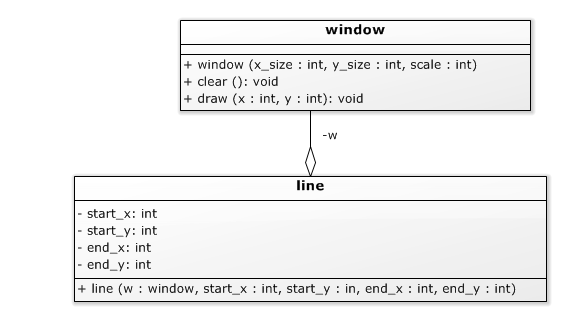

# Associatie [](title-id)

### Inhoud[](toc-id)
- [Compositie ](#compositie-)
    - [Inhoud](#inhoud)
    - [Relaties tussen klassen](#relaties-tussen-klassen)
      - [Compositie](#compositie)
      - [Compositie en UML](#compositie-en-uml)
      - [Voorbeeld van compositie](#voorbeeld-van-compositie)
      - [Constructor en initialisatielijst voor compositie](#constructor-en-initialisatielijst-voor-compositie)
      - [Initialisatie van variabelen (in constructor)](#initialisatie-van-variabelen-in-constructor)
    - [Schermobjecten](#schermobjecten)
      - [Gebruik schermobject](#gebruik-schermobject)
    - [Reference parameters en reference variabelen](#reference-parameters-en-reference-variabelen)
      - [References vs. pointers](#references-vs-pointers)
    - [Relaties tussen klassen: associatie](#relaties-tussen-klassen-associatie)
    - [Reference parameters en reference variabelen](#reference-parameters-en-reference-variabelen-1)
      - [Declaratie reference (\&)](#declaratie-reference-)
      - [Verschil reference en pointer](#verschil-reference-en-pointer)

### Relaties tussen klassen
#### Associatie
In UML komt een reference tussen objecten die ieder een eigen ‘leven’ hebben (het ene object is niet een logisch deel van het andere) doorgaans overeen met een ‘gewone’ associatie. Een associatie wordt weergegeven 
- met een *open wiebertje* aan van de klassen die de reference bevat, 
- en de naam van de referentie aan de kant van de klasse waar hij aan refereert. 
  
Als we in een lijn opslaan op welk scherm hij afgebeeld moet worden krijgen we dus de volgende UML diagram:


*UML diagram voor een lijn die (een referentie naar) zijn window opslaat*

Merk op dat (net als bij een compositie) de window niet apart wordt vermeld in de lijst met attributen: de associatie met de naam w geeft aan dat het de lijn klasse een attribuut w van het type window heeft.

In de C++ code is er een window reference attribuut toegevoegd die in de initialisatielijst van de constructor zijn waarde krijgt. Dit moet op die plaats, je kunt een reference niet later (in de body) een waarde geven. 

In dit voorbeeld zijn de coördinaten nu ook in de initialisatielijst gezet zodat de body van de constructor leeg is. De definitie van de constructor staat in dit voorbeeld in de class declaratie.

```cpp
#include “window.hpp”
class line {
private:
  int start_x;
  int start_y;
  int end_x;
  int end_y;
  window & w;
public:
  line( window & w,int start_x, int start_y, int end_x, int end_y ):
    start_x( start_x ),
    start_y( start_y ),
    end_x( end_x ),
    end_y( end_y ),
    w( w )
  {}
  void print();
};
```
*Codevoorbeeld 04-09 - C++ klasse voor een lijn die (een referentie naar) zijn window opslaat*

#### Initialisatie en initialisatielijst
Merk op dat in de initialisatielijst bv. voor het initialiseren van w de syntax `w( w )` wordt gebruikt. Er zijn twee dingen die w heten: 
- het attribuut en 
- de parameter van de constructor. 

De compiler geeft de parameter voorrang, dus in principe betekent w de parameter, behalve bij de attribuut naam in een initialisatielijst: dat kan alleen maar een attribuut zijn, dus dan wordt w geïnterpreteerd als het
attribuut w. Daardoor betekent w( w ) in een initialisatielijst dus: 

*initialiseer het attribuut w (de eerste w) met de waarde van de parameter w (de tweede w)*.

### Voorbeeld: lijn met window object
Bij het aanmaken van een window object moet je
- de omvang in x en y richting meegeven en 
- de schaal. Omdat pixels op een PC scherm nogal klein zijn, worden de pixels met die schaal factor ‘opgeblazen’. 

De gebruikte waarden komen redelijk overeen met het schermpje dat we later gaan gebruiken met de Arduino Due. 

In het UML diagram zijn de lokale variabelen van window weggelaten omdat we daar even geen nadruk op willen leggen. In de praktijk zal een window op een PC in ieder geval zijn x_size, y_size en scale moeten opslaan, en ook een manier om bij zijn (door het Operating System beheerde) window te komen.

```cpp
#include "window.hpp"
#include "line.hpp"

int main(int argc, char **argv){
  window w( 128, 64, 2 );
  line diagonal_line( w, 5, 5, 30, 40 );
  diagonal_line.print();
}
```
*Codevoorbeeld 04-10 - Gebruik van een lijn die een expliciete window vereist*