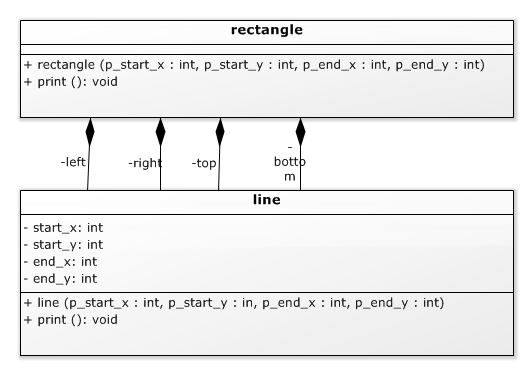
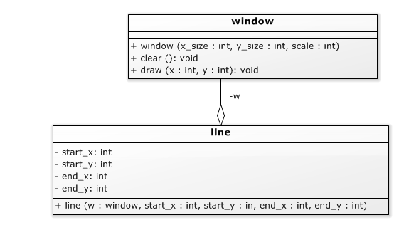

# Compositie [](title-id) <!-- omit in toc -->

### Inhoud[](toc-id) <!-- omit in toc -->
- [Relaties tussen klassen](#relaties-tussen-klassen)
  - [Compositie](#compositie)
  - [Compositie en UML](#compositie-en-uml)
  - [Voorbeeld van compositie](#voorbeeld-van-compositie)
  - [Constructor en initialisatielijst voor compositie](#constructor-en-initialisatielijst-voor-compositie)
  - [Initialisatie van variabelen (in constructor)](#initialisatie-van-variabelen-in-constructor)
- [Schermobjecten](#schermobjecten)
  - [Gebruik schermobject](#gebruik-schermobject)
- [Reference parameters en reference variabelen](#reference-parameters-en-reference-variabelen)
  - [References vs. pointers](#references-vs-pointers)
- [Relaties tussen klassen: associatie](#relaties-tussen-klassen-associatie)
- [Reference parameters en reference variabelen](#reference-parameters-en-reference-variabelen-1)
  - [Declaratie reference (\&)](#declaratie-reference-)
  - [Verschil reference en pointer](#verschil-reference-en-pointer)

### Relaties tussen klassen

#### Compositie
Een object kan samengesteld zijn uit deelobjecten. Als we een (niet opgevulde) rechthoek willen kunnen printen dan kunnen we dat doen door de vier lijnen die de omtrek van de rechthoek vormen te printen. 
De *constructor* kan deze lijn-objecten aanmaken; in de print functie hoeven we ze dan alleen maar te printen. Het rechthoek object bevat dan vier lijn objecten. 

#### Compositie en UML
In *UML* wordt de 'bevat'-relatie aangegeven door een lijn met aan de kant van de ‘eigenaar’ een opgevuld wiebertje. Dit heet **compositie**: de rechthoek is samengesteld uit vier lijnen. 

Compositie (A bevat B, B is een deel van A) is de sterkste relatie (associatie) tussen klassen: de deelobjecten kunnen alleen bestaan als onderdeel van het omvattende object en dat omvattende object is verantwoordelijk voor het aanmaken van zijn deelobjecten.

Net als bij attributen geeft een + of – voor de naam van het deelobject aan of de compositie public (voor code buiten de klasse benaderbaar) of private (niet door vreemden benaderbaar) is.

#### Voorbeeld van compositie

*UML diagram van een rechthoek die vier lijnen bevat*

Zie het UML diagram hierboven:
In C++ zijn de vier compositie relaties zichtbaar als attributen van de rechthoek, van het type lijn. Om dit te kunnen doen moet de declaratie van lijn (line.hpp) opgenomen worden in de definitie van rechthoek.

```cpp
#include ”line.hpp”

class rectangle {
  private:
    line left, right, top, bottom;

  public:
    rectangle( int start_x, int start_y, int end_x, int end_y );
    void print();
};
```
*Codevoorbeeld 04-09 - C++ declaratie van een rechthoek die vier lijnen bevat (file rectangle.hpp)*

#### Constructor en initialisatielijst voor compositie
In de rechthoek zijn vier lijnen opgenomen (*left, right, top en bottom*). 
In de declaratie van lijn is een constructor gedeclareerd. Dat betekent dat we bij het aanmaken van een *lijn* verplicht zijn deze constructor aan te roepen. Het aanmaken van de lijnen moet in de constructor van rechthoek, net voor de body (het stuk tussen de krulhaken), in de initialisatielijst. Daarmee zijn de lijnen geïnitialiseerd en er is niets meer te doen in de body zelf, dus die is leeg. Dit patroon komt vaak voor in C++: het meeste ‘werk’ in een constructor wordt gedaan in de initialisatielijst, en de body is vaak leeg.

#### Initialisatie van variabelen (in constructor)
Vaak kun je kiezen of je klasse variabelen hun initiële waarden geeft in de initialisatie-lijst, of in de body (via assignments). Over het algemeen heeft het de voorkeur dit te doen in de initialisatielijst, omdat dat *effectiever* is (anders wordt de variabele eerst default-geconstrueerd en daarna ge-assigned). Ook komt het voor dat een datatype wél een constructor heeft maar géén assignment, zodat de initialisatielijst de enige optie is. (Andersom, dus wel assignment maar geen constructor die een specifieke waarde geeft, komt eigenlijk niet voor.)

```cpp
#include ”rectangle.hpp”

rectangle::rectangle( int start_x, int start_y, int end_x, int end_y ):
  left( start_x, start_y, start_x, end_y + 1 ),
  right( end_x, start_y, end_x, end_y + 1 ),
  top( start_x, start_y, end_x + 1, start_y ),
  bottom( start_x, end_y, end_x + 1, end_y )
  {} // lege body
```
*Codevoorbeeld 04-10 - De constructor van een rechthoek (file rectangle.cpp)*

Ad. codevoorbeeld 04-10: Merk op dat er in de coördinaten soms +1 staat. Kun je beredeneren waarom?

Omdat de lijnen al geconstrueerd zijn in de constructor van rechthoek hoeft er in de print functie maar weinig gedaan te worden: het printen van de rechthoek wordt gedaan door het printen van de vier lijnen. Zie codevoorbeeld 04-11.

```cpp
void rectangle::print(){
  left.print();
  right.print();
  top.print();
  bottom.print();
}
```
*Codevoorbeeld 04-11 - de print functie van een rechthoek (ook in de file rectangle.cpp)*

### Schermobjecten
Tot nu toe zijn we er aan voorbij gegaan waar een lijn of rechthoek eigenlijk op afgebeeld wordt. Dit kan worden aangegeven door een schermobject mee te geven. Van dit object interesseert ons (als programmeurs die schermobjecten willen implementeren) alleen de publieke interface. Die kan heel beperkt zijn: wis een scherm (maak het wit), en maak een pixel zwart.

*Andere interfaces zijn ook mogelijk, zoals ‘maak deze pixel kleur k’, dan heb je geen aparte wis-functie nodig.*


*Image - UML diagram van een window klasse*

#### Gebruik schermobject
De print functies moeten een schermobject hebben om hun werk te kunnen doen. Er zijn twee manieren om het schermobject ter beschikking te stellen:
- We kunnen een schermobject meegeven aan iedere print aanroep.
- We kunnen een schermobject meegeven aan de constructor van een af te beelden object (bv. een lijn). Het schermobject wordt dan opgeslagen in het af te beelden object en is dus tijdens het printen beschikbaar.

Welke oplossing er gekozen wordt is een kwestie van ontwerp. De eerste oplossing is flexibeler, de tweede (vaak) makkelijker.

### Reference parameters en reference variabelen
Hoe je het scherm ook doorgeeft aan de print functie, het is van belang dat het scherm object niet *‘by value’* wordt doorgegeven. Als je dat doet dan wordt er geprint op een kopie van het scherm, wat in veel gevallen niet het juiste resultaat zal leveren (het oorspronkelijke scherm object wordt dan niet veranderd).

#### References vs. pointers 
*In C zouden we om het schermobject zelf (dus niet een kopie) door te geven, een pointer naar het scherm doorgeven (en in de tweede oplossing ook opslaan). In C++ kunnen we in zo’n geval een reference doorgeven (en desgewenst ook opslaan).*

Een reference declareer je door een `&` voor de naam van een parameter of object te plaatsen. Als je vervolgens die naam gebruikt in een expressie of om er een waarde aan toe te kennen, dan gebruik je automatisch het object waar de reference naar refereert.

Voor een reference moet je op het moment dat de reference wordt aangemaakt aangeven waaraan hij refereert. Gedurende de levensduur van de reference blijft hij naar dat object refereren. Er is geen mogelijkheid om een reference later naar een ander object te laten wijzen.

### Relaties tussen klassen: associatie
In UML komt een reference tussen objecten die ieder een eigen ‘leven’ hebben (het ene object is niet een logisch deel van het andere) doorgaans overeen met een ‘gewone’ associatie. Een associatie wordt weergegeven met een open wiebertje aan de kant van de klasse die de reference bevat, en de naam van de referentie aan de kant van de klasse waar hij aan refereert. Als we in een lijn opslaan op welk scherm hij afgebeeld moet worden krijgen we dus het volgende UML diagram:



*Image - UML diagram voor een lijn die (een referentie naar) zijn window opslaat* 

> (Dit is een voorbeeld van aggregatie.)

Merk op dat (net als bij een compositie) de window niet apart wordt vermeld in de lijst met attributen: de associatie met de naam w geeft aan dat de lijn klasse een attribuut w van het type window heeft.

In de C++ code is een window reference attribuut toegevoegd die in de initialisatielijst van de constructor zijn waarde krijgt. Dit moet op die plaats, je kunt een reference niet later (in de body) een waarde geven. In dit voorbeeld zijn de coördinaten nu ook in de initialisatielijst gezet zodat de body van de constructor leeg is. De definitie van de constructor staat in dit voorbeeld in de class declaratie.

*Een reference lijkt op een pointer, maar een reference kun je niet naar een ander object laten wijzen, je kunt er niet mee rekenen, en je hoeft geen adres-van (&) en pointer-dereference (\*) operatoren te gebruiken.*

```cpp
#include “window.hpp”

class line {
private:
  int start_x;
  int start_y;
  int end_x;
  int end_y;
  window & w;

public:
  line( window & w,int start_x, int start_y, int end_x, int end_y ):
    start_x( start_x ),
    start_y( start_y ),
    end_x( end_x ),
    end_y( end_y ),
    w( w )
  {}
  void print();
};
```
*Codevoorbeeld 04-12 - C++ klasse voor een lijn die (een referentie naar) zijn window opslaat*

Merk op dat in de initialisatielijst bv. voor het initialiseren van w de syntax w( w ) wordt gebruikt. Er zijn twee dingen die w heten: het attribuut en de parameter van de constructor. De compiler geeft de parameter voorrang, dus in principe betekent w de parameter, behalve bij de attribuut naam in een initialisatielijst: dat kan alleen maar een attribuut zijn, dus dan wordt w geïnterpreteerd als het
attribuut w. Daardoor betekent w( w ) in een initialisatielijst dus initialiseer het attribuut w (de eerste w) met de waarde van de parameter w (de tweede w).

Bij het aanmaken van een window object moet je de omvang in x en y richting meegeven en de schaal: omdat pixels op een PC scherm nogal klein zijn, worden de pixels met die schaal factor ‘opgeblazen’. De gebruikte waarden komen redelijk overeen met het schermpje dat we later gaan gebruiken met de Arduino Due. 

In het UML diagram zijn de lokale variabelen van window weggelaten omdat we daar even geen nadruk op willen leggen. In de praktijk zal een window op een PC in ieder geval zijn x_size, y_size en scale moeten opslaan, en ook een manier om bij zijn (door het Operating System beheerde) window te komen.

```cpp
#include "window.hpp"
#include "line.hpp"

int main(int argc, char **argv){
  window w( 128, 64, 2 );
  line diagonal_line( w, 5, 5, 30, 40 );
  diagonal_line.print();
}
```
*Codevoorbeeld 04-13 - Gebruik van een lijn die een expliciete window vereist*

### Reference parameters en reference variabelen
Hoe je het scherm ook doorgeeft aan de print functie, het is van belang dat het scherm object niet ‘by value’ wordt doorgegeven. Als je dat doet dan wordt er geprint op een kopie van het scherm, wat in veel gevallen niet het juiste resultaat zal leveren (het oorspronkelijke scherm object wordt dan niet veranderd). 

*In C zouden we om het scherm-object zelf (dus niet een kopie) door te geven een pointer naar het scherm doorgeven (en in de tweede oplossing ook opslaan). In C++ kunnen we in zo’n geval een reference doorgeven (en desgewenst ook opslaan).*

#### Declaratie reference (&)
Een reference declareer je door een `&` voor de naam van de parameter of het object te plaatsen. Als je vervolgens die naam gebruikt in een expressie of om er een waarde aan toe te kennen, dan gebruik je automatisch het object waar de reference naar verwijst.

#### Verschil reference en pointer
Een reference lijkt op een pointer, maar een reference 
- kun je niet naar een ander object laten wijzen, 
- je kunt er niet mee rekenen, en 
- je hoeft geen adres-van (&) en pointer-dereference (*) operatoren te gebruiken.

Voor een reference moet je op het moment dat de reference wordt aangemaakt aangeven waarnaar hij refereert, en gedurende de lifetime van de reference blijft hij naar dat object refereren. **Er is geen mogelijkheid om een reference later naar een ander object te laten wijzen.**
