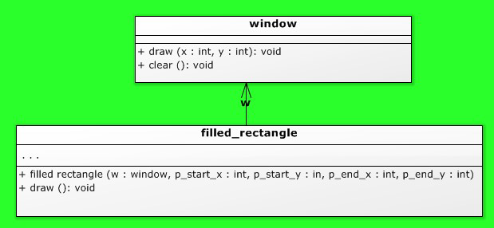

# Opdrachten Classes C++

### Inhoud
- [Opdrachten Classes C++](#opdrachten-classes-c)
    - [Inhoud](#inhoud)
    - [Opdracht OO1.5 Gevulde rechthoek](#opdracht-oo15-gevulde-rechthoek)

### Opdracht OO1.5 Gevulde rechthoek
Neem de [04-07-window voorbeeldcode](./04-07-rectangle/) als uitgangspunt.

Schrijf (voeg eraan toe) een klasse (hpp en cpp files) voor een opgevulde rechthoek (`filled_rectangle`). 
- De constructor ziet er hetzelfde uit als van de rechthoek in de voorbeelden maar bij het afdrukken moeten alle pixels die deel uitmaken van de rechthoek (inclusief de randen) getekend worden. 
- Je maakt dus *geen gebruik* van de lijn klasse.
- Gebruik direct de methode(n) van window.
- Demonstreer je klasse in een applicatie die een aantal gevulde rechthoeken toont. 
- In het UML-diagram zijn de attributen van de gevulde rechthoek weggelaten: die moet je zelf bedenken.

*UML-diagram van een opgevulde rechthoek (en de window waarop deze wordt afgebeeld)*