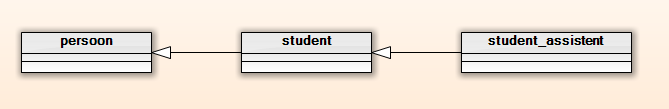

# Objecten en waarden (title-id) <!-- omit in toc -->

### Inhoud <!-- omit in toc -->
- [Klassen: objecten en waarden](#klassen-objecten-en-waarden)
  - [Objecten](#objecten)
    - [Objecten vergelijken](#objecten-vergelijken)
  - [Waarden](#waarden)
    - [Kenmerken van een waarde](#kenmerken-van-een-waarde)
    - [Waarden vergelijken](#waarden-vergelijken)
    - [ADTs: waarden als klassen](#adts-waarden-als-klassen)
  - [Objecten vs. ADTs](#objecten-vs-adts)

## Klassen: objecten en waarden
Een C++ klasse kan verschillende 'dingen' implementeren: 
- iets tastbaars of bestaands, een *object*, óf 
- een eenheid of grootheid: een *waarde*.

### Objecten
De klassieke OO implementatie van een klasse betreft meestal een object: het object heeft een *identiteit*, het is iets tastbaars of bestaands.
Denk aan 
- een persoon, 
- een auto, 
- een bankrekening, 
- een beeldscherm, etc. 

#### Objecten vergelijken
De *eigenschappen* van een object kunnen in de loop van zijn bestaan veranderen, maar het object blijft hetzelfde object. Als je twee objecten vergelijkt, dan bedoel je (meestal): ‘zijn deze twee variabelen hetzelfde object'.

Objecten zitten vaak in een klasse hiërarchie: 
- een student is afgeleid van een persoon, 
- en een student-assistent is weer afgeleid van student.

*Figuur - UML voorbeeld van klasse student_assistent*

### Waarden
Een waarde is bijvoorbeeld 
- een getal, 
- een kleur, 
- een naam, 
- het saldo op een rekening, 
- een tijdsduur, 
- een GPS coördinaat, etc. 

#### Kenmerken van een waarde
- Een waarde is geen ding of object.
- Een variabele is geen waarde: het bevát een waarde, en die waarde kan in de loop der tijd veranderen (anders was het geen variabele maar een constante).

#### Waarden vergelijken
Als je twee waarden test op gelijkheid dan bedoel je *of ze beiden dezelfde waarde bevatten*, niet of ze dezelfde variabele zijn. 

#### ADTs: waarden als klassen
Een waarde maakt doorgaans geen deel uit van een klasse hiërarchie, maar het kan toch nuttig zijn om een waarde als klasse te implementeren *omdat je dan details van de implementatie kunt verbergen, en methoden en operaties kunt aanbieden.*

Zo’n klasse noemt men een **Abstract Data Type (ADT)**.

### Objecten vs. ADTs
De typische eigenschappen van een object en een ADT staan in de volgende tabel naast elkaar.

| Object | ADT |
| ------ | ------|
| Heeft een **identiteit**.| Bevat een **waarde**.|
| Gelijkheid betekent hetzelfde object zijn.| Gelijkheid betekent dezelfde waarde bevatten.|
| Maakt deel uit van een klasse hiërarchie.| Staat op zich zelf.|
| Geen equality of andere vergelijkingen, geen operatoren.| Heeft equality, mogelijk andere vergelijkingen, vaak operatoren. |
| Een basis klasse heeft een virtuele destructor, en vaak ook (veel) andere virtuele methoden. | Niet bedoeld om van te erven.|
| Is zelden een constante.| Constanten komen vaak voor.|
| Is vaak een fysiek ‘object’. Typisch voorbeeld: **persoon**.| Is vaak iets meetbaars, en heeft vaak een eenheid. Typisch voorbeeld: **kleur**.|
| Bevat vaak referenties naar andere objecten.| Is doorgaans ‘self contained’: bevat geen verwijzingen naar andere objecten.|