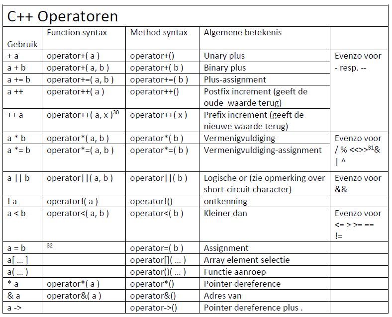

# Meer operatoren (title-id)

### Inhoud[](toc-id)
- [Meer operatoren (title-id)](#meer-operatoren-title-id)
    - [Inhoud](#inhoud)
  - [Meer operatoren](#meer-operatoren)
    - [Gebruik references in operatoren](#gebruik-references-in-operatoren)
      - [Implementatie operator+=](#implementatie-operator)
      - [Pointers](#pointers)
      - [Verschil operator+ en operator+=](#verschil-operator-en-operator)
      - [Don't Repeat Yourself](#dont-repeat-yourself)
      - [Operator: methode of 'vrije' functie?](#operator-methode-of-vrije-functie)
  - [Vaste lijst operatoren en prio's](#vaste-lijst-operatoren-en-prios)
  - [Tabel belangrijkste operatoren](#tabel-belangrijkste-operatoren)
    - [Monadic operator](#monadic-operator)
    - [Naamgeving en verwachtingsmanagement](#naamgeving-en-verwachtingsmanagement)
      - [`<<` en `>>` operatoren](#-en--operatoren)
      - [`&&` en `||` operatoren](#-en--operatoren-1)
    - [Tips: zelf operatoren schrijven](#tips-zelf-operatoren-schrijven)
      - [Tekst operatoren](#tekst-operatoren)
      - [Reken operatoren](#reken-operatoren)
      - [Advies: definieer niet alles zelf](#advies-definieer-niet-alles-zelf)


## Meer operatoren
We hebben gezien, in [operatoren](./README.md) hoe een operator+ en een operator- voor vectoren kan worden gemaakt. 

Van een echte [ADT](../ADTs/README.md) verwacht de gebruiker veel meer operatoren. Als een ADT een operator+ en een operator= (assignment) heeft, dan verwacht je ook een operator+=. Die moet, anders dan een operator+, zijn linker argument wijzigen. Dat argument moet dus ‘by reference’ worden doorgegeven (dat is automatisch zo) maar anders dan bij de operator+ niet ‘als const’. 

### Gebruik references in operatoren
De C++ gewoonte is dat het resultaat van een assignment-achtige operator (=, +=, -=, etc.) een reference is naar het object zelf. Anders dus dan bij de operator+, daar is het resultaat een waarde. Het rechter argument (rhs: right hand side) wordt voor beide operatoren op de zelfde wijze doorgegeven: by const reference.

```c++
class vector {
public:
    int x;
    int y; 
    vector operator+( const vector & rhs ) const; 
    vector & operator+=( const vector & rhs );
};

```
*Codevoorbeeld 06-10 - Een vector klasse met operatoren + en +=*

#### Implementatie operator+=
De implementatie van de operator+= is simpel: 
- tel de x en y waarden van de rhs (right hand side) op bij de x en y attributen van het object. 
- Daarna moeten we het object zelf retourneren. De C++ feature die dat mogelijk maakt is de *this pointer*, die wijst steeds naar het object. Wat we moeten retourneren is niet een pointer naar het object maar het object zelf, dus we retourneren `*this.`

#### Pointers
*Pointers worden later uitgebreider besproken. Je kunt een pointer zien als een soort reference waarbij je met een `*` expliciet moet aangeven dat je het aangewezen object bedoelt, en niet de pointer zelf. Bij een reference gaat dat automatisch.*

```c++
  vector & vector::operator+=( const
    vector & rhs ){ 
        x += rhs.x; 
        y += rhs.y; 
        return *this; 
    }
```
*Codevoorbeeld 06-10 - Implementatie van operator+=*

#### Verschil operator+ en operator+=
De operator+ en operator+= doen gedeeltelijk hetzelfde: twee vectoren optellen. 
Het **verschil is waar ze het resultaat laten**: 
- `+=` bergt het op in de lhs (left hand side), 
- `+` geeft de nieuwe waarde terug als functie resultaat. 

#### Don't Repeat Yourself
Als wat zo’n koppel operatoren doet wat minder triviaal is dan is het een goed idee om dit maar één keer op te schrijven: *DRY (Don’t Repeat Yourself)*.
 
De eenvoudigste manier is om de `operator+=` te implementeren zoals we al zagen, en dan de `operator+` te implementeren door een kopie te maken van onze eigen waarde, daar de operatror+= op los te laten, en dan die kopie te returnen. Dit lijkt misschien wat omslachtig, maar de winst is dat deze drie regels helemaal onafhankelijk zijn van wat ‘optellen’ voor de klasse precies inhoudt: deze drie regels vind je dus in vrijwel alle operator+ implementaties.

```c++
vector vector::operator+( const vector & rhs ) const { 
    vector temp = *this;
    temp += rhs;
    return temp; 
}
```
*Codevoorbeeld 6-10 - 
Implementatie van operator+ door gebruik te maken van operator+=*

#### Operator: methode of 'vrije' functie?
Je kunt veel (maar niet alle) operatoren naar keuze als methode (klasse functie) schrijven of als ‘vrije’ functie (los van een klasse). 
- Het voordeel van een methode is dat die automatisch bij de private attributen van de klasse kan, een losse functie kan dat niet. 
- Maar een losse functie kun je schrijven voor een klasse waarvan je de declaratie niet kan aanpassen, bv. omdat die in een bibliotheek zit die jij niet kunt wijzigen. 
  
**De vuistregel is dat je een operator als methode (klasse functie) schrijft, tenzij dat niet kan.**

```cpp
class vector {
public:
  int x;
  int y;
  . . . 

  // operator+ methode (binnen de klasse)
  vector operator+( const vector & rhs ) const { 
    return vector( x + rhs.x, y + rhs.y ); 
    }

  };

// operator- functie (buiten de klasse)
vector operator-( const vector & lhs, const vector & rhs ){ 
  return vector( lhs.x - rhs.x, lhs.y + rhs.y ); 
}
```
*Codevoorbeeld 06-11 - Een methode `operator+` en een losse functie `operator-`*

## Vaste lijst operatoren en prio's
In C++ kunnen veel operatoren door de gebruiker worden gedefinieerd, maar,
- de lijst van operatoren ligt vast, en 
- hun onderlinge prioriteit ook.

*Je kunt dus géén nieuwe operator `$` of `^^` maken.*

## Tabel belangrijkste operatoren
De [onderstaande tabel](./tabel_operatoren.png) geeft de belangrijkste operatoren weer die je in C++ zelf kunt definiëren. Slechts een klein deel daarvan behandelen we hier.

De meeste operatoren kun je op twee manieren schrijven:
- als **losse functie**, alle parameters zijn dan expliciet in de parameterlijst vermeldt, of
- als **klasse functie (methode)**, de eerste parameter is dan het object zelf, en alleen de parameters die daarna komen staan expliciet in de parameterlijst.

### Monadic operator
Je kunt ook een operator+() methode met 1 parameter maken (in het geval van een klasse functie dus géén parameter), dat is dan de (minder nuttige) ‘monadic’ plus, die bv. wordt aangeroepen met `a = +b`.

*Let op: `a = +b`  is iets anders dan `a += b`!.*


*ad. 30: Een extra (dummy) integer parameter wordt meegegeven door de compiler om de prefix operator te onderscheiden van de postfix versie.
ad. 31: De << en >> operatoren worden eigenlijk altijd als losstaande functies geschreven, omdat het voor het algemeen aanvaarde gebruik van deze operatoren (geformatteerde tekst input en output) nodig is dat het linker argument van het type std::istream of std::ostream kan zijn, en aan die klassen kan een gebruiker niets toevoegen.
ad. 32: Deze operatoren kunnen alleen als methode worden gedefinieerd, niet als vrije functie.*

### Naamgeving en verwachtingsmanagement
Aangezien een operator niet zoals een methode of functie een lange, betekenisvolle naam kan hebben is het erg belangrijk dat de gebruiker van een operator krijgt wat hij verwacht. 

Dit beperkt het gebruik van operatoren tot bv. typen waarmee je kunt rekenen, zoals meetwaarden, vectoren, en imaginaire getallen. Twee strings bij elkaar optellen heeft voor de meeste mensen ook nog wel een intuïtieve betekenis, en een string met een integer vermenigvuldigen eventueel ook nog (s * 5 is dan het zelfde als s + s + s + s + s). 

Maar strings van elkaar aftrekken of een string delen door een getal is voor bijna alle argeloze lezers van zo’n stukje code betekenisloos. 

#### `<<` en `>>` operatoren
De operatoren `<<` en `>>` hebben een standaard betekenis (tekst-output en -input) die later nog besproken wordt.

#### `&&` en `||` operatoren
De ingebouwde `&&` en `||` operatoren (logische `and` en `or`) hebben een short-circuit eigenschap. Eerst wordt de linker waarde bepaald. Als met die waarde het resultaat van de operator al vast staat (voor welke combinaties van operatoren en waarden is dat zo?) dan wordt de rechter waarde niet meer uitgerekend. Dit kan van groot belang zijn als het bepalen van die rechter waarde een probleem zou opleveren. 

Een door de gebruiker gedefinieerde `&&` of `||` operator heeft nooit deze short-circuit eigenschap: beide waarden worden eerst uitgerekend, en dan pas wordt de (door de gebruiker gedefinieerde) operator functie aangeroepen.

### Tips: zelf operatoren schrijven
Na al die waarschuwingen vraag je je misschien af of het überhaupt wel verstandig is om zelf operatoren te definiëren. 

Een paar **vuistregels**:

#### Tekst operatoren
- Voor alle typen die redelijkerwijs als *tekst* weergegeven kunnen worden is een `operator<<` nuttig, al is het alleen maar voor debuggen. 
- Een `operator>>` is dan wellicht ook nuttig (als het redelijkerwijs mogelijk is het type van een console of een tekst file in te lezen).

#### Reken operatoren
- Voor typen waar je mee kan *rekenen* is het heel handig om de reken-operatoren (` + - * / `) te definiëren. 
- Dergelijke typen kun je meestal ook *ordenen* (vergelijken), dus definieer dan ook de vergelijkings-operatoren ( `><>= <= == != `). 
- De `operator=` zul je voor dit soort typen vaak niet zelf hoeven te definiëren omdat de automatisch door de compiler aangemaakte operator= voldoet.
- Zorg dat je operatoren zich op dezelfde manier tot elkaar verhouden als de integer operatoren: 
  - als je operator+ een 1 accepteert als rechter argument, definieer dan ook de operatoren voor ++a en a++, zodanig dat die ook 1 bij a optellen, en laat a++ de oude waarde van a teruggeven, en ++a de nieuwe waarde. 
  - Als je een operator+ definieert, maak dan ook een operator+=, zodanig dat net als bij integers de volgende twee statements het zelfde effect hebben:
    ```
    a = a + b;
    a += b;
    ```

- De array element selectie (`operator[]`) kan gebruikt worden om een onderdeel dat opgeslagen is op te vragen.

#### Advies: definieer niet alles zelf
- Het definiëren van de short-circuit operatoren `&&` en `||` ligt niet voor de hand omdat die dan niet het short-circuit karakter kunnen hebben die een (naïeve?) lezer ervan verwacht.
- De *functie aanroep* en de *adres en dereference operatoren* worden veel gebruikt in containers en zgn. smart pointers. 
Het is goed om te weten dat in zulke gevallen gebruik wordt gemaakt van deze mechanismen, maar **het zelf schrijven van zulke constructies (behalve om het even uit te proberen) kun je beter overlaten aan de zeer ervaren programmeurs die zulke libaries voor je hebben geschreven**.