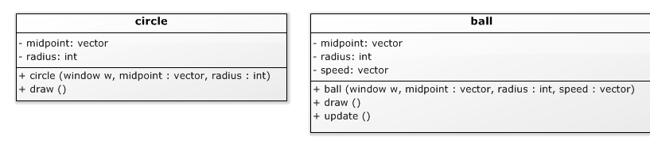
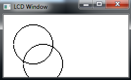
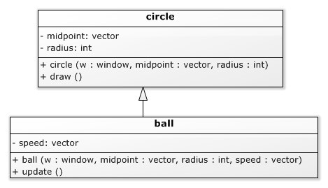
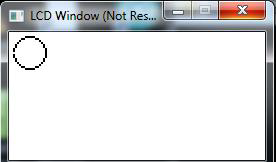
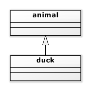

# Overerving - classes [](title-id)<!-- omit in toc -->

### Inhoud[](toc-id)<!-- omit in toc -->
- [Een bewegende bal](#een-bewegende-bal)
  - [Dilemma's](#dilemmas)
- [Overerving](#overerving)
  - [UML notatie (open pijl)](#uml-notatie-open-pijl)
  - [Constructor van afgeleide klasse](#constructor-van-afgeleide-klasse)
  - [Private, public of protected variabelen](#private-public-of-protected-variabelen)
  - [Samenvatting](#samenvatting)
  - [Een bijna lege main](#een-bijna-lege-main)
- [Functies en parameters: statische typering](#functies-en-parameters-statische-typering)
  - [Supertype als parameter in functies](#supertype-als-parameter-in-functies)
  - [Pointers en references](#pointers-en-references)


### Een bewegende bal
Stel dat we een bal op het scherm willen afbeelden die (eenparig) beweegt. Een bal (afgebeeld als een cirkel) zit bijvoorbeeld in de bibliotheek van SFML, maar deze `CircleShape` klasse heeft geen attribuut voor snelheid, en zal al helemaal niet uit zichzelf bewegen. 

#### Dilemma's
We kunnen natuurlijk code schrijven die buiten de bal om onthoudt welke snelheid de bal heeft, en aan de hand daarvan de positie met vaste intervallen aanpast. Maar volgens de Object Oriented principes is het bijwerken van de positie **een verantwoordelijkheid van het bal object**, dus hoort de snelheid, en de code die de positie aanpast, in de bal thuis, niet erbuiten.

We kunnen een bal klasse schrijven met alle gegevens en functies van een cirkel er in, plus de gegevens en functies voor bewegen, maar dan hebben we die cirkel aspecten (`middelpunt`, `diameter`, `draw()` functie) op twee plekken in ons programma staan: in cirkel en in bal. Dat is een slecht teken voor de kwaliteit van je code, en het is **dubbel werk** voor jou.



En, nog erger: dubbel leeswerk voor iemand die jouw code moet lezen, en de mogelijkheid dat een verbetering (bug fix, of een nieuwe feature) maar op 1 van de 2 plekken wordt doorgevoerd. **Code duplicatie is een teken van ‘code smell’: de geur van slechte code**.

```cpp
class circle {
private:
    vector midpoint;
    int radius;
public:
    circle( window & w,vector midpoint, int radius );
    void draw();
};

class ball {
private:
    vector midpoint;
    int radius;
    location speed;
public:
    ball( window & w,vector midpoint, int radius, vector speed );
    void draw();
    void update();
};
void ball::update(){
    midpoint += speed;
}
```
*Codevoorbeeld 12-01 - C++ code voor aparte cirkel en bal klassen, met een update functie (dit kan beter met overerving)*

We kunnen nu een bal aanmaken, tekenen, zichzelf laten updaten, en dan weer tekenen.
```cpp
window w( 128, 64, 2 );
ball b( w, vector( 30, 30 ), 20, vector( 10, 20 ) );
b.draw();
b.update();
b.draw();
```
*Codevoorbeeld 12-01 - Een ‘bewegende’ bal.*



### Overerving
Wat we voor de bal nodig hebben is het OO principe van overerving: 
- als een subklasse *erft* van een superklasse, dan heeft die subklasse *alle eigenschappen (attributen en functies) van de superklasse*, 
- en waarschijnlijk nog wat meer (anders heeft het weinig zin om een subklasse te maken).

#### UML notatie (open pijl)
In ons geval maken we de cirkel de superklasse, en daarvan leiden we de subklasse bal af. In UML geven we dit aan met een **open pijl**, in C++ met `: public circle`. Met deze opzet erft bal alle* dingen die in cirkel zitten, dus de duplicaties in bal kunnen weg.
Voor de richting van de pijl kun je als ezelsbruggetje gebruiken dat de wijdere kant van de pijl zit aan de kant van de klasse die meer eigenschappen heeft.

*Niet echt alles: constructors worden nooit geërfd. Dat zou ook raar zijn: een bal heeft meer attributen, en heeft dus ook een uitgebreidere constructor nodig. Er zijn nog andere dingen die niet geërfd worden, die worden later besproken.



```cpp
class circle {
private:
  window & w;
  location midpoint;
  int radius;
public:
  circle( window & w, const vector & midpoint, int radius );
  draw();
};

class ball : public circle {
private:
  vector speed;
public:
  ball(window & w, const vector & midpoint, int radius, const vector & speed );
  void update();
};
```
*Codevoorbeeld 12-02 - C++ code voor een bal afgeleid van cirkel*

#### Constructor van afgeleide klasse
In de constructor van bal moeten we de constructor van cirkel aanroepen, en de juiste parameters doorgeven.

```cpp
ball::ball( window & w, const vector & midpoint, int radius, const vector & speed ):
  circle( w, midpoint, radius ),
  speed( speed )
{}
```
*Codevoorbeeld 12-02 - de constructor van bal moet de constructor van zijn superklasse aanroepen*

Er is nu wel een probleem met de *update functie*: dat is een functie van bal, maar hij probeert de positie, die een variabele van cirkel is, te wijzigen. Die variabele is privé, dus dat zal de compiler niet toestaan.

```cpp
void ball::update(){
  midpoint += speed; // compiler error
}
```
*Codevoorbeeld 12-02 - privé variabelen van een superklasse zijn niet toegankelijk in een subklasse (afgeleide klasse)

#### Private, public of protected variabelen
We kunnen die variabele natuurlijk publiek maken, maar dat is misschien wat te veel van het goede. Een tussenoplossing is om de variabele protected te maken: **dan is hij wel bereikbaar voor de klasse zelf en voor afgeleide klassen, maar niet voor andere code.**

```cpp
class circle {
protected:
  vector midpoint;
  . . .
};

class ball : public circle {
  . . .
  void update(){
    midpoint += speed; // no compiler error
  }
};
```
Codevoorbeeld 12-03 - protected: ook toegankelijk in subklassen

#### Samenvatting
Nu is alles op zijn plaats voor een bewegende bal. 
- De applicatie creëert de window en de bal, 
- en daarna komt een oneindige lus die steeds 
  - de window leeg maakt, 
  - de bal tekent, 
  - even wacht, 
  - en de bal verplaatst naar zijn nieuwe positie. 

#### Een bijna lege main
Merk op hoe weinig details er in de main staan: 
- de window en de bal moeten gecreëerd worden met al hun details (plaats, omvang, snelheid, etc.), maar daarna zijn ze zelfstandig: 
  - een bal weet zelf hoe hij zich afbeeldt (en zelfs waarop), 
  - en hoe hij beweegt. 

Zelfs het detail dat de bal beweegt is niet zichtbaar: de bal kan op de update reageren zoals hij wil, hij zou ook bijvoorbeeld van kleur of omvang kunnen veranderen.

```cpp
int main(){
  window w( 128, 64, 2 );
  bal b( w, vector( 10, 10 ), 8, vector( 2, 2 ));

  for(;;){
    w.clear();
    b.draw();
    wait_ms( 100 );
    b.update();
  }

}
```
*Codevoorbeeld 12-04 - een bewegende bal*



### Functies en parameters: statische typering
C++ is in principe een statisch (compile-time) getypeerde taal: bij een functie parameter moet je aangeven van welk *type* die parameter is, en je kunt die functie alleen aanroepen met een parameter van dát type, anders compileert je code niet. 
- Het voordeel is dat er tijdens het runnen van je programma geen type checks meer hoeven plaats te vinden, wat de snelheid ten goede komt. 
- Maar soms is het handig om een functie te kunnen schrijven die kan werken met verschillende typen parameters. 

#### Supertype als parameter in functies
Dit kan in C++ als die verschillende typen een gemeenschappelijk supertype hebben: je kunt dan het *supertype* als parameter type gebruiken. Alle subtypen van dat supertype zijn dan toegestaan als parameter.

```cpp
class animal { . . . };
void sell( animal & a );

class duck : public animal { . . . };
void fly( duck & d );

duck d;

fly( d ); // OK: duck required, duck provided
sell( d ); // OK: animal required, duck provided

animal a;
sell( a ); // OK: animal required, animal provided
fly( a ); // ERROR: duck required, animal provided
```
*Codevoorbeeld 12-05 - een subklasse object is acceptabel als een superklasse object wordt gevraagd*


#### Pointers en references
De regel dat een subklasse object overal gebruikt kan worden waar een superklasse vereist is geldt ook voor pointers en references. **Een superklasse pointer of superklasse reference kan ook naar een subklasse object wijzen**, maar andersom kan niet.

```cpp
class animal { . . . };
class duck : public animal { . . . };

duck d;
duck * dp;
animal a;
animal * ap;

ap = & a;// OK: animal pointer required, animal pointer provided
ap = & d; // OK: animal pointer required, duckpointer provided
dp = & d; // OK: duck pointer required, duckpointer provided
dp = & a; // ERROR: duck pointer required, animal pointer provided
```
*Codevoorbeeld 12-05 - een superklasse pointer kan ook naar een subklasse object wijzen*

```cpp
class animal { . . . };
class duck : public animal { . . . };

duck d;
animal a;

animal & ar1 = a;// OK: animal reference refers to an animal
animal & ar2 = d; // OK: animal reference refers to a duck

duck & dr1 = d; // OK: duck reference refers to a duck
duck & dr2 = a; // ERROR: rerence can’t refer to a plain animal
```
*Codevoorbeeld 12-05 - een superklasse reference kan ook aan een subklasse object refereren*

Er is een uitgewerkt [overerving voorbeeld](./voorbeeld/README.md) en lees verder over [virtual en abstract](./virtual-abstract.md).