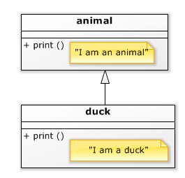
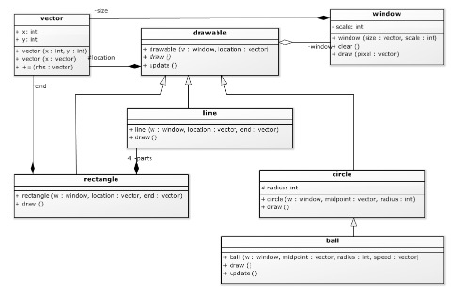

# Virtual en abstract [](title-id)<!-- omit in toc -->

### Inhoud[](toc-id)<!-- omit in toc -->
- [Superklassen en pointers](#superklassen-en-pointers)
  - [Generaliseren](#generaliseren)
  - [Virtual en abstract voor draw()](#virtual-en-abstract-voor-draw)
  - [Virtual en abstract voor update()](#virtual-en-abstract-voor-update)
  - [Virtual en abstract in UML](#virtual-en-abstract-in-uml)
  - [Virtual en abstract in andere programmeertalen](#virtual-en-abstract-in-andere-programmeertalen)
  - [Virtual en abstract in C++](#virtual-en-abstract-in-c)
- [Abstracte klassen](#abstracte-klassen)


Zie ook: [Overerving](./README.md)

### Superklassen en pointers
Als je in C++ een object van een afgeleide klasse gebruikt via een pointer of reference naar zijn superklasse, dan kan je alleen bij de eigenschappen van de superklasse. Het subklasse deel is er nog wel, maar het is voor jouw code onzichtbaar. Dit gaat zo ver dat als je in de superklasse en de subklasse een functie hebt met dezelfde naam, je dan toch de superklasse functie gebruikt.

```c++
class animal {
public:
    void print(){
        std::cout <<"I am an animal.\n";
    }
};

class duck : public animal {
public:
    void print(){
        std::cout <<"I am a duck.\n";
    }
};

animal a;
duck d;

a.print(); // I am an animal
d.print(); // I am a duck

animal & ar = d;
ar.print(); // I am an animal <======== !!

void f( animal & x ){
    x.print();
}
f( a ); // I am an animal
f( d ); // I am an animal <======== !!
```
*Codevoorbeeld 12-06 - Welke functie wordt aangeroepen?*


Het gebruiken van de superklasse functie is niet altijd gewenst: het is bijvoorbeeld handig als een verzameling objecten (bijvoorbeeld figuren die we op het scherm afbeelden) allemaal eenzelfde functie hebben die we kunnen aanroepen, maar dat wat ze dan in die functie doen verschillend is.

Naast de bewegende bal zouden we ook muren op het scherm willen afbeelden, die niet bewegen, maar op een andere manier reageren op het verstrijken van tijd. Vervolgens willen we deze schermobjecten onthouden in een array, zodat we ze in een loop kunnen bijwerken en afbeelden.

#### Generaliseren
Om dit te kunnen doen gebruiken we weer inheritance, maar wat we doen is het omgekeerde van specialiseren: we moeten *generaliseren*. De eigenschappen die de verschillende schermobjecten gemeenschappelijk hebben brengen we onder in een gemeenschappelijk superklasse (‘common base class’):
- een beginpunt (locatie);
- het feit dat ze afgebeeld kunnen worden
- het feit dat ze bijgewerkt kunnen worden.

Deze superklasse kunnen we noemen naar wat zijn objecten zijn (schermobjecten?), of zoals in dit geval, naar wat je er mee kunt doen (je kunt ze tekenen). Anders dan bij de bal die erft van een cirkel, is de
superklasse nu iets volkomen theoretisch: een drawable zelf is niets, het is abstract: het is alleen het gemeenschappelijke deel van zijn concrete subklassen. 
- Je kunt van een drawable niet aangeven wat de body van `draw()` zou moeten zijn: 
- dit kan alleen voor de echte (concrete) objecten. 
- Verder moet, als we bijvoorbeeld de draw() of update() methode van een schermobject aanroepen, de methode in het echte object worden aangeroepen. 

#### Virtual en abstract voor draw()
Om dit te bereiken moeten we twee C++ features gebruiken:
- De `draw` functie is **virtual**. 
  Dit betekent dat als we deze functie aanroepen, we de functie van het ‘echte’ object aanroepen. Dit is iets langzamer en kost iets meer geheugen dan het aanroepen van een gewone functie, vandaar dat het in C++ niet de default is.
- De `draw()` functie is behalve virtual ook nog **abstract**. 
  Dit betekent dat er in `drawable` helemaal geen (drawable-specifieke) `draw()` functie is. Dat is ook wel logisch, hoe zou je een object willen tekenen als je niet weet wat voor object het is?

#### Virtual en abstract voor update()
De `update()` functie is wel virtual, want als je een object (waar je verder niets van weet, alleen dat het een object is) wil bijwerken dan moet je de `update` functie van dat eigenlijke object aanroepen. Maar bijwerken is voor veel objecten (bijvoorbeeld de gewone lijn, cirkel en rechthoek) een *lege* operatie. Daarom is update() niet abstract: er is een (lege) implementatie gegeven. De ‘gewone’ sub objecten hoeven die dus niet te herdefiniëren. De bal doet dat wel, want die moet wel bewegen.

#### Virtual en abstract in UML
- In UML wordt abstract aangegeven door de naam in *italic* te schrijven. 
- Virtual zie je niet in UML, omdat het een implementatie detail is (dat in de meeste talen niet speelt).



#### Virtual en abstract in andere programmeertalen
In talen die meer op gemak voor de programmeur en minder op snelheid gefocust zijn wordt dit onderscheid doorgaans niet gemaakt en zijn alle klasse functies (methoden) `virtual`. Dit geldt bijvoorbeeld voor Python en Java.

#### Virtual en abstract in C++
- In C++ wordt `virtual` aangegeven met het `virtual` keyword voor de functie, en
- `abstract` met `= 0` op de plaats van de functie body. 
- Als je in een afgeleide klasse een functie implementeert die in de superklasse virtual is, dan geef je dan aan met `‘override’` achter de parameter lijst.
  
```c++
class drawable {
protected:
  window & w;
  vector location;
public:
  drawable( window & w, const vector & location );
  virtual void draw() = 0;
  virtual void update(){};
};

class circle : public drawable {
protected:
  int radius;
public:
  circle( window & w, const vector & midpoint, int radius );
  void draw() override;
};

class ball : public circle {
private:
  vector speed;
public:
  ball( window & w, const vector & midpoint, int radius, const vector & speed );
  void update() override;
};
```
*Codevoorbeeld 12-07 - C++: drawable, circle, ball* 

### Abstracte klassen
Als een klasse een of meer abstracte functies heeft (in het besproken geval geldt dit dus alleen voor drawable) dan is die klasse als geheel abstract. 
- Van een abstracte klasse kan je geen objecten (variabelen) aanmaken. 
- Je kan wel pointers en referenties maken die wijzen naar zo’n abstract type, maar die kunnen alleen wijzen naar bestaande objecten van een afgeleid, niet-abstract type.
  *Dit is in de taal C++ niet verplicht, maar het is wel sterk aan te raden. De compiler kan dan namelijk checken of je wel echt een virtual functie uit de superklasse (her)definieert, zo niet dan krijg je een foutmelding. Daarnaast is het ook informatief voor iemand die je code leest.*
  *Zoals eerder gezegd: een superklasse pointer of reference kan naar een subklasse object verwijzen.*

```c++
class abstract {
public:
  virtual void draw() = 0;
};

abstract obj; // ERROR: object is abstract
obj.draw(); // and what would this call anyway?

class concrete : public abstract {
public:
  void draw() override {}
};

concrete brick;
brick.draw(); // call the concrete draw()

abstract & p = brick;
p->draw(); // again, call the concrete draw
```
*Codevoorbeeld 12-08 - Een variabele van een abstracte klasse?*