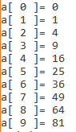

# std::array<> [](title-id)

### Inhoud[](toc-id)

### std::array<>
Een `std::array<>` bevat een aantal waarden van hetzelfde type. Anders dan bij een `std::vector<>` moet je aangeven wat het *aantal* is, en dit aantal kan gedurende de levensduur van het array niet veranderen. Dit is een flinke beperking, maar daar staat tegenover dat het alloceren en benaderen van een `std::array<>` sneller gaat dan een `std::vector<>`. 

Op een klein embedded systeem is het vaak niet mogelijk een `std::vector<>` te gebruiken omdat die gebruik maakt van de **heap**, en die is op zo’n systeem vaak niet aanwezig. `std::array<>` is dan dus het enige alternatief.

```c++
#include <array>

int main(){
    std::array< int, 10 > a;
    for( unsigned int i = 0; i < a.size(); i++ ){
        a[ i ] = i * i;
    }
    for( unsigned int i = 0; i < a.size(); i++ ){
        std::cout << "a[ " << i << " ]= " << a[ i ] << "\n";
    }
}
```
*Codevoorbeeld 05-07 - Gebruik van std::array<>*



#### Best practices gebruik std::array<>
De omvang (aantal elementen) van een std::array<> moet je expliciet aangeven. Dat kun je doen door het getal op te nemen (bv. 10 in het vorige voorbeeld), maar het is beter om van dat getal een `const` te maken: 
- dan word je gedwongen een *zinnige naam* te geven aan het aantal, 
- en als je het getal op meerdere plekken moet gebruiken loop je niet de kans dat het getal op de ene plek wordt veranderd en op een andere plek niet.

*N.B. In plaats van een constante te gebruiken kun je (in dit geval) nog beter de size() van het array opvragen, dan kun je je ook niet vergissen in de naam van de constante.*

```c++
const unsigned int squares_table_size = 10;

int main(){
  std::array< int, squares_table_size > squares;

  for( unsigned int i = 0; i < squares_table_size; i++ ){
    squares[ i ] = i * i;
  }
  for( unsigned int i = 0; i < squares.size(); i++ ){
    std::cout << "squares[ " << i << " ]= " << squares[ i ] << "\n";
  }
}
```
*Codevoorbeeld 05-08 - Een const als std::array size*

#### std::array als parameter
Als je een `std::array<>` als parameter wilt gebruiken, dan moet wat je meegeeft, precies hetzelfde zijn als de parameter, dus zowel het type van de elementen als het aantal elementen. Als dat niet zo is krijg je een compiler error.

```c++
const unsigned int word_size = 8;

void print( const std::array< char, word_size > & word ){
  for( unsigned int i = 0; i < word.size(); i++ ) {
    std::cout<< word[ i ];
  }
}

int main(){
  std::array< char, word_size > word = { 'P', 'a', 't', 'a', 't', 'j', 'e', '!' };
  print( word );

  std::array< char, 5 > short_word = { 'P', 'a', 't', 'a', 't' };
  print( short_word ); // compiler error
}
```
*Codevoorbeeld 05-09 - Een std::array<> als parameter*

#### Best practices std::array parameter
Als je een `std::array<>` doorgeeft, maar niet alle elementen zijn geldig, dan moet je dit op een andere manier doorgeven:
- bv. met een extra parameter, 
- of door speciale waarden te gebruiken om ongeldige elementen te markeren.

```c++
const unsigned int word_size = 8;

void print(
const std::array< char, word_size > & word,
unsigned int valid
){
  for( unsigned int i = 0; i < valid; i++ ) {
    std::cout<< word[ i ];
  }
}

int main(){
  std::array< char, word_size > word = { 'P', 'a', 't', 'a', 't', 'j', 'e', '!' };
  print( word, 8 );

  std::array< char, word_size > short_word = { 'P', 'a', 't', 'a', 't' };
  print( short_word, 5 );
}
```
*Codevoorbeeld 05-10 - Gebruik van een extra parameter om de geldige lengte door te geven*

#### Sentinel
Soms is het mogelijk een speciale waarde te gebruiken om aan te geven dat een element (en de elementen die daarna komen) niet geldig zijn. Dit wordt vaak een **‘sentinel’** genoemd. 

##### ASCII sntinel
Voor ASCII characters is het ASCII nul character ( `\0` ) een veel gebruikte sentinel. Dit is zelfs in de taal ingebouwd: een string literal tussen dubbel-quotes is de reeks characters tussen de quotes, met een ASCII nul er achter. De string ”hello” neemt dus 6 bytes in beslag: de 5 letters plus de nul.

```c++
void print( const std::array< char, word_size > & word ){
  for( unsigned int i = 0; i < word.size(); i++ ) {
    if( word[ i ] == '\0' ){
      return;
    }
    std::cout<< word[ i ];
  }
}

int main(){
  std::array< char, 8 > short_word = { 'P', 'a', 't', 'a', 't', '\0' };
  print( short_word );
}
```
*Codevoorbeeld 05-11 - Gebruik van een sentinel*