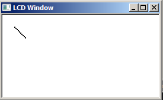
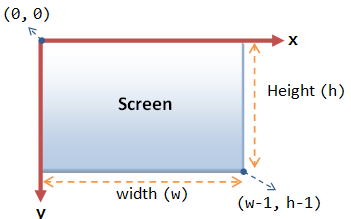

# Compositie - structs[](title-id)

### Inhoud[](toc-id)
- [Compositie - structs](#compositie---structs)
    - [Inhoud](#inhoud)
  - [Introductie](#introductie)
    - [Voorkennis en leeswijzer](#voorkennis-en-leeswijzer)
    - [Teken een lijn](#teken-een-lijn)
      - [Naamgeving functie](#naamgeving-functie)
      - [Grafisch scherm en coördinaten](#grafisch-scherm-en-coördinaten)
    - [Struct datatype voor lijn](#struct-datatype-voor-lijn)
      - [Let op accolades { en } en puntkommma's](#let-op-accolades--en--en-puntkommmas)
      - [Overloading van functies](#overloading-van-functies)
    - [Memberfuncties](#memberfuncties)
    - [Constructors (memberfuncties)](#constructors-memberfuncties)
    - [Afscherming (private en public)](#afscherming-private-en-public)

---

**v0.1.0 [](version-id)** Start document voor OO programming concepten C++ door HU IICT[](author-id).

---

## Introductie

### Voorkennis en leeswijzer
Onderstaande informatie gaat ervan uit dat je kennis hebt genomen van de C++ [basisconcepten](../basisconcepten/README.md) en [datatypes](../data-types/README.md).
Als je nog niet eerder met het datatype `struct` hebt gewerkt, begin dan met de [basisinformatie over het datatype struct](../data-types/struct/README.md).

### Teken een lijn
Stel dat we op een grafisch scherm vormen willen afbeelden, te beginnen met een eenvoudige vorm: een lijn. Als we de lijn willen printen, kunnen we hiervoor een functie maken. Aan deze print-functie moeten we doorgeven wat hij precies moet doen. Dit kan door de coördinaten van het begin- en eindpunt van de lijn mee te geven als 4 (integer) parameters.
Met de code in voorbeeld 04-01 (en natuurlijk de bijbehorende implementatie van `line_print`) wordt een lijn geschreven in een window.

#### Naamgeving functie
De naam van de functie (`line_print`) geeft aan wat de functie doet. Beide naamdelen zijn nuttig: als je ‘print’ weglaat weet je niet wat er met de lijn moet gebeuren (opslaan? uitwissen? roteren? ...); als je ‘line’ weglaat weet je niet wat de 4 parameters (getallen) betekenen (punten van een rechthoek? gemiddelde temperaturen van 4 dagen? …).

```c++
void line_print( int start_x, int start_y, int end_x, int end_y );

. . . // hier is code weggelaten

line_print( 10, 10, 20, 20 );
```
*Codevoorbeeld 04-01 - Specificeer een lijn via de x en y waarden van zijn begin- en eindpunten*

#### Grafisch scherm en coördinaten


Bij een grafisch scherm is het de gewoonte dat (0,0) linksboven is, en dat de y-coördinaten naar beneden lopen (dus anders dan in een grafiek).



Voor een window met grootte w (breedte, horizontaal) bij h (hoogte, verticaal) valt de pixel (0,0) dus net binnen een window, de pixel (w, h) valt er net buiten. Net als bij vectoren en arrays lopen de indexen van 0 ……n-1.

### Struct datatype voor lijn
Vaak is het handig om alle gegevens van een lijn bij elkaar te zetten, zodat ze als 1 variabele (of parameter) kunnen worden behandeld; net als alle bitjes van een integer. 
Dit kan door de gegevens, in dit geval de 4 coördinaat-waarden, bij elkaar te plaatsen in een `struct`. Zo’n `struct` definieert een nieuw datatype, in dit geval een lijn. 
Met een struct kun je:
- lijn variabelen maken, en
- lijn parameters doorgeven aan een functie. 
- Een functie kan een lijn waarde retourneren (teruggeven), en je kunt 
- een array van lijnen maken.
  
Een struct datatype is vrijwel gelijkwaardig aan de ingebouwde datatypen (int, float, etc.).

Lees ook de [basisinformatie over het datatype struct](../data-types/struct/README.md).


Het volgende code fragment laat zien hoe een line struct wordt gedefinieerd en gebruikt. Je ziet dat de print functie nog maar 1 parameter heeft. Het ‘lijn’ deel van de functienaam kunnen we nu ook weglaten, want de parameter *is* een lijn.
Let op: onderstaande code kan nog verbeterd worden.

```c++
struct line {
  int start_x;
  int start_y;
  int end_x;
  int end_y;
}; // niet vergeten af te sluiten

void print( line x ); // declaratie

. . . // weggelaten code
line diagonal_line = { 10, 10, 40, 20 };
print( diagonal_line );
```
*Codevoorbeeld 04-02 - Specificeer een lijn via een lijn datatype*

#### Let op accolades { en } en puntkommma's
Let op dat je een `struct` afsluit met `};` Als je de ; vergeet krijg je een foutmelding op de volgende C++ regel. Dat kan een mysterieuze melding zijn als die volgende regel in een ander bestand staat.

#### Overloading van functies
In C++ kunnen (anders dan in C) er meerdere functies zijn met dezelfde naam (bv `print`, mits ze verschillende parameters hebben. Dit heet *overloading*. 
Er zijn interessante discussies over het gebruik van overloading, sommigen (met name programmeurs die gewend zijn aan een taal zonder overloading) vinden het een probleem dat je aan de naam van een (overloaded) functie niet meteen kunt zien welke functie wordt aangeroepen.

### Memberfuncties
De functie `print` hoort echt bij de lijn struct. Dit kunnen we uitdrukken door de lijn struct en de print functie te combineren. We declareren dan de print functie in de struct in plaats van er buiten. Zo’n functie wordt een *member functie* of *methode* genoemd. Zo’n member functie wordt aangeroepen met de syntax `object.functie(…)`, waarbij het object impliciet wordt doorgegeven, in het volgende voorbeeld dus `diagonal_line.print()`. In de parameterlijst van print komt line dus niet meer voor. [^1]

```c++
struct line {
  int start_x;
  int start_y;
  int end_x;
  int end_y;

  void print(); // memberfunctie
};

. . . // weggelaten code
line diagonal_line = { 10, 10, 40, 40 };
diagonal_line.print();
```
*Codevoorbeeld 04-03 - De print functie ondergebracht in het lijn datatype*

[^1]: In C++ hoef je voor een lege parameterlijst niet zoals in C *(void)* te schrijven (dat mag nog wel): alleen () is voldoende. In dit voorbeeld:
`void print();` (C++) vs. `void print(void);` (C).

### Constructors (memberfuncties)
Als je een member functie schrijft *met dezelfde naam* als de struct dan is dit (per definitie) een **constructor**. 

Een constructor maakt zijn struct klaar voor gebruik; vaak aan de hand van parameters die hij mee krijgt. In dit geval is de constructor bijna triviaal: de parameters worden gekopieerd naar de overeenkomstige data elementen van de lijn. 
Een constructor heeft **geen return type** (zelfs niet void).
Bij het aanmaken van de lijn wordt nu een iets andere syntax gebruikt: de constructor parameters worden meegegeven bij het creëren van de variabele.
Deze syntax wordt door de compiler afgedwongen: bij het creëren van een variabele die een of meer constructors heeft moet een van die constructors worden aangeroepen.

```c++
struct line {
  int start_x;
  int start_y;
  int end_x;
  int end_y;

  line( int p_start_x, int p_start_y, int p_end_x, int p_end_y ){
    start_x = p_start_x;
    start_y = p_start_y;
    end_x = p_end_x;
    end_y = p_end_y;
  } // constructor

  void print();
};

. . . // weggelaten code
line diagonal_line = { 10, 10, 40, 40 }; // initialisatie
diagonal_line.print();
```
*Codevoorbeeld 04-04 - Initialisatie d.m.v. een constructor*

### Afscherming (private en public)
De lijn, uit codevoorbeeld 04-04, heeft
- een constructor waarmee hij aangemaakt kan worden en 
- een print functie die de lijn kan printen. 

Dat is eigenlijk alles wat een gebruiker moet weten: dat er in de lijn vier integers worden opgeslagen is voor de gebruiker niet van belang. We kunnen dit uitdrukken door de vier integers `private` te maken. Private geldt voor alle dingen die erna komen, dus we moeten nog wel zorgen dat de constructor en de print functie toegankelijk blijven. Dit doen we door er het label `public` voor te zetten. 

**Private vs public**:
Code buiten de struct kan nu niet meer bij de attributen, maar de methoden van de struct kunnen nog wel gebruik maken van de attributen.

```c++
struct line {
private:
  int start_x;
  int start_y;
  int end_x;
  int end_y;

public:
  line( int p_start_x, int p_start_y, int p_end_x, int p_end_y ){
    start_x = p_start_x;
    start_y = p_start_y;
    end_x = p_end_x;
    end_y = p_end_y;
  } // constructor

  void print();
};

. . . // weggelaten code
line diagonal_line = { 10, 10, 40, 40 }; // initialisatie

// dit geeft nu een compilatie fout:
line.start_x = 7; // error: 'int line::start_x' is private

diagonal_line.print();
```
*Codevoorbeeld 04-05 - Onderscheid tussen privé en publiek*