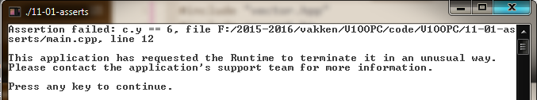
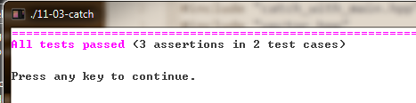
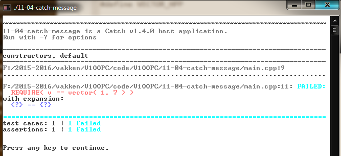
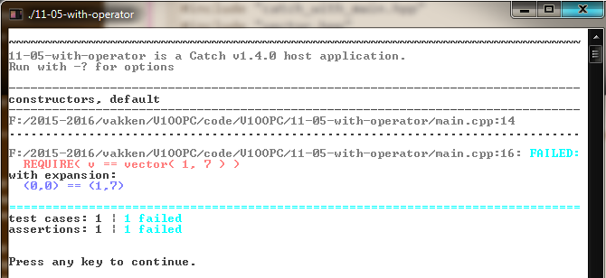

# Unit tests [](title-id) <!-- omit in toc -->

### Inhoud[](toc-id) <!-- omit in toc -->
- [Unit Test Frameworks](#unit-test-frameworks)
  - [Catch2](#catch2)
    - [Geen main](#geen-main)
    - [TEST\_CASE](#test_case)
    - [Voorbeeld Catch2](#voorbeeld-catch2)
    - [Uitvoer Catch](#uitvoer-catch)
    - [Tip: Operator\<\< en stringstream](#tip-operator-en-stringstream)


Behandelde onderwerpen
• unit tests
• asserts
• Catch2

### Waarom testen?
Het is een ‘fact of life’ dat software fouten (bugs) bevat. Het is natuurlijk een goed voornemen om geen fouten te maken tijdens het schrijven, maar dat zal het aantal fouten nooit tot nul reduceren. 
Uit onderzoek is gebleken dat het herstellen van een fout (veel) duurder* is in latere fasen van de ontwikkeling van een applicatie, dus het is verstandig fouten zo vroeg mogelijk te vinden. 
*Eén reden is dat het verbeteren van een fout vaak een nieuwe fout introduceert, en als je pech hebt meer dan één.*


#### Fouten vroeg opsporen
Voor technische software geldt dit misschien nog wel sterker dan voor andere software: als een bug pas tijdens het gebruik van een kerncentrale aan het licht komt is er misschien geen centrale meer om je gewijzigde software te gebruiken. (Als je dichtbij woonde is er misschien ook geen ‘jij’ meer om die wijziging te maken.) 

#### Test Driven Development
Het is dus verstandig software *zo vroeg mogelijk te testen*. Er is zelfs een ontwikkelmethode (Test Driven Development) die er op is gebaseerd dat je pas code mag schrijven of wijzigen als je eerst een test hebt geschreven die (met de code die je tot nu toe hebt) faalt.

### Unit tests
De kleinste eenheden code die we schrijven worden **units** genoemd, en het testen daarvan dus **unit testing**. 

Een unit test heeft meestal een simpel patroon:
- Zet een paar dingen (objecten) klaar
- Laat de te testen code iets doen met die dingen en/of een nieuw ding maken
- Verifieer dat de oude dingen en/of de nieuwe dingen de verwachte waarden hebben

#### Voorbeeld: operator+
Neem als voorbeeld de `operator+` voor twee vectoren. 
- Om die te testen moeten we twee vectoren hebben met bekende waarden die we bij elkaar optellen, wat een nieuwe vector oplevert. 
- Na het optellen checken we dat de nieuwe vector de verwachte waarde heeft, en (dat wordt vaak vergeten)
- dat de oude vectoren nog steeds hun oude waarden hebben. 

#### Assert()
Om te checken of aan een bepaalde voorwaarde is voldaan kun je `assert()` gebruiken. 
- Een assert met een false argument levert een run-time foutmelding op. Althans, als je compileert voor de debug: 
- als je compileert voor *‘release’* (of de macro `NDEBUG` definieert) dan worden alle asserts genegeerd.
*Sommige mensen vergelijken dit met een fabriek die veiligheidsriemen en airbags plaatst in testauto’s, maar niet in de productie-modellen.*

#### Tips
Richt je test zo in dat het waarschijnlijk is dat realistische fouten in de te testen code ook aan het licht komen. Als je alleen test dat `(0,0) + (0,0)` gelijk is aan `(0,0)` dan zijn er voor de hand liggende fouten die je niet zult ontdekken. 

#### Voorbeeldcode operator+
De onderstaande test is al wat beter, maar wat zou deze test niet ontdekken en wat zou jij er aan veranderen om dat wel te ontdekken?

```c++
#include <assert.h>

vector a( 1, 2 );
vector b( 4, 3 );
vector c = a + b;

assert( a.x == 1 ); assert( a.y == 2 );
assert( b.x == 4 ); assert( b.y == 3 );
assert( c.x == 5 ); assert( c.y == 5 );
```
*Codevoorbeeld 09-01 - Recht-toe-recht aan test van vector::operator+*

#### Voorbeeld operator==
De `operator+` test bevat een reeks asserts op de *attributen* van een vector. Je kunt het jezelf (en je lezer) wat makkelijker maken door een `operator==` te definiëren voor vector en die te gebruiken. Maar dan moet je die `operator==` natuurlijk wel testen!

```c++
bool operator==( const vector &lhs, const vector &rhs ){
  return ( lhs.x == rhs.x ) && ( lhs.y == rhs.y );
}

vector a( 1, 2 );
vector b( 4, 3 );

vector c = a + b;

assert( a == vector( 1, 2 ) );
assert( b == vector( 4, 3 ) );
assert( c == vector( 5, 5 ) );
```
*Codevoorbeeld 09-02 - Testen met gebruik van `operator==`*

#### Nadeel eenvoudig testen
Als één van de tests faalt krijg je een foutmelding, maar die vermeldt alleen dat een assert faalde op een bepaald regelnummer.



## Unit Test Frameworks
Het zou best handig zijn als de bovenstaande foutmelding ook aangaf *wat de beide waarden zijn*. 
Je kunt zelf een macro schrijven die dat doet, maar dat werk is natuurlijk al lang een keer gedaan. 

Een library die zoiets (en vaak nog veel meer) voor je doet heet een **‘unit test framework’**. Wij gebruiken een heel simpel unit test framework: *Catch2*.

### Catch2
Een eenvoudige Catch2 applicatie bevat 
- een reeks `TEST_CASE`'s 
- met daarin aanroepen van `REQUIRE`. 

#### Geen main
Een main is meestal niet nodig: de main die de header `catch.hpp` levert als `CATCH_CONFIG_MAIN` is gedefinieerd, is doorgaans voldoende. 

#### TEST_CASE
Een `TEST_CASE` leest als een soort functie definitie, maar op de plaats van de parameter lijst staat een string literal die de test identificeert.

#### Voorbeeld Catch2

```c++
#include "ostream"
#include "vector.hpp"
#define CATCH_CONFIG_MAIN
#include "catch.hpp"

bool operator==( vector lhs, vector rhs ){
  return ( lhs.x == rhs.x ) && ( lhs.y == rhs.y );
}

std::ostream & operator<<( std::ostream & lhs, vector rhs ){
  return lhs << "(" << rhs.x << "," << rhs.y << ")";
}

TEST_CASE( "constructors, two_parameters" ){
  vector v( 3, 4 );
  REQUIRE( v.x == 3 );
  REQUIRE( v.y == 4 );
}
TEST_CASE( "constructors, default" ){
  vector v;
  REQUIRE( v == vector( 0, 0 ) );
}
```
*Codevoorbeeld 09-03 - Een eenvoudige Catch applicatie*

#### Uitvoer Catch
De uitvoer van Catch voor een run waarin geen fouten zijn gevonden vermeldt het aantal assertions en het aantal tests dat is uitgevoerd.



Als een assertion faalt dan wordt dit gemeld.
```c++
TEST_CASE( "constructors, default" ){
  vector v;
  REQUIRE( v == vector( 1, 7 ) );
}
```
*Codevoorbeeld 09-04 - 
Een test case die een fout zal opleveren*



Er wordt nu gemeld dat er een fout is opgetreden en waar, maar het zou nog handiger zijn als we ook zouden zien *welke waarden* er aan beide kanten van de `operator==` staan. Dit kan Catch2 voor je doen, maar dan moet er voor die waarden wel een `operator<<` bestaan.

```c++
std::ostream & operator<<( std::ostream & lhs, vector pos ){
    lhs << "(" << pos.x << "," << pos.y << ")";
    return lhs;
}

TEST_CASE( "constructors, default" ){
    vector v;
    REQUIRE( v == vector( 1, 7 ) );
}
```
*Codevoorbeeld 09-05 - Falende test case met een `operator<<`*



#### Tip: Operator<< en stringstream
Tot nu toe hebben we `operator<<` alleen gebruikt om te schrijven naar de *standaard uitvoer*. 
Om een `operator<<` te testen is het handig om te weten dat je die via een omweg ook kunt gebruiken om naar een `string` te schrijven, *want dan kun je na afloop de inhoud van die string checken*. Dit doe je door naar een (lege) `std::stringstream` te printen, en daarna de waarde van die `stringstream` op te vragen met de `s.str()` methode.

```c++
TEST_CASE( "operator<<" ){
    std::stringstream s;
    vector v( 1, 2 );
    s << v;
    REQUIRE( s.str() == "(1,2)" );
}
```
*Codevoorbeeld 09-06 - test de `operator<<` door middel van `std::stringstream`*