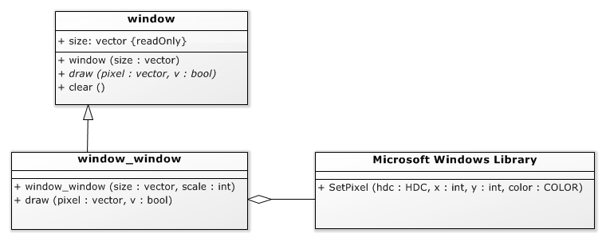
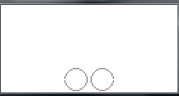

# Adapter[](title-id) <!-- omit in toc -->

## Inhoud[](toc-id) <!-- omit in toc -->

- [Adapter vs. decorator](#adapter-vs-decorator)
  - [Decorator: gedrag anders, interface gelijk](#decorator-gedrag-anders-interface-gelijk)
  - [Adapter: gedrag gelijk, interface verschillend](#adapter-gedrag-gelijk-interface-verschillend)
- [Adapter voorbeeld: window](#adapter-voorbeeld-window)
  - [Functioneel geen veranderingen](#functioneel-geen-veranderingen)
- [Decorator voorbeeld: window](#decorator-voorbeeld-window)

## Adapter vs. decorator

Het adapter en het decorator patroon zijn elkaars tegengestelden.
Lees ook alles over het [Decorator pattern](../decorator/README.md).

### Decorator: gedrag anders, interface gelijk

Een [decorator](../decorator/README.md) biedt een ‘laagje’ over een object, zodat het zich iets anders gaat gedragen, maar *de interface van de decorator en het ‘minion’ object is dezelfde*.

### Adapter: gedrag gelijk, interface verschillend

Bij het adapter pattern zijn *het gedrag van het ‘minion’ object en de adapter hetzelfde*, maar *de interface is anders*.
Bijvoorbeeld de naam van de functies, de types en volgorde van de parameters zijn anders.

## Adapter voorbeeld: window

Een voorbeeld van een adapter is de implementatie van een (abstract) *grafisch scherm* op bijvoorbeeld windows.

De `window_window` klasse is een implementatie van de abstracte `window` klasse. De `window` klasse hoeft maar 2 functies te implementeren:

- een window maken, en
- een pixel schrijven.

Het *wissen* (`clear`) van de window kunnen we in de abstracte window klasse oplossen door alle pixels uit te zetten.
De `window_window::draw` functie maakt gebruik van de `SetPixel` functie in de Microsoft Windows library die hetzelfde doet, maar met heel andere parameters.


*Figuur - Een adapter: een abstracte window, en een implementatie daarvan op Microsoft Windows*

### Functioneel geen veranderingen

Behalve het veranderen van de parameters (de boolean waarde moet vervangen worden door twee RGB waarden) hoeft bv. de `window_window::draw` functie eigenlijk niets te doen. (De code bevat nog twee for loops omdat we op windows de pixels wat groter willen maken.)

**Dit is typisch voor een adapter: de interface van de adapter is anders dan van het onderliggende object, maar de functie (wat er eigenlijk gebeurt) is meestal hetzelfde.**

```cpp
void window_window::draw( const vector & pixel, bool v ){
  for( int dx = 0; dx < scale; dx++ ){
    for( int dy = 0; dy < scale; dy++ ){
      SetPixel(
        hdc,
        scale * pixel.x + dx,
        scale * pixel.y + dy,
        v ? RGB( 0x00, 0x00, 0x00 ) : RGB( 0xFF, 0xFF, 0xFF )
      );
      }
  }
}
```

*Codevoorbeeld 17-04 - `window_window::draw` implementatie*

## Decorator voorbeeld: window

Een window is trouwens ook een goede kandidaat voor decorators. De mirror decorator splitst de window in twee sub-windows, en print naar beide windows, maar *geïnverteerd*.

```cpp
class window_mirror : public window {
private:
  window & w;
public:
  window_mirror( window & w ):
    window( vector( w.size.x / 2, w.size.y ) ),
    w( w )
  {}

  void draw( const vector & pixel, bool v = true ) override {
    if( pixel.x <= ( w.size.x / 2 )){
      w.draw( pixel, v );
      w.draw( vector( ( w.size.x - 1 ) - pixel.x, pixel.y ), v );
    }
  }

};
```

*Codevoorbeeld 17-05 - Een mirror decorator*

```cpp
int main(){

  window_window w1( vector( 128, 64 ), 2 );
  auto w = window_mirror( w1 );

  ball b( w, vector( 10, 10 ), 8, vector( 2, 2 ));

  for(;;){
    w.clear();
    b.draw();
    wait_ms( 100 );
    b.update();
  }
}
```

*Codevoorbeeld 21-05 - Gebruik van de mirror decorator*


*Figuur - Schermprint van de mirror decorator*
