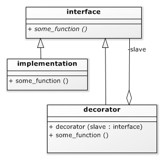

# Decorator[](title-id) <!-- omit in toc -->

## Inhoud[](toc-id) <!-- omit in toc -->
- [Decorator](#decorator)
  - [Inhoud](#inhoud)
  - [Design patterns](#design-patterns)
  - [Introductie patterns](#introductie-patterns)
  - [Decorator](#decorator-1)
    - [Decorator (uitleg en voordeel)](#decorator-uitleg-en-voordeel)
    - [UML decorator pattern](#uml-decorator-pattern)
    - [Voorbeeld: een inverter pin](#voorbeeld-een-inverter-pin)
  - [Terminologie](#terminologie)
    - [Decorator voorbeeld: inverter](#decorator-voorbeeld-inverter)
    - [Decorator voorbeeld: pin\_out\_all](#decorator-voorbeeld-pin_out_all)
  - [Adapter pattern](#adapter-pattern)
    - [Mirror decorator](#mirror-decorator)


## Design patterns
In de context van software engineering is een *pattern* een min of meer vaste manier om iets te doen, die in de loop der tijd zijn nut heeft bewezen. Er zijn enorm veel dingen die aanspraak maken op de term software pattern, maar er is maar een klein aantal (ongeveer 20) dat echt algemeen erkend en bekend verondersteld wordt. [^59]

Het handige van de patterns is (behalve dat ze goed blijken te werken) dat je met weinig woorden (“dit is een decorator”) veel informatie geeft aan iemand die met het pattern bekend is. Dat bespaart jou veel schrijfwerk, en de lezer veel leeswerk.

[^59]: Voor de meeste professionals zijn dit de ’oer’ patterns die beschreven zijn in het boek “Design Patterns: Elements of Reusable Object-Oriented Software”.

## [Introductie patterns](../README.md)
<!-- Er is een apart md-bestand met informatie over patronen (patterns) -->

## Decorator
Het principe van het decorator pattern is dat je eerst 
- een *abstracte interface klasse* hebt, bijvoorbeeld een GPIO pin. Om daar nuttig gebruik van te maken moet je natuurlijk ook 
- een of meer *concrete implementaties* van die klasse hebben, bijvoorbeeld een GPIO pin van de Arduino Due.

Vervolgens kun je een klasse maken die een gegeven GPIO pin *een beetje aanpast*, bijvoorbeeld een inverter: 
- als je `1` naar de pin schrijft, dan wordt de pin laag, en 
- als je er een `0` naar schrijft dan wordt hij hoog (dus precies andersom als bij een normale pin). 
Je zou zo’n feature natuurlijk onder kunnen brengen in de abstracte klasse, maar dan moet je het in iedere concrete klasse implementeren. De truc van het decorator pattern is *dat je het maar 1 keer hoeft te schrijven*, en dan als een soort decoratie om of over een ander object kan leggen. 

### Decorator (uitleg en voordeel)
Een decoratorklasse 'omhult' de oorspronkelijke klasse en verbetert de mogelijkheden ervan. Met een decorator kun je nieuwe gedragingen of functionaliteiten aan objecten toevoegen *tijdens runtime*, zonder hun structuur te wijzigen.

### UML decorator pattern

<!-- Todo: rename inappropriate relationships in figure -->
*Figure: UML voor een (algemene) decorator*

### Voorbeeld: een inverter pin
De C++ code voor een *inverter decorator* is een klasse die 
- een subklasse is van de interface. 
- Hij krijgt in zijn constructor het ‘onderliggende’ object mee. 
- De operaties die niet gewijzigd hoeven te worden zijn in de decorator geïmplementeerd door simpelweg ‘door te verwijzen’ naar het onderliggende object. 
- De twee operaties die wel gewijzigd zijn, `set()` en `get()`, verwijzen ook door, maar met een (in dit geval kleine) verandering.

## Terminologie
*N.B. We gebruiken in onderstaande voorbeelden het woord **'minion'** in plaats van de vroeger gebruikte term 'slave'. Andere termen die je tegen kunt komen zijn: agent, child, follower, secondary etc.

In plaats van **'master'** kun je ook 'controller', parent, leader of primary tegenkomen.

```cpp
class pin_in_out_invert : public hwlib::pin_in_out {
private:
  hwlib::pin_in_out & minion;

public:
  pin_in_out_invert( hwlib::pin_in_out & minion ):
    minion( minion ){}

  void direction_set_input() override {
    minion.direction_set_input();
  }

  bool get() override {
    return ! minion.get();
  }
  void direction_set_output() override {
    minion.direction_set_output();
  }
  void set( bool x ) override {
    minion.set( ! x );
  }
};
```
*Codevoorbeeld 17-01A - Een inverter decorator voor de GPIO `pin_in_out` klasse*

In een eerder programma kopieerden we een schakelaar naar een LED. Dat kopiëren kunnen we onderbrengen in een functie.

```cpp
void copy_pins(
  hwlib::pin_in_out & destination,
  hwlib::pin_in_out & source
){
  destination.direction_set_output();
  source.direction_set_input();
  for(;;){
    destination.set( source.get() );
  }
}
```
*Codevoorbeeld 17-01B - Kopieer de waarde van een source pin naar een destination pin*

### Decorator voorbeeld: inverter
Maar nu hebben we een probleem: 
- de `LED in` is actief-hoog (de LED is aangesloten tussen de pin en ground), 
- maar de switch pin is actief-laag (de schakelaar is aangesloten tussen de pin en ground, dus de pin is laag als de schakelaar is ingedrukt). 

Dit kunnen we oplossen door aan de `copy_pins` functie niet de ‘originele’ LED en schakelaar pinnen mee te gaven, maar een van beiden te *inverteren*.

```cpp
int main( void ){
  . . .
  auto led = target::pin_in_out( target::pins::led );
  auto sw_pin = target::pin_in_out( target::pins::d7 );

  // LED on when switch is *not* pressed
  // copy_pins( led, sw_pin );
  // LED on when switch is pressed
  auto sw = pin_in_out_invert( sw_pin );
  copy_pins( led, sw );
}
```
*Codevoorbeeld 17-01C - Kopieer schakelaar naar LED*

### Decorator voorbeeld: pin_out_all
Een ander voorbeeld van een decorator is pin_out_all. Deze klasse krijgt in zijn constructor een aantal pin_out objecten mee, en als je pin_out_all.set() aanroept worden set() functies van al die *'minion'* pin_out objecten aangeroepen. 

Het is lastig om in C++ een variabel aantal parameters mee te geven, maar voor een beperkt maximum aantal kun je hetzelfde effect bereiken *door voor de parameters een geschikte (dummy) default te kiezen*. 

Het is in C++ niet mogelijk een array van references te maken, dus worden de adressen van de ‘minion’ pin_out’s opgeslagen in een array.

```cpp
class pin_out_all : public hwlib::pin_out {
private:
  hwlib::pin_out * list[ 4 ];

public:
  pin_out_all(
    hwlib::pin_out & p0,
    hwlib::pin_out & p1 = hwlib::pin_out_dummy,
    hwlib::pin_out & p2 = hwlib::pin_out_dummy,
    hwlib::pin_out & p3 = hwlib::pin_out_dummy
  ):
    list{ &p0, &p1, &p2, &p3 }
  {}
  void set( bool v ){
    for( const auto p & : list ){
      p->set( v );
    }
  }
};
```
*Codevoorbeeld 17-02A - De pin_out_all decorator*

Met deze decorator kunnen we `hwlib::blink` gebruiken om meer dan 1 pin tegelijk te laten blinken.

```cpp
int main( void ){
  . . .
  auto led0 = target::pin_out( target::pins::d7 );
  auto led1 = target::pin_out( target::pins::d6 );

  auto leds = pin_out_all( led0, led1 );

  hwlib::blink( leds );
}
```
*Codevoorbeeld 17-02B - Blink 2 LEDs tegelijk*

Met deze twee decorators (`pin_out_all` en `pin_out_invert`, een variatie op `pin_in_out_invert`), kunnen we allerlei combinaties maken, bijvoorbeeld het patroon:
` xx--/--xx/xx--/--xx `.

```cpp
int main( void ){
  . . .
  auto led0 = target::pin_out( target::pins::d7 );
  auto led1 = target::pin_out( target::pins::d6 );
  auto led2_pin = target::pin_out( target::pins::d5 );
  auto led3_pin = target::pin_out( target::pins::d4 );

  auto led2 = pin_out_invert( led2_pin );
  auto led3 = pin_out_invert( led3_pin );

  auto leds = pin_out_all( led0, led1, led2, led3 );

  hwlib::blink( leds, 500 );
}
```
*Codevoorbeeld 17-03 - Blink 4 LEDs in twee clusters*

## [Adapter pattern](../adapter/README.md)

### [Mirror decorator](../adapter/README.md#decorator-voorbeeld-window)