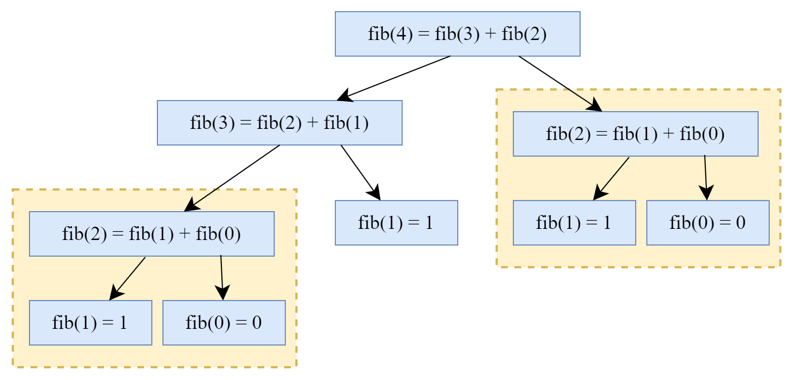

# Opdrachten Recursie C++[](title-id)

### Inhoud[](toc-id)
- [Opdrachten Recursie C++](#opdrachten-recursie-c)
    - [Inhoud](#inhoud)
  - [Opdracht 5.1 — Konijnen](#opdracht-51--konijnen)
  - [Opdracht 5.3 — Groot en gemeen](#opdracht-53--groot-en-gemeen)
  - [Opdracht 5.4 — Rij van Fibonacci](#opdracht-54--rij-van-fibonacci)
      - [Notatie en uitkomsten](#notatie-en-uitkomsten)
  - [Opdracht 5.6 - Gemiddelde](#opdracht-56---gemiddelde)
  - [Opdracht 5.8 — Robotpiraat](#opdracht-58--robotpiraat)


## Opdracht 5.1 — Konijnen

*Beschrijf* in één zin wat de onderstaande functie doet. Probeer de code alleen te *lezen* en niet uit te voeren.

```c++
int ears(int n_rabbits){
    if(n_rabbits <= 1){
        return n_rabbits * 2;
    }else{
        return 2 + ears(n_rabbits-1);
    }
}
```

## Opdracht 5.3 — Groot en gemeen

Hoe vaak wordt de onderstaande code uitgevoerd als `a=900` en `b=280`?

```c++
int findGCD(int a,int b){
    if(a == b){
        return a;
    }
    else if(a>b){
        return findGCD(a-b,b);
    }else{
        return findGCD(a,b-a);
    }
}
```

## Opdracht 5.4 — Rij van Fibonacci



*Figuur 5.1 - Voorbeeld van een programma dat recursief het vierde element van de fibonacci reeks uitrekent.*

De rij van Fibonacci is genoemd naar Leonardo van Pisa, bijgenaamd Fibonacci, die de
rij noemt in zijn boek *Liber abaci* uit 1202. 

- De rij begint met 0 en 1; 
- vervolgens is elk volgend element van de rij steeds **de som van de twee voorgaande elementen**. 

#### Notatie en uitkomsten

Bij de rij gebruiken we de notatie f<sub>n</sub> voor het aangeven van het n-de element van de rij. f<sub>9</sub> is bijvoorbeeld gelijk aan 34. 
De eerste elementen van de rij zijn dan als volgt:
0, 1, 1, 2, 3, 5, 8, 13, 21, 34, 55, 89, 144, 233, 377, 610, 987, 1597, 2584.

**Opdracht: Implementeer een functie die fn uitrekent gegeven integer n. De functie moet recursief zijn.**
Maak gebruik van de volgende definitie van de rij van Fibonacci:
1. f<sub>0</sub> == 0
2. f<sub>1</sub> == 1
3. f<sub>n</sub> = f<sub>n-1</sub> + f<sub>n-2</sub>, voor n > 1

Dezelfde regels, maar iets uitgebreider uitgelegd:
1. Als n == 0, dan geeft de functie 0 terug
2. Als n == 1, dan geeft de functie 1 terug
3. Als n > 1, dan geeft de functie de waarde terug van f<sub>n-1</sub> + f<sub>n-2</sub>. 

Je mag aannemen dat de gebruiker altijd een n geeft die groter of gelijk is aan 0.

## Opdracht 5.6 - Gemiddelde

Schrijf een recursieve functie die van een `vector<int>` het gemiddelde uitrekent. 
Neem aan dat de vector die de functie meekrijgt minimaal één element heeft.

## Opdracht 5.8 — Robotpiraat

De robotpiraat Arrrrr2D2 is op zoek naar de schat van de beroemde robotpiraat Roestbaard.
Om de schat te vinden heeft hij instructies gekregen, maar zijn batterij is bijna op. 

Schrijf een programma dat **de kortste instructies** geeft naar de schat, zodat Arrrrr2D2 genoeg
energie heeft om de schat te bereiken. 
- Splits je programma op in minimaal 2 deelproblemen.
- Schrijf voor elk deelprobleem een functie.
- Minimaal één van de functies moet recursief
zijn.
Tip: Kijk naar het uiteindelijke resultaat; de volgorde in instructies mag 'gehusseld' worden (bv. north en daarna south is gelijk aan south en daarna north).

De instructies naar de schat zijn:
```c++
Vector<string> map = 
  {"west", "west", "south", "south", "south", "west",
  "west", "west", "north", "north", "north", "north", "north", "west",
  "west", "west", "west", "west", "west", "south", "south", "south",
  "south", "east", "east", "east", "west", "west", "south", "south", "south", "west", "west", "north", "north", "north", "north", "north",
  "north", "west", "west", "west", "west", "west", "west", "south", "south", "south", "south", "east", "east", "east", "north", "north",
  "north", "north", "north", "north", "north", "north", "north", "north", "north", "east", "east", "east", "east", "east", "east", "east", "east", "east", "south", "south", "south", "south", "south",
  "west", "west", "west", "east", "east", "east", "east", "east", "east", "east", "east", "north", "west", "north", "north", "north", "north", "north", "north", "north", "north", "north", "north"}
```