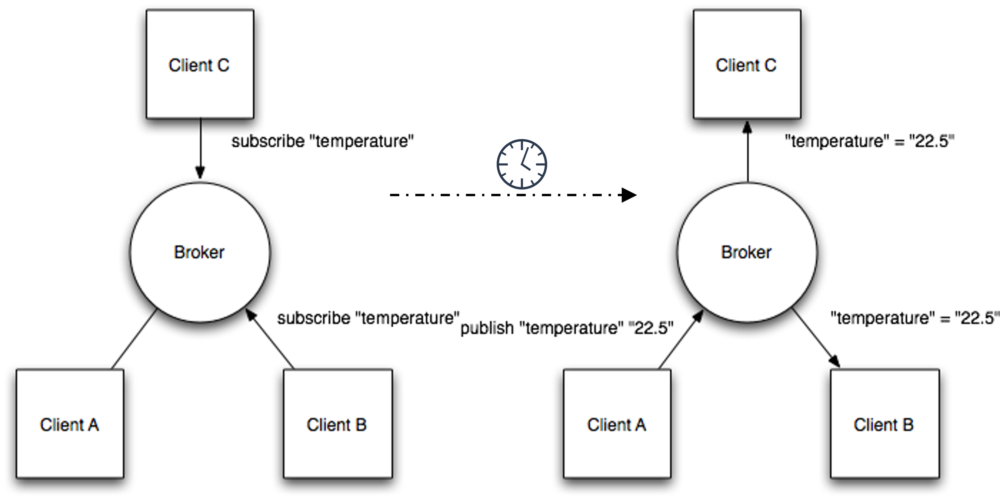

 

# MQTT <!-- omit in toc -->

### Inhoud <!-- omit in toc -->

- [Een introductie](#een-introductie)
- [Import characteristics of MQTT](#import-characteristics-of-mqtt)
- [Publish/Subscribe](#publishsubscribe)
- [Data-agnostic method](#data-agnostic-method)
- [Topics](#topics)
- [Quality of Service (QoS)](#quality-of-service-qos)
- [Message Queueing](#message-queueing)
- [Half-open connections \& disconnects](#half-open-connections--disconnects)
- [References](#references)

---

**v0.1.0 ** Start document voor MQTT and installatie instructies door HU IICT.

---

## Een introductie

MQTT has become the standard messaging and data exchange protocol for the Internet of Things (IoT). MQTT solves the folowing problem: A sensor can only seldomly send data, because of power-usage (recharge time). If at the moment of transmission there is no client to listen the information is lost. Furthermore, sending the data to multiple clients would cost more power as well. With MQTT protocol in place the the sensor sends its data to an intermediate server (a so called “broker”). That broker than publishes the data to any subscriber that is interested.

MQTT is a lightweight, publish-subscribe, machine to machine network protocol. The letters MQTT do not stand for anything. It is no longer a traditional 'message que'. It usually runs over a TCP/IP transport protocol.

## Import characteristics of MQTT

    Data Agnostic – the broker does not need to understand the semantics of the data that it is caching.
    Continuous Session Awareness (optional) - a client could provide the broker with his “last will and testament”. That determines what the broker will do after contact with the client is lost. Example: retry to connect for up to 10 more times over a timespan of one hour.

## Publish/Subscribe

In contrast to many API services you know the client-server architecture is not a request/response model. It adhers a publish/subscribe model resulting in loose coupling.

NB: Sometimes this is abbreviated as `pub-sub`.

Client A opens a topic at a broker. Other clients can subscribe to that topic (fully asynchronously). A broker must always be online.

## Data-agnostic method

Methods that work, regardless of the semantics of the data. These 5 simple, pre-implemented methods are all you need to get your MQTT job done!

1) Connect:  Connects with the broker
2) Disconnect: Disconnect with the broker
3) Subscribe: Subscribes the client to (a) topic(s)
4) Unsubscribe:  Unsubscribes the client from (a) topic(s)
5) Publish:  Publishes a message to a topic

## Topics

Subscriptions are on topics. Hierarchical, separated by “/” (e.g. kitchen/oven/temperature). Wildcards subscribe to whole hierarchies and are not allowed in publishing “+” matches a single level “#” matches multiple levels (0 or more).

The topic **kitchen/+/temperature**

- matches **kitchen/foo/temperature**
- does not match **kitchen/foo/bar/temperature**

The topic **kitchen/#**

- matches **kitchen/fridge/compressor/temperature**

## Quality of Service (QoS)

Fire and Forget. The broker sends data to subscribers without verifying whether it is received (like UDP). Messages are delivered at least once (like TCP).
Messages are delivered exactly once (more strict than TCP) for non-idempotent operations.

QOS downgrading: Both clients can specify the desired QOS. The lowest of both is used.

## Message Queueing

Messages can be marked ***retained***. All (re-)connecting subscribers receive last retained message.

To retain ***all*** messages of a topic, a persistent session must be setup by the client. Persistent session: subscriber gets session-id. After offline->back online it continues, using that session-id.

The broker will then store:

- Existence of a session, even if no subscriptions
- All subscriptions
- All unconfirmed QoS 1 and 2 messages

Subscriber will receive the messages upon reconnection. Very suitable for low-power clients. There is no need to (re-)authenticate using a computationally expensive https connection.

## Half-open connections & disconnects

A crash or transmission error can create ***half-open*** connections.

The functioning end is not aware and wastes resources.

The solutions for this are the following:

1. A client can setup a ***Keep-Alive connection***, which sends a PING in a regular (configurable) 'timeout' interval. Keep-alive pings include a random number. Keep-alive pinging is also called a “heartbeat”.

   - The broker disconnects on a timeout.
   - The broker also disconnects if the same client reconnects on a different connection (Client take-over).\
     It disconnects the oldest of both connections, because only one is needed for a single client.

2. A publisher can set a ***Last Will & Testament***, a predefined payload, sent on a (detected) disconnect, if:

   - The broker detects an I/O error or network failure.
   - The client fails to communicate within the Keep-Alive time window.
   - The client closes the network connection without sending a DISCONNECT packet.
   - The broker server closes the network connection due to a protocol error.
  
   Example of "Last will": “Keep sending the data for half an hour”.

## References

- MQTT (<https://en.wikipedia.org/wiki/MQTT>)
