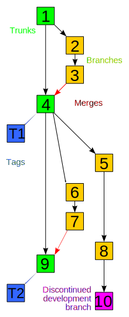

 

# Git

### Inhoud

- [Git](#git)
    - [Inhoud](#inhoud)
  - [Version Control System](#version-control-system)
  - [Alternatives to Git](#alternatives-to-git)
  - [Distributed versus centralized VCS](#distributed-versus-centralized-vcs)
  - [Git as a service](#git-as-a-service)
  - [Git from the command line](#git-from-the-command-line)
  - [Using Git](#using-git)
    - [Creating a repository](#creating-a-repository)
    - [Clone versus Fork](#clone-versus-fork)
    - [Basic workflow](#basic-workflow)
  - [Branching](#branching)
    - [Branching strategies](#branching-strategies)
    - [Branch how?](#branch-how)
    - [Branch 'Workflow'](#branch-workflow)
  - [Pull requests](#pull-requests)
  - [Referenties](#referenties)

---

**v0.1.0 ** intitial source from GitGud slides by Nick Goris in Markdown template by Harm Snippe.

---

## Version Control System

VCS is an abbreviation for Version Control System. A VCS is a tool that saves the changes to files in a local and/or remote repository. The benefit of using a VCS is the clear development history – at any point in time it is possible to see who did what and what happened since then. This clear development history makes it easier to locate bugs and roll back to stable versions. 

## Alternatives to Git

Are there any alternatives to using a VCS? Not really – one could use local backups on (removable) hard drives, but this makes working together much harder. Git is the most popular VCS worldwide, mostly because of its ease of use and speed – because you work locally you’re not as limited by network speed, there is no single point of failure as with centralized VCS(SVN) and git is available offline.

Alternatives to Git include Mercurial and SVN, but only about 16.1% of developers use SVN, and only 3.6% use Mercurial while 80-90% of developers use Git: [https://insights.stackoverflow.com/survey/2021#most-loved-dreaded-and-wanted-tools-tech-love-dread](https://insights.stackoverflow.com/survey/2021#most-loved-dreaded-and-wanted-tools-tech-love-dread) 

## Distributed versus centralized VCS

Git is a distributed VCS, meaning that you always have a working local repository in addition to a central remote. Centralized VCS only have a remote, so any ‘commits’ you make are sent directly to the remote. 

## Git as a service

GitHub ‘merely’ hosts Git as a service. There are alternative hosts, including hosting your own, but GitHub is the most popular provider. However, it’s market share has decreased a little ever since it got taken over by Microsoft.

## Git from the command line

Problems with IDE/GUI; they may be linked to specific languages (JetBrains), may not always be available (problems with software), unknown what actually happens when using these tools. As a software developer it’s important to select the right tools for the job, but Git through command line is always a good tool to have. 

Example; 1st year students have learned to use Git through JetBrains IDEs, but not manually. For a project they did they had to work with the Arduino IDE, which does not have a native git integration. They said they kept copy+pasting code from Arduino IDE to Clion in order to use the Git integration.

## Using Git

### Creating a repository

There are a few ways of making a new repository. The easiest is by making one on GitHub and cloning that to a local repository. This is easiest, because it allows you to initiate with a readme, a gitignore and a license. It also makes it easy for your clone of this repo to find the remote when making your first commit from your remote. You can then simply clone the remote to make a local copy. It is also possible to initiate a new repo locally and then set its remote using `git remote add <REPO NAME> <REPO SSH/URL>` . This feels like more work though, and if you want a remote anyway it’s easier to start with making the remote.

### Clone versus Fork

Cloning and Forking both create copies of a repository, but with different intents. Forking makes a remote copy, whereas cloning makes a local copy. In a forked repo you can contribute changes without affecting the original, but a clone can’t do this. You can, of course, combine the two -> Fork first to make your own remote (unlinked) copy, and then clone to work on the project locally.

### Basic workflow

`git status`: Shows tracked files that have changed and new files that aren’t tracked yet. Additionally; git diff: Shows changes within files

`git add`: Allows to add new files to the staging area; can be new files or tracked files that have changed

`git add` has a lot of flags you can use to make using it easier, but usually it’s neater to use filenames directly -> `git add <filename1> <filename2>`

    https://stackoverflow.com/a/26039014

    Using these flags is generally discouraged, but if you DO use them at least make sure you know what they do exactly.

`git restore`: Allows for removal of staged files from staging area -> `git restore <filename>`

`git commit`: ‘Saves’ staging area to local repository. Use the –m flag to add a commit message. Another –m can be used for a more detailed description -> `git commit –m “COMMIT MESSAGE” –m “MORE DETAILS”`. The first –m is ‘required’ (not adding it opens a text editor to type it instead), the second is optional.

There is also `git push` to push to your remote repo, but this is further explained in the branching segment.

## Branching

A branch is a copy of the main codebase, where one can introduce changes without changing the main codebase. These are used so developers can work on new features, fixes, etc. in parallel without changing the main codebase until whatever is worked on in the branch is complete. Properly using branches prevents merge conflicts.

### Branching strategies

There are a few different strategies development teams use for branching, but the most common is branching based on features. In this strategy, a team usually starts off with a main branch – this is the release branch. This branch only contains working code. From the main branch a development branch is created – this is where complete code is ‘staged’ until it is ready to be released. From this development branch developers create new branches for each new feature, including potential branches for bug fixes etc. If an agile project is properly set up (task division etc.), this is very easy to do. 

### Branch how?

Making new branches or switching to existing branches can be done using the `git checkout` commands. Adding the `-b` flag allows for making a new branch as such; `git checkout –b “new_branch_name”` (quotes aren’t necessary, but I use them automatically). If you leave out the –b flag you change to an existing branch instead -> `git checkout “dev”` would switch to the ‘dev’ branch.

### Branch 'Workflow'

Working with branches introduces a few new commands. 

`git checkout` is used for switching branches or making a new one. The –b flag allows for making a new, while leaving that flag unchecked switches to a different branch; `git checkout (-b) “branch_name”`

`git pull` pulls changes from the remote to your local repository. If you use this in a specific branch only the changes from the remote to that branch are pulled. For example, if the dev branch has been changed but you pull a different feature branch, you don’t pull the changes to the dev branch.

`git push` pushes your local commits to the branch you are in to the corresponding branch on the remote. Similar to pull, this only works for the specific branch you are on.

`git merge “other”` merges ‘other’ into the branch you are currently in. Merging can create merge conflicts, so using it properly requires a merging strategy.

The general workflow for **merging** a feature into a destination.

First, make sure the branch you want to merge into is up to date by switching to that branch and pulling it.

Then move back to the branch you want to merge and merge the destination branch to your current branch.

If merge conflicts arise, fix them and repeat from the top.

If no merge conflicts arise (anymore), you can push your local changes

Switch to your destination folder and merge the branch you want to merge into destination, push changes.

## Pull requests

Pull requests are a [GitHub](https://www.GitHub.com) feature, not Git. They allow you to ask if a branch can be merged into a different branch, giving the opportunity for a code review. This is usually done in order to allow feature branches to be merged into dev, or even to merge dev into main

## Referenties

- Git on Wikipedia (<https://en.wikipedia.org/wiki/Git>)
- GitGud (<https://github.com/Druyv/GitGud/tree/main>)
- Git (<https://git-scm.com/>)