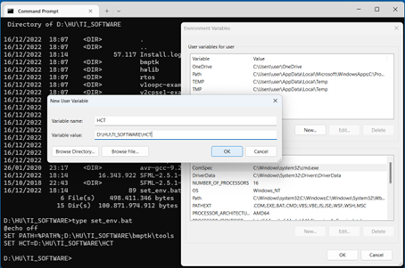
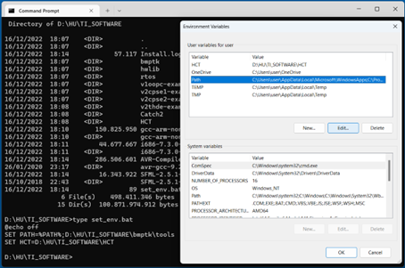
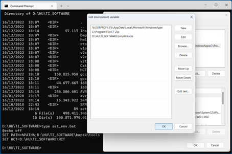
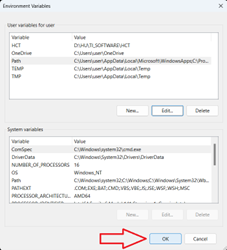
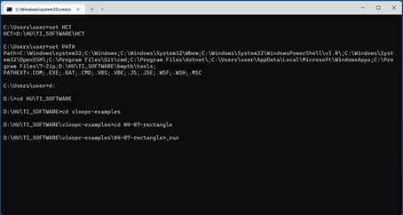

 [](logo-id)

# Inrichten ontwikkelomgeving[](title-id)

## Inhoud[](toc-id)
- [Inrichten ontwikkelomgeving](#inrichten-ontwikkelomgeving)
  - [Inhoud](#inhoud)
  - [Installeren](#installeren)
    - [Arduino IDE](#arduino-ide)
    - [CodeLite](#codelite)
      - [MinGW](#mingw)
      - [Visual Studio Code](#visual-studio-code)
      - [Doxygen](#doxygen)
      - [Een C++programma uitvoeren](#een-cprogramma-uitvoeren)
      - [Project](#project)
- [Uitgebreide software ontwikelomgeving](#uitgebreide-software-ontwikelomgeving)
  - [Vooraf](#vooraf)
  - [Software-ontwikkelomgeving](#software-ontwikkelomgeving)
  - [Omgevingsvariabelen](#omgevingsvariabelen)
    - [Testen of alles goed werkt](#testen-of-alles-goed-werkt)
    - [Oké, en wat nu?](#oké-en-wat-nu)
  - [Wat als het niet goed is gegaan?](#wat-als-het-niet-goed-is-gegaan)
  - [Referenties](#referenties)


## Installeren
In dit semester wordt onder andere gebuik gemaakt van de volgende, vrij verkrijgbare, software:
- Arduino IDE
- CodeLite
- MinGW
- Git
- Visual Studio Code

Mocht het helemaal niet lukken met de ontwikkelomgeving, gebruik dan *tijdelijk* een online C++ editor (bv https://onecompiler.com/cpp).

### Arduino IDE
Om C++ code te draaien, gebruiken we in eerste instantie een [Arduino IDE](https://docs.arduino.cc/learn/starting-guide/the-arduino-software-ide/).

### CodeLite
CodeLite is een editor/IDE die je kunt vinden op: https://codelite.org.

CodeLite heeft de vervelende eigenschap bij het opstarten te checken of er een nieuwe versie is, en als die er niet is lukt het niet om die te installeren. Dit kan je uitzetten via Settings -> Preferences -> Misc -> Check for new version at startup.

#### MinGW
MinGW is een GCC compiler voor Windows. Je kunt MinGW installeren via de link op: http://tdm-gcc.tdragon.net/download. Neem de 32 bits versie.

#### Visual Studio Code
Visual Studio Code (VSC) is een lichtgewicht ontwikkelomgeving die draait op je desktop. VSC is beschikbaar voor Windows, macOS en Linux.
* [Installatie VScode](visualstudiocode.md)
* [Configuratietips](vscode_tips.md)

#### Doxygen
Doxygen is een tool die helpt bij het genereren van commentaar of documentatie.
* [Installatie Doxygen](./doxygen.md)

#### Een C++programma uitvoeren
Om een C++programma uit te voeren moet je eerst een **workspace** hebben. In een workspace kunnen meerdere C++ programma’s staan. Een workspace maak je met:
File -> New -> New Workspace.

#### Project
Voor elk C++programma moet je een **project** aanmaken in je workspace. Een project maak je aan met: 
- File -> new -> project. 
- Kies "Simple executable (g++)" -> next.
- Geef je project een naam. 
- next -> Finish.
  
In het project staat nu een bestand genaamd `“main.cpp”`. Hierin schrijf je je C++ code.

# Uitgebreide software ontwikelomgeving

Deze uitgebreide handleiding heb je pas nodig na de tweede helft van semester 2 van Technische Informatica.

In iedere professionele omgeving krijg je te maken met een ontwikkelomgeving. Ga je werken bij een bedrijf of begin je voor jezelf er is altijd sprake van een gedefineerde software ontwikelomgeving. Om de software opdrachten te maken binnen de aangeboden semesters kom je er dan ook niet onderuit om je softwareomgeving op een vooraf gedefineerde manier in te richten. We bieden vooraf geteste procedure aan met deze handleiding. Je bent vrij om hier van af te wijken en andere systemen te gebruien als je daar comfortabel mee bent. In semester 3 leer je hoe je een ontwikkelomgeving zelf kunt opzetten.

De procedure duurt in totaal ongeveer 15-20 minuten.

## Vooraf

Installeer de onderstaande programma’s in de standaard directories. Dus geef geen alternatieve locaties aan.

- Python 3: https://www.python.org/downloads/release/
- 7-Zip: https://www.7-zip.org/
Gewoon heb je de ‘*.exe’-type van de ‘64-bit Windows x64’ versie nodig.
Dit is de versie waarmee de procedure is getest.
- Git: https://git-scm.com/download/win
Kies de ‘Standalone Installer’ voor ‘64-bit Git for Windows Setup.’
Let op: installeer deze ‘voor alle gebruikers’.
- CodeLite: https://codelite.org/  

Python moet je in de gewone Windows ‘Command Prompt’ kunnen opstarten. Als bij het intoetsen van ‘python’ de Windows Store opstart, dan moet je dit uitschakelen: https://stackoverflow.com/questions/58754860/cmd-opens-windows-store-when-i-type-python

    Als het installatie programma 7-Zip en Git niet in de PATH kan vinden, dan zoekt het op bepaalde standaard plaatsen in de Windows ‘Program Files’ folders en verwacht ze daar ook te vinden.

## Software-ontwikkelomgeving

1.	Maak een folder waar de omgeving in moet komen. Zorg wel dat het een folder is zonder spaties in de naamgeving. Dus “D:\TI_SOFTWARE” gaat goed. Echter “D:\TI SOFTWARE” gaat fout. Dat komt door de spatie tussen de I en de S.
2.	Zet het python programma ([InstallSoftware.py](https://github.com/HU-TI-DEV/installers)) in die folder
3.	Ga met CMD (‘Command Prompt’) naar die folder
4.	Tik in: python InstallSoftware.py <Return>
5.	Neem een bak koffie
6.	Als het programma klaar is zonder fout dan toont het een melding met aan het einde ‘Installation complete.’
7.	Je kan op de command line set_env.bat uitvoeren om bepaalde omgevingsvariabelen te zetten. Daarna kan je met _run in een project map programma’s bouwen en te runnen. 
Dat uitvoeren van set_env.bat moet je altijd na het opstarten van CMD doen.
8.	Je kan de instellingen in set_env.bat ook tot jouw ‘Omgevingsvariabelen’ (Environment Variables) toevoegen. Let op: deze wijziging werkt pas in een nieuwe CMD instantie.

In de folder staan nu de volgende bestanden en folders.

```bash
D:\HU\TI_SOFTWARE>dir
 Volume in drive D is Data
 Volume Serial Number is C05C-73FF

 Directory of D:\HU\TI_SOFTWARE

16/12/2022  18:07    <DIR>          .
16/12/2022  18:07    <DIR>          ..
16/12/2022  18:14            57,117 Install.log
16/12/2022  18:07    <DIR>          bmptk
16/12/2022  18:07    <DIR>          hwlib
16/12/2022  18:07    <DIR>          rtos
16/12/2022  18:07    <DIR>          v1oopc-examples
16/12/2022  18:07    <DIR>          v2cpse1-examples
16/12/2022  18:07    <DIR>          v2cpse2-examples
16/12/2022  18:08    <DIR>          v2thde-examples
16/12/2022  18:08    <DIR>          Catch2
16/12/2022  18:08    <DIR>          HCT
16/12/2022  18:10       150,825,950 gcc-arm-none-eabi-9-2019-q4-major-win32.zip
16/12/2022  18:10    <DIR>          gcc-arm-none-eabi-9-2019-q4-major-win32
16/12/2022  18:11        44,677,667 i686-7.3.0-release-posix-dwarf-rt_v5-rev0.7z
16/12/2022  18:11    <DIR>          i686-7.3.0-release-posix-dwarf-rt_v5-rev0
16/12/2022  18:14       286,506,601 AVR-Compiler.tar.gz
26/01/2020  23:17    <DIR>          avr-gcc-9.2.0-P0829
16/12/2022  18:14        16,343,922 SFML-2.5.1-windows-gcc-7.3.0-mingw-32-bit.zip
15/10/2018  22:43    <DIR>          SFML-2.5.1-32
16/12/2022  18:14                89 set_env.bat
               6 File(s)    498,411,346 bytes
              15 Dir(s)  100,542,179,328 bytes free

D:\HU\TI_SOFTWARE>

```

- Install.log – hoe alles is verlopen
- bmptk – Bare Metal Programming Toolkit
- hwlib – Hardware Library (HU eigen, opgezet door Wouter van Ooien)
- rtos – Real Time Operating System ondersteuning
- v1oopc-examples – voorbeeldcode
- v2cpse1-examples – voorbeeldcode
- v2cpse2-examples – voorbeeldcode
- v2thde-examples – voorbeeldcode
- Catch2 – C++ testing framework
- HCT – HWLIB-Cmake-Tools voor CLion’s autocomplete feature
- Zip files die gedownload zijn. Je mag deze verwijderen, maar dit hoeft niet.
- Folders met de compilers voor Intel/AMD x86 (Windows), ARM en AVR
- SFML-2.5.1-32 – Simple and Fast Multimedia Library
- set_env.bat – Windows command batch bestand met instellingen voor de omgeving

De ZIP bestanden zijn de juiste compilers voor native (i686), Atmel (Arduino DUE (GCC) en de 8 bit Arduino’s (AVR-GCC)) en SFML (graphics).

Verder zijn er een aantal folders ‘gecloned’ uit de GitHub omgeving. 

In semester 2 gebruiken we de folder v1oopc-examples. De folders v2cpse1-examples, v2cpse2-examples en v2thde-examples komen in het 2e jaar aan bod.

In de respectievelijke folders zijn ook CodeLite workspaces gemaakt zodat je gelijk toegang hebt tot alle voorbeelden en stukken code die je nodig hebt voor de opgaven.

Verder heeft het installatie programma een bestand “Install.log” en “set_env.bat” aangemaakt. 

De eerste (“Install.log”) is een verslag van alle stappen die zijn doorlopen. De tweede (“set_env.bat”) is nodig om de omgevingsvariabelen juist op te zetten om bmptk-make en de compilers goed te kunnen gebruiken.

## Omgevingsvariabelen

Om CodeLite goed te kunnen gebruiken (door klik op het CodeLite symbool en niet door opstarten vanuit de CMD command line), moeten we nu nog een aantal omgevingsvariabele (environment variables) toevoegen en een bewerken.

Windows kent twee soorten omgevingsvariabelen (environment variables):
-	System environment variables (systeem omgevingsvariabelen)
-	User environment variables (gebruikersomgeving)

Het is voldoende, de gebruikersomgeving te bewerken. Dus heb je daarvoor geen admin-rechten nodig. We moeten twee onderdeken toevoegen:
-	De omgevingsvariabele HCT
-	Uitbreidingen van de variabele PATH

Eerdere versies van InstallSoftware.py maakten een ’registry import file’ aan om dat niet handmatig te moeten doen, maar daar waren risico’s aan gehecht. Met Windows 11 is het ook niet meer zo makkelijk deze *.reg bestanden te gebruiken.

Als je op de Windows-toets gaat en ‘omgeving’ intoetst moet je twee keuzes kunnen zien: ‘Systeemomgeving’ en ‘Gebruikersomgeving’. Op het Engels toets je ‘environment’ en krijgt “Edit environment variables for your account”. Dan krijg je een venster ‘Environment variables’, en onder het bovenste venster kan je met ‘New…’ een nieuwe variabele toevoegen.

In Figuur 1 heb ik de variabele HCT toegevoegd. Je kan ook het CMD-venster zien waar ik met ‘type’ de inhoud van set_env.bat had laten tonen. Daar staan alle variabelen die nog moeten worden toegevoegd (alleen ‘HCT’), en de uitbreidingen van PATH (in mijn voorbeeld is dat alleen tot  bmptk/tools).



***Figuur 1: De variabele HCT moeten we toevoegen, dus 'New' kiezen***

In Figuur 2 heb ik PATH gekozen en ‘Edit’, om iets toe te voegen.



***Figuur 2: PATH moeten we alleen bewerken, dus 'Edit' kiezen***

En in Figuur 3 zie je dat ik de pad naar de map D:\HU\TI_SOFTWARE\bmptk\tools toevoeg. 



***Figuur 3: Een element aan de PATH toevoegen, hier …\bmptk\tools***

**Super belangrijk**: Nu moeten we op OK klikken, anders worden alle onze veranderingen gewist!



***Figuur 4: Bevestigen met OK is belangrijk!***

Om te controleren dat de variabelen goed zijn moeten we een nieuwe CMD venster openen.

In Figuur 5 zien we dan dat HCT en PATH de juiste waarden hebben.



***Figuur 5: met 'set' kunnen we zien of alles goed verwerkt is, en dan een van de voorbeelden bouwen en runnen***

### Testen of alles goed werkt

- CodeLite opstarten en daar de CodeLite workspace in v1oopc-examples openen.
- Daarna naar de folder 00-00-hello gaan en daarop dubbel klikken. Dan build en run. En nu zou hij het moeten doen (drukt Hello op het terminal).
- Daarna naar de folder 04-07-rectangle gaan en daarop dubbel klikken. Dan build en run. En nu zou hij het moeten doen (opent een grafisch venster met een rechthoek).
- Daarna naar de folder 15-01-Registers-blink gaan en daarop dubbel klikken. Pas bestand Makefile.DUE (die zie je niet in CodeLite) aan voor de juiste COM port van jouw DUE. Dan Build en Run. En nu zou hij het moeten doen

### Oké, en wat nu?

Als alles goed blijkt te werken mag Install.log verwijderd worden. Dus wacht even een paar weken zodat we zeker zijn dat alles naar behoren werkt.

De ZIP bestanden die gedownload zijn mag je verwijderen maar dat hoeft niet. Bij een herinstallatie van alles pakt het InstallSoftware.py script deze bestanden als ze er nog staan. Anders gaat het alles opnieuw downloaden.

## Wat als het niet goed is gegaan?

- Soms wil het nog wel eens misgaan met het uitpakken van een van de compilers. De oorzaak is dat in sommige gevallen en onder de root folder nog een folder staat met dezelfde naam en pas daarin weer folders als bin etc. De eenvoudigste oplossing is om dan gewoon alles direct onder de root van die compiler folder te plaatsen.
- SFML wil nog wel eens misgaan. De oorzaak is dat soms een van de HU scripts wordt aangepast waardoor er gekeken wordt naar SFML-2.5.1 en een andere keer naar SFML-2.5.2-32.
- Het is goed om dit een keer mee te maken (we behandelen “make” in het 2e jaar). Het leert je om een volledige compile opdracht te lezen zonder te schrikken van de eindeloze tekst.

## Referenties

- Installers (<https://github.com/HU-TI-DEV/installers>)