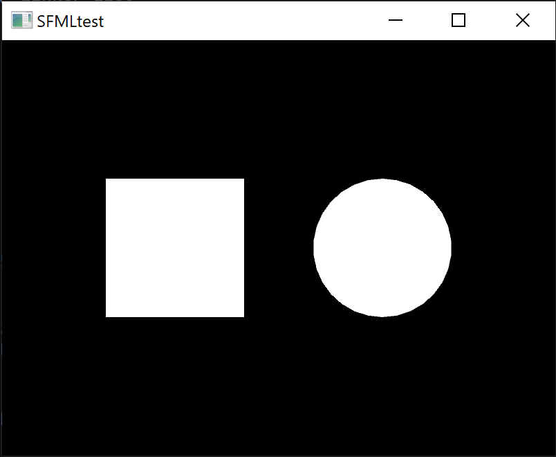

# SFML installatie[](title-id) <!-- omit in toc -->

### Inhoud[](toc-id) <!-- omit in toc -->

- [Vooraf](#vooraf)
- [Installatie SFML](#installatie-sfml)
- [Test SFML Installatie](#test-sfml-installatie)
- [Voorbeeld tasks.json](#voorbeeld-tasksjson)
- [SFML voorbeelden](#sfml-voorbeelden)

## Vooraf

We gaan er van uit dat je een geinstalleerde MinGW-w64 toolchain hebt. Installeer onder de MSYS2 UCRT64 terminal!
[VScode + MinGW en GCC](https://code.visualstudio.com/docs/cpp/config-mingw)

## Installatie SFML

Installeer SFML met de packetmanager (dankzij Lia E.):

- Open een **MSYS2 MSYS UCRT64 terminal** (dus niet een CMD terminal!)
- Voer het volgende commando uit (wacht tot het klaar is!):

```bash
pacman -Syu
```
- De MSYS2 MSYS UCRT64 moet na afloop sluiten. Start dan de juiste terminal weer op en vervolg je stappen.
- Voer het volgende commando uit:

```bash
pacman -S mingw-w64-ucrt-x86_64-sfml
```

- Bij alles op Yes klikken.
Zet de juiste tasks.json settings:
Zie voorbeeld onder.

Zelf installeren:

- Let op de versie die je [downloadt](https://www.sfml-dev.org/download/sfml/2.5.1/): gebruik de juiste gcc mingw versie.

## Test SFML Installatie

Deze voorbeeldcode toont een venster met een cirkel en een vierkant.

```c++
/// @file main.c -- SFML install test
#include <SFML/Graphics.hpp>
#include <SFML/Window.hpp>
#include <iostream>

int main ()
{
    sf::RenderWindow window (sf::VideoMode(800,600), "SFMLtest", sf::Style::Default, sf::ContextSettings(0, 0, 2));
    sf::RectangleShape square(sf::Vector2f(200.0,200.0));
    sf::CircleShape circle(100.0);
    square.setPosition(sf::Vector2f(150.0,200.0));
    circle.setPosition(sf::Vector2f(450.0,200.0));
    while (window.isOpen()) {
        sf::Event event;
        while (window.pollEvent(event)) {
            if (event.type == sf::Event::Closed)
                window.close();
        }
        window.clear();
        window.draw(square);
        window.draw(circle);
        window.display ();
        sf::sleep(sf::milliseconds(20));
    }
    return 0;
}
```

*main.cpp*

Je kan deze bestand ook [hier downloaden](./test_sfml_installatie.cpp).

Dit is hoe het dan uitziet:




## Voorbeeld tasks.json

```json
{
    "tasks": [
        {
            "type": "cppbuild",
            "label": "C/C++: SFML g++.exe build AND RUN active file",
            "command": "C:\\msys64\\ucrt64\\bin\\g++.exe",
            "args": [
                "-fdiagnostics-color=always",
                "-g",
                "${fileDirname}\\*.cpp",
                "-lsfml-graphics",
                "-lsfml-window",
                "-lsfml-system",
                "-o",
                "${fileDirname}\\${fileBasenameNoExtension}.exe",
                "&&",
                "${fileDirname}\\${fileBasenameNoExtension}.exe"
            ],
            "options": {
                "cwd": "C:\\msys64\\ucrt64\\bin"
            },
            "problemMatcher": [
                "$gcc"
            ],
            "group": {
                "kind": "build",
                "isDefault": true
            },
            "detail": "Task generated by Debugger."
        }
    ],
    "version": "2.0.0"
}
```

*Voorbeeld tasks.json file voor VScode, bij gebruik van SFML. Let op de -l flags (-lsfml-system en -lsfml-window)*  
*Bron: Lia Engelchor en Tobias Bosch*


> *Toelichting door Tobias:*
>
> Als het goed is kun je met bovenstaande tasks.json simpelweg de build task runnen via  
> `Terminal` -> `Run Build Task` of de shortcut `Ctrl+Shift+B` gebruiken.
>
> De task compilet de binary, en runt die gelijk daarna, het is niet nodig om die zelf nog te runnen.*

## SFML voorbeelden

- Gebruik de [code uit de tutorial](https://www.sfml-dev.org/tutorials/2.6/window-window.php) en open een window.
- [SFML auto test en classes oefening](../inrichten-ontwikkelomgeving/sfml_auto_test/README.md)
