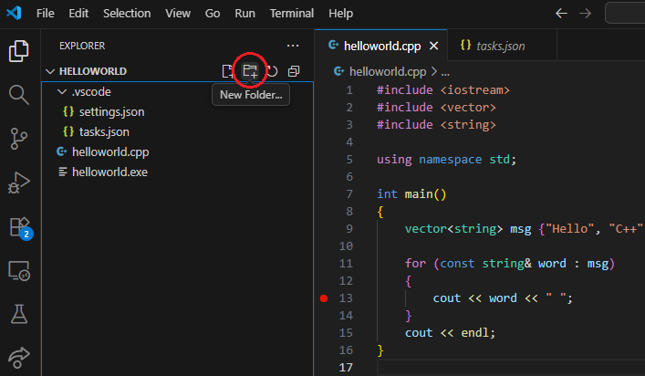

 

# Visual Studio Code ontwikkelomgeving <!-- omit in toc -->

### Inhoud <!-- omit in toc -->

- [Platforms](#platforms)
  - [VScode en C++](#vscode-en-c)
- [Een C++ programma uitvoeren](#een-c-programma-uitvoeren)
  - [Workspace](#workspace)
  - [Folders](#folders)

## Platforms
Visual Studio Code (VSC) is een lichtgewicht ontwikkelomgeving die draait op je desktop. VSC is beschikbaar voor **Windows, macOS en Linux**. 
VScode heeft ingebouwde ondersteuning voor JavaScript, TypeScript en Node.js. Het heeft extensies voor andere talen en runtime omgevingen: (zoals C++, C#, Java, Python, PHP, Go, .NET). 
VScode informatie vind je op: https://code.visualstudio.com/docs#vscode

### VScode en C++ 
In deze handleiding configureer je Visual Studio Code om de GCC C++-compiler (g++) en de GDB-debugger van mingw-w64 te gebruiken voor het maken van programma's die op Windows draaien. Na de configuratie van VS Code compileer en voer je een "Hello World"-programma uit en debugt deze.

Doorloop alle stappen op de volgende pagina:
https://code.visualstudio.com/docs/cpp/config-mingw

De installatie omvat de volgende stappen:
- Installeer Visual Studio Code
- Installeer de C/C++ extension for VS Code
- Installeer MSYS2 (Windows)
- Het opzetten van een test file
- Het testen van de debugger

## Een C++ programma uitvoeren

### Workspace
Om een C++ programma uit te voeren binnen VScode heb je een **workspace** nodig. In een workspace kunnen meerdere folders met meerdere C++ programma’s staan.
Een workspace maak je automatisch aan met: `File` -> `Open Folder`.
N.B. Na het VScode installatieproces heet je workspace waarschijnlijk *HELLOWORLD*.

[Meer uitleg over workspaces staat op deze site.](https://code.visualstudio.com/docs/editor/workspaces/workspaces)

### Folders
Voor elk C++ programma is het handig om een aparte folder op te nemen in je workspace. 
1. Selecteer de workspace in de linkerbalk.
2. Check dat de workspace is uitgeklapt.
3. Als het goed is, kun je nu rechts van de workspace-naam een icoon vinden om een nieuwe folder aan te maken.

