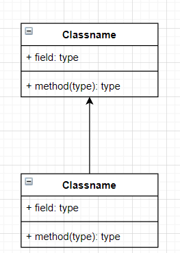
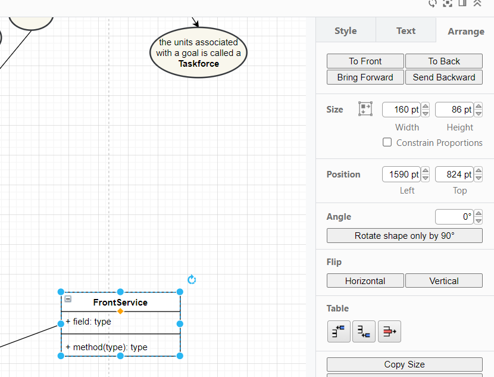
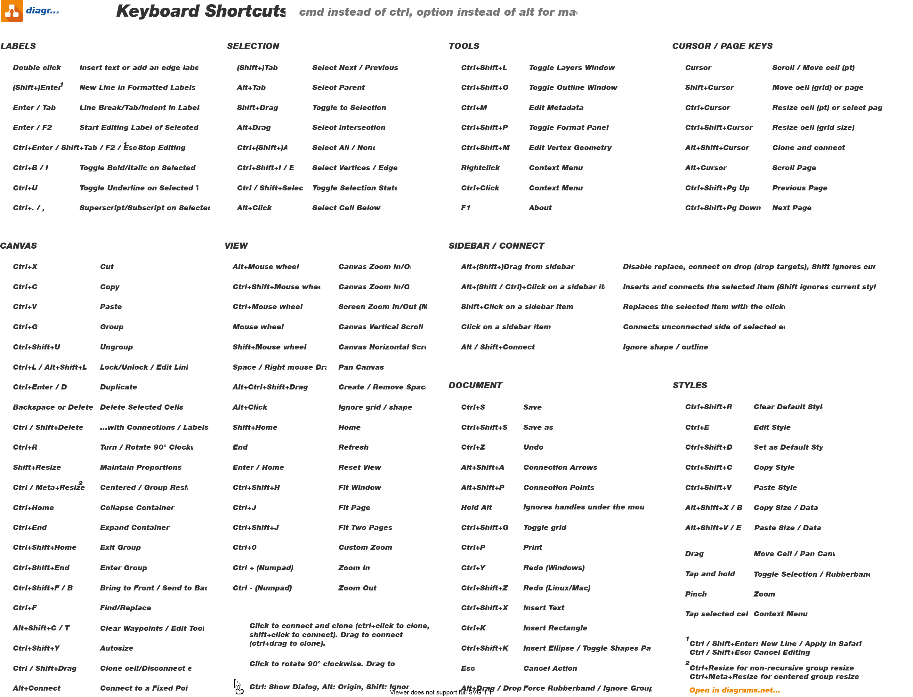

\[draw.io, drawio\]

# Drawio-tips

[Video voor beginners](https://youtu.be/Rv4_nfpTFHk)

## Probleem: een class object heeft sub-velden hij wil steeds pijlen attachen aan die subvelden ipv aan de class

Dus als je een arrow vanuit een class probeert te slepen naar een
bovengelegen class:

~~Remedie: drag de subvelden even eruit. Attach je pijlen en drag ze
weer terug.  
Nee: beter: selecteer de velden, dan in hun properties: disable
“connectable”.. vervolgens:  
trek een nieuwe lijn vanuit de bottom (yep eruit trekken lukt wel,
ernaar niet) van een class naar de top van de class eronder. Dan
eventueel CTRL+R (reverse direction).  
Alternatief: klik op de class aan de bovenkant. Als je in de buurt
hovert, zie je een dikke blauwe pijl. Als je daarvandaan sleept, komt er
ook een pijl.~~

De oplossing is: selecteer het subveld (methods), properties,
deselecteer “connectable” en “allow arrows” voor dat subveld.

## Probleem: bij een class object met meerdere velden. Hoe voeg je een separator tussen de member en de functievelden toe?

Remedie: er is in UML sectie een horizontaal stuk lijn dat je kunt
draggen. Dat is een separator.

## Hoe voeg je makkelijk methods toe?

Antwoord: **Selecteer het methods veld, en gebruik arrange -\> table
manipulators**

## Het valt niet mee om een veld te openen en te sluiten (met het – symbool linksboven in de class)

Remedie: gebruik daarvoor de shortcut keys

## Shortcut keys

<https://defkey.com/draw-io-shortcuts>

## Hide/show Collapsability buttons in the schematic

(voor het maken van een image export wil je dat waarschijnlijk hiden)

Select *Extras \> Collapse/Expand* in the menu

NB: je kunt van elke vorm een collapsable container maken door hem te
groupen (CTRL+G).

## Line jumps op crossing lines mogelijk maken

1. Selecteer een lijn

2. Kies lijn type sharp of rounded, maar NIET curved

3. Kies bij lijn jumps in de style property in de dropdown:spacing =
   arc

4. De betreffende lijn jumped nu als het over een andere lijn gaat.  
   (NIET als het onderdoor gaat. Gebruik arrange front/back om dat aan
   te passen)

## Er verschijnt geen oker puntje om de text mee te draggen

Oplossing: in de properties, check “Movable Label”.

## Optimale manier van lijnen trekken en onderhouden:

- Hover over een box en wacht tot blauwe pijlen verschijnen.

- Drag van zo’n blauwe pijl naar een andere box.

- Verleg de lijn door de zijkanten te draggen, **niet** door start of
  eind te manipuleren.

## Probleem: soms zie je line jumps niet en soms zie je ze ongewenst bij een bocht van een lijn met “rounded” property

Oplossing: send line backward of juist forward (verander de depth
sorting)

## Tekst toevoegen bij lijnen:

Doe het **niet** via dubbelklik op de lijnen, maar selecteer met
enkel-klik, gevolgd door F2.  
(Anders kan er een label ontstaan dat niet aan de lijn gekoppeld is)

## Makkelijk text bij lijnen copieren naar andere lijnen

Dubbelklik op de tekst bij een lijn. CTRL+C. Klik een andere lijn aan.
CTRL+V.

## Groepen verslepen

Belangrijk: niet eerst klikken op de groep (om te selecteren), en dan
nog eens gaan slepen (want dan sleep je er een onderdeel van). Maar:
klik op het bovenste item (meest ‘forward’ in de sortering) en drag
direct (in een beweging - zonder muisknop los te laten dus)

CTRL+G en CTRL+SHIFT+U voor snel groeperen/ontgroeperen.
CTRL**+SHIFT**+G voor toggle grid.

## Nauwkeurig positioneren

Voor fijne positionering kun je ook de cursortoetsen gebruiken.

## Klasse in hoogte resizen

Resize niet de klasse, maar het textveld er in. De klasse resized dan
automatisch mee.

## Snel naar linkerbovenhoek van tekening

Druk op ENTER.

## Orthogonaal rechte pijlen houden bij kleine verschuivingen van de blokken
Als je twee blokken met een pijl verbindt, en de pijl is recht, en je versleept een blok een beetje, dan komt er een knak in de pijl. Je kunt weliswaar een pijltype selecteren dat altijd recht is, maar dan gaat die pijl typisch scheef staan.
**Oplossing:**
•	Verbindt de blokken door een uitsleeppijl (blauwe connectie met hoofddeel van blokken) zoals gebruikelijk.
•	Selecteer de uitsleeppijl in het midden (zodat hij niet knakt), houd LMB ingedrukt en verschuif hem een beetje in orthogonale richting.
•	Klaar. In het vervolg als je een van de aangehechte blokken verschuift, blijft de pijl zonder knik en recht – tenzij het echt niet anders kan.