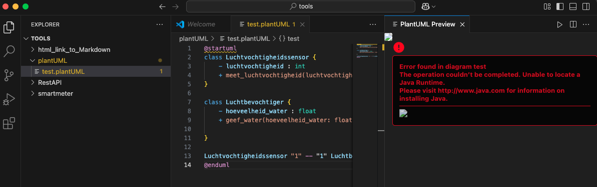
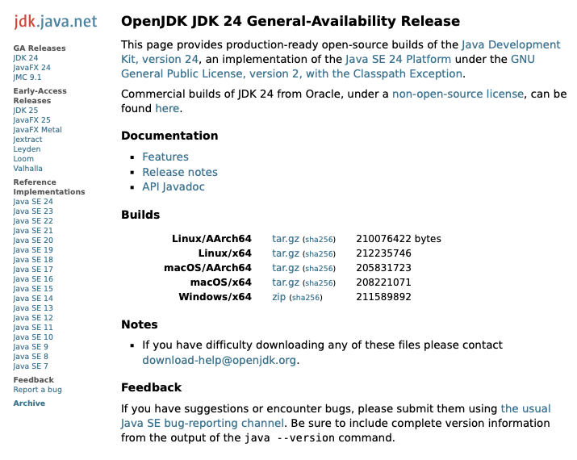
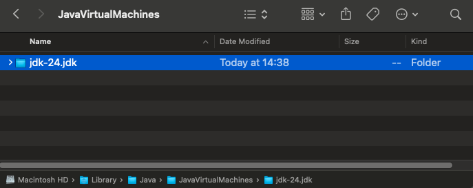
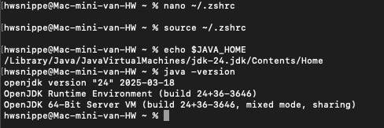
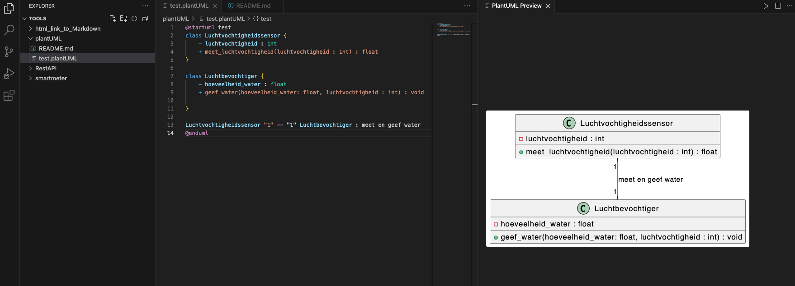

# plantUML in MacOS

Dit is een korte beschrijving voor de installatie van plantUML op MacOS. Ik gebruik **MacOS Sequoia** op een M4 with Visual Studio Code versie 1.99.

Installeer plantUML plugin uit de extensions:marketplace. Mijn huidige versie is 2.18.1. De plugin maakt gebruik van de Java SDK. Extra software en configuratie is daarom nog nodig.



 Ik download de OpenJDK van [https://jdk.java.net/24/](https://jdk.java.net/24/). De versie die ik kies voor mijn OS is.

    macOS / AArch64	tar.gz (sha256)	205831723



Uitpakken geef mij een folder waar de binaries staan. Ik verplaats deze folder `jdk-24.jdk` naar de volgende directory.



```bash
/Library/Java/JavaVirtualMachines/
```

De JAVA_HOME directory is dan.

```bash
/Library/Java/JavaVirtualMachines/jdk-24.jdk/Contents/Home
```

Dit moeten we toevoegen als path variabele. Voor de zsh shell doe ik dat op de volgende manier.

```bash
nano ~/.zshrc
```

Voeg aan dit bestand de volgende twee regels toe.

```bash
export JAVA_HOME="/Library/Java/JavaVirtualMachines/jdk-24.jdk/Contents/Home"
export PATH="$JAVA_HOME/bin:$PATH"
```

De veranderingen moet je na het opslaan nog activeren.

```bash
source ~/.zshrc
```

Nu kan je controleren of het werkt.

```bash
echo $JAVA_HOME
java -version
```



De verwijzing van je $JAVA_HOME path en versie van de Java SDK komen in beeld.

Ik krijg nog de volgende error "Dot executable does not exist" wanneer ik een UML grafisch wil laten tonen. Dat komt omdat er een afhankelijkheid is van Graphviz.

```bash
brew install graphviz
```
Nu heb je pauze want dit kan even duren.

```bash
dot -version
```

Geeft bij mij graphviz version 12.2.1. Happy coding!




