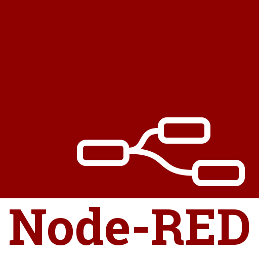

 

# Node-RED <!-- omit in toc -->

### Inhoud <!-- omit in toc -->

- [Introductie](#introductie)
- [Referenties](#referenties)

---

**v0.1.1 ** Begin documentatie voor visueel programmeren in Node-RED HU IICT.

---

## Introductie

Node-RED is een (open-source) visuele programmeer tool. Bij Internet of Things (IoT) applicaties is het een handig hulpmiddel om datastromen eenvoudig te kunnen beheren. Met Node-Red heb je zelfs toegang tot de [GPIOs](../../../infrastructuur/OS/Raspberry-Pi-OS/) van de Raspberry Pi. Daarnaast kan je berichten publiceren op een [MQTT broker](../../communicatie/MQTT/README.md). Of data opslaan en of ophalen uit een [database].

Node-RED kan je op een visuele manier in een browser gebruiken. Doormiddel van het slim verbinden van verschillende nodes kan je taken defineren. Aaneegeschakelde nodes noemen we flows.

## Referenties

- Node-RED (<https://en.wikipedia.org/wiki/Node-RED>)