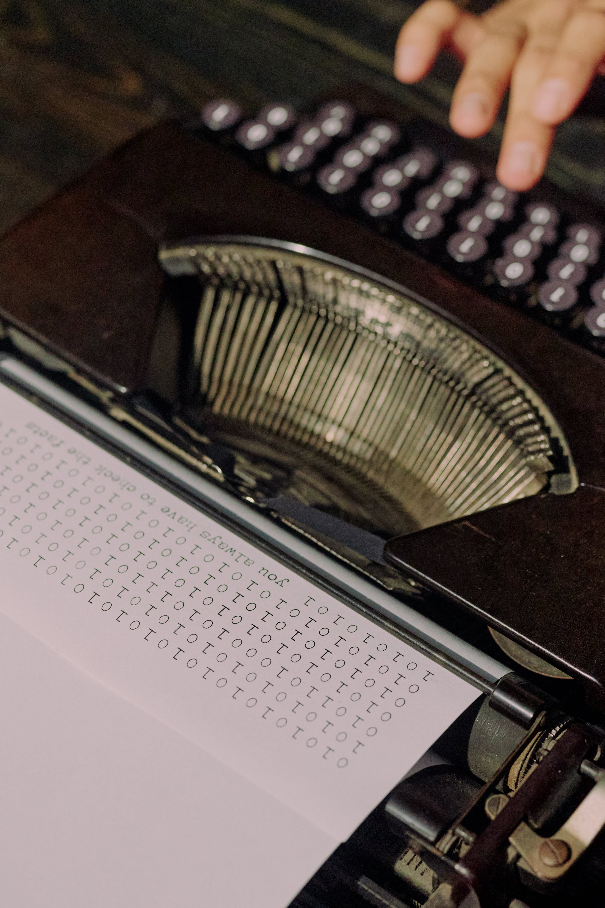
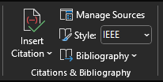

 

[4]

# Documenteren <!-- omit in toc -->

### Inhoud <!-- omit in toc -->

- [Een introductie](#een-introductie)
- [Toepassen](#toepassen)
- [Voorbeelden in IEEE-stijl:](#voorbeelden-in-ieee-stijl)
  - [Boekreferentie:](#boekreferentie)
  - [Artikel in een tijdschrift:](#artikel-in-een-tijdschrift)
  - [Website:](#website)
- [bronnen](#bronnen)

---

**v0.1.0 ** Start document voor documenteren uitleg en voorbeelden door HU IICT.

---

## Een introductie

Het correct en nauwkeurig vermelden van bronnen is van cruciaal belang voor elke wetenschappelijke, technische of academische publicatie. Het is niet alleen om plagiaat te voorkomen, maar fungeert ook als een middel om de oorsprong van informatie te laten zien en lezers in staat te stellen de bronnen op te zoeken voor verdere studie. 

## Toepassen
Er zijn verschillende standaarden om bronvermelding op te zetten, maar meestal wordt in wetenschappelijke literatuur APA7 of IEEE gebruikt. Deze laatste vind je meestal in technische literatuur en werken we verder uit. In principe moet je altijd elke claim van een bron voorzien. Een claim is bijvoorbeeld:

De SR04 Sonic Ranging Module 5V nodig heeft om te werken.

We kunnen hier op verschillende manieren een bron aan koppelen. Hieronder staan drie voorbeelden van correcte verwijzing en hoe je die kan gebruiken. De bronnen staan zoals het hoord in de bronnenlijst onderaan. Let op dat dit vier veel voorkomende referenties zijn, maar er zijn er natuurlijk nog veel meer denk aan filmpjes. Als je twijfeld aan hoe je de verwijzing moet doen kijk dan in de IEEE handleiding op internet. Je kan hiervoor ook de referentie tab in word gebruiken. Hier kan je jouw stijl kiezen (IEEE of APA) en kan je met "Insert Citation" 

Een nieuwe bron toevoegen. In de dropdown kan je daar het type kiezen en via de wizard automatisch de correcte verwijzing opbouwen. Onder Bibliography kan je dan een automatische bronnenlijst onderaan het document laten plaatsen.

## Voorbeelden in IEEE-stijl:

### Boekreferentie:
Wanneer we informatie uit boeken halen benoem je de auteur en de titel correct te vermelden.

De SR04 Sonic Ranging Module 5V nodig heeft om te werken[1]. 

### Artikel in een tijdschrift:

Het citeren van artikelen uit tijdschriften vereist specifieke details zodat de lezer in staat te stellen het artikel te lokaliseren. 

De SR04 Sonic Ranging Module 5V nodig heeft om te werken[2].

### Website:
Internet bronnen zijn lang niet altijd betrouwbaar, maar vaak kom je er niet omheen.

De SR04 Sonic Ranging Module 5V nodig heeft om te werken[3].

## bronnen
[1]  J. K. Autheur, "Eletronica voor beginneres" Cambridge university press, 2024.

[2]  A. B. Autheur, "Range findind an overview" Electro Weekly, vol. X, no. X, pp. XX-XX, Februari, 2024.

[3]  E. F. Autheur, "Sparkfun Datasheets" Sparkfun, [URL naar bron](https://cdn.sparkfun.com/datasheets/Sensors/Proximity/HCSR04.pdf), accessed on: 04 02 2024.

[4]  Ron Lach, "Documenteren" Pexels, [URL naar bron](https://www.pexels.com/nl-nl/foto/typen-schrijfmachine-retro-document-9757562/), accessed on: 04 02 2024. <!-- markdown-link-check-disable-line -->