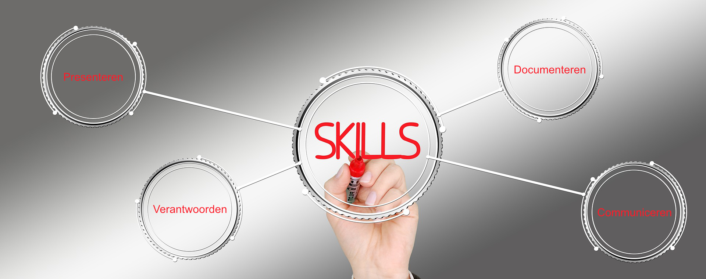

 

# Professionele vermogens

### Inhoud

- [Professionele vermogens](#professionele-vermogens)
    - [Inhoud](#inhoud)
  - [Presenteren](#presenteren)
  - [Scrum](#scrum)
  - [Feedback geven en ontvangen](#feedback-geven-en-ontvangen)
  - [reflecteren vs evalueren](#reflecteren-vs-evalueren)
  - [Gesprekstechniek](#gesprekstechniek)
  - [Documenteren](#documenteren)

---

**v0.1.0 ** Start document voor uitwerking professionele vermogens HU IICT.

---

## Presenteren

Naast het ontwikkkelen van technische skills zijn professionele vermogens minstens zo belangrijk. Hoe goed een technische oplossing ook is deze moet wel aan de man worden gebracht. Dit gebeurt in de eerste plaats vaak in de vorm van een presentatie en daarom is het belangrijk om te leren hoe te [presenteren](../vermogens/presenteren/README.md).

## Scrum

De basis van de projectorgansiatie van S2 is agile werken. We gebruiken hiervoor met name onderdelen van de scrum methodiek. We verzamelen informatie over de manier van werken hier: [Scrum](../vermogens/Scrum/README.md).

## Feedback geven en ontvangen

Voor het aantonen van de leeruitkomsten heb je naast het maken van werk feedback van anderen nodig en geef je ook zelf feedback. Ook als je later in het bedrijfsleven aan de slag gaat heb je deze vermogens hard nodig aangezien het de basis vormt voor zakkelijke communciatie. Je kan meer informatie over goed feedback geven hier vinden: [Feedback](../vermogens/Feedback/README.md). 

## reflecteren vs evalueren 

Naast anderen van constructieve feedback te voorzien ga je ook veel feedback ontvangen. Dit kan van je medestudenten zijn, van de docenten en later eventueel externe opdrachtgevers. Deze feedback moet je gebruiken om te reflecteren op jezelf en op de voortgang van je studie en het project. In dit topic geven we inzichten in de basis van [reflecteren](../vermogens/Reflecteren_en_evalueren/README.md) en geven we handvatten hoe je dit kan verwerken tot een evaluatiedocument.  

## Gesprekstechniek

Mondelinge communicatie is een belangrijk kenmerk van het agile werken. Het vormt een van de basis ingredienten van het manifest. In het topic [Gesprekstechniek](../vermogens/Gesprekstechniek/README.md) vind je informatie over hoe je in gesrpekken de juiste toon kan vinden. 

## Documenteren

Je zou denken dat bij onderwijs het aantonen van de eigen kennis het belangrijkst is, maar het is minstens zo belangrijk om aan te kunnen tonen waar jouw kennis vandaan komt. Correcte bronvermelding is hierbij cruciaal. Uit welke data sheet komt jouw basis? Waarom maak je deze keuze? Dit zijn allemaal vragen die je eigenlijk alleen goed kan beantwoorden met de kennis van anderen. 

