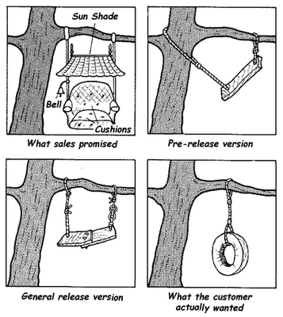

 

# Requirements analyse <!-- omit in toc -->

### Inhoud <!-- omit in toc -->

- [Een introductie](#een-introductie)
- [bronnen](#bronnen)

---

**v0.1.0 ** Start document voor presentatietechnieken uitleg en voorbeelden door HU IICT.

---

## Een introductie

Om iets te kunnen maken voor iemand moet je eerst weten wat iemand wil. Dat klinkt simpel, maar in de praktijk is dit een lastig probleem waar veel bij komt kijken. In dit topic worden een aantal manieren beschreven hoe verwachtingen van klanten in beeld kunnen worden gebracht.

## bronnen
[1] https://cofamedia.com/blog/project/web-design-and-development-sign-off-agreement/

